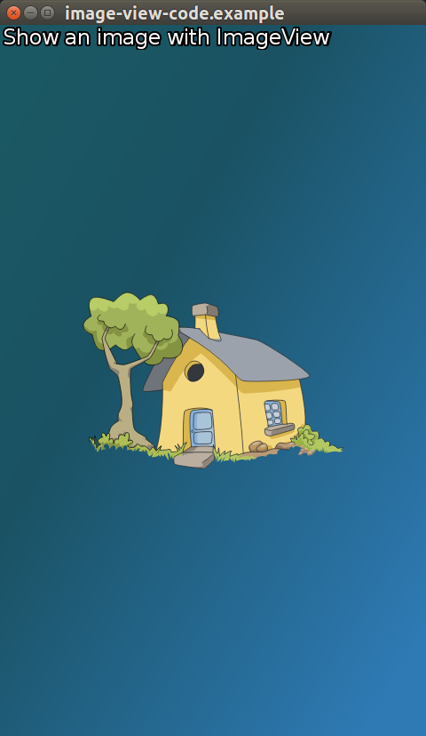

# ImageView


The `Dali::Toolkit::ImageView` is a control which displays an image. It's a common use is for showing an ImageVisual.

In this tutorial the following subjects are covered:

[Basic creation and usage](#1)<br>
[Creation and usage with Visuals](#2)<br>
[ImageView Properties](#3)<br>

<a name="1"></a>
## Basic creation and usage

A basic instance of an ImageView is created with a file path:

If the filename is to a Nine Path, GIF, SVG or regular image, then the respective Visual will be created and used.

```
ImageView imageView = ImageView::New("./images/image_view.svg");
```


<a name="2"></a>
## Creation and usage with Visuals

To have full control over the Visual and what ImageView displays a Visual, Property::Map should be used.

Below example uses the image and forces ATLASING off.
Each Visual has it's own Properties which can be set.

```
auto imageView = ImageView:New();

imageView.SetProperty( ImageView::Property::IMAGE,
                       Property::Map().Add( ImageVisual::Property::URL, "./images/apple.svg" )
                                      .Add( ImageVisual::Property::ATLASING, false  ) );
```

To subsequently change a visual, then set the IMAGE property a new visual property map.

```
imageView.SetProperty( ImageView::Property::IMAGE,
                       Property::Map().Add( ImageVisual::Property::URL, "./images/house.png" )
                                      .Add( ImageVisual::Property::ATLASING, false  ) );

imageView.SetParentOrigin( ParentOrigin::CENTER );
imageView.SetResizePolicy( ResizePolicy::USE_NATURAL_SIZE, Dimension::ALL_DIMENSIONS );
```

This image is displayed via an ImageView:



<a name="3"></a>
## ImageView Properties

ImageView has the following properties:

| Property  | Type | Description |
|--------------|--------------|--------------|
| IMAGE  | Map | map of properties associated with a given image. |
| PRE_MULTIPLIED_ALPHA | bool | opacity adjusted image. |
| PIXEL_AREA | Vector4 | sub area of image (Animatable). |

> **Note**  
>- PreMultipliedAlpha
>
> If PreMultipliedAlpha is true, the RGB components represent the color of the object or pixel adjusted for its opacity by multiplication. If false, the opacity is disregarded.
>
>- PixelArea
>
> PixelArea is a relative value, with the whole image area as [0.0, 0.0, 1.0, 1.0]. Vector4 area values are (x, y, width, height).
>
> e.g on a 200 x 200 pixel image [0.25, 0.5, 0.5, 0.5] would represent a sub area of that image with the following co-ordinates:
>
> Top left     : 50,100 / Top right    : 150,100 / Bottom left  : 50,200 / Bottom right : 150,200


## Related Information
- Dependencies
  - Tizen 2.4 and Higher for Mobile
  - Tizen 3.0 and Higher for Wearable
