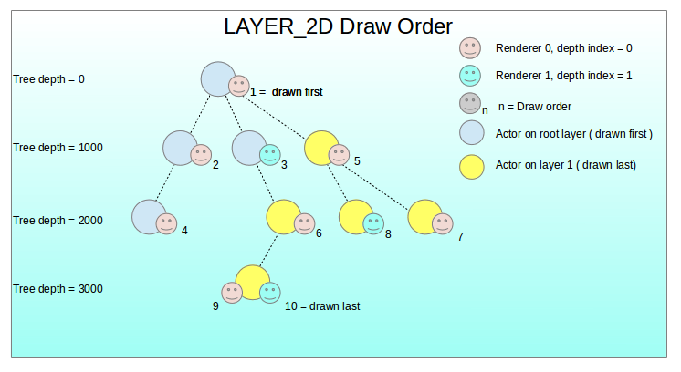
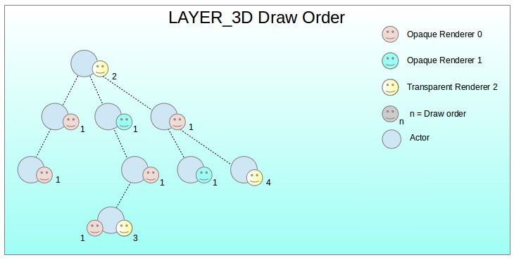
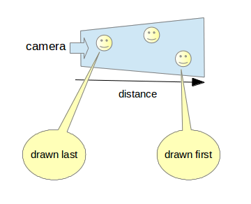

# Layer


A layer acts like a transparent sheet upon which shapes can be placed, sub-layers within layers to any desired depth are supported. Layers provide a mechanism for overlaying groups of views on top of each other.
Layers can also clip their contents to exclude any content outside a user defined area.

Layers can be 2D or 3D, defined by their _behaviour_ property.

 

When a layer is added to the stage, it is assigned a unique depth value. By default the stage has a root layer with a depth value of 0.

Layers are actors and inherit the position, orientation and scale of their parent actor.
Layers are drawn in an order determined by a layer depth value.

> **Note**  
> Layers work independently of the Actor hierarchy.

Layers can be positioned anywhere in the actor tree. The layer draw order is always defined by the _depth_ value.

```
// C++ example of adding a actor to the root layer

//  using stage.add() will automatically add actor to the root layer
Stage stage = Stage::GetCurrent();
stage.add( myActor );

// Or you can explicitly add an actor to the root layer.
Layer rootLayer = stage.GetRootLayer();
rootLayer.add( myActor );  // adds an actor to the root layer

```

## Layer Specific Properties

 - `Layer::Property::CLIPPING_ENABLE`
 - `Layer::Property::CLIPPING_BOX`
 - `Layer::Property::BEHAVIOR` : which can be `Dali::Layer::LAYER_UI` (default), or `Dali::Layer::LAYER_3D`

### Layer clipping

Clips the contents of the layer to a rectangle.

### Re-ordering layers

A range of functions are provided to change the draw order of the layers.

### Rendering order of Actors inside of a layer

### Layer_UI

#### Background

 - Graphics are drawn in DALi using renderers
 - Actors can have zero or many renderers
 - Renderers can be shared by actors
 - Renderers have a depth index property

With `Dali::Layer::LAYER_UI`, the draw order of the renderers is defined by both:
 - Renderer depth index.
 - Position of actor in the actor tree





### Layer_3D

Set Layer behavior to `Dali::Layer::LAYER_3D`;

Opaque renderers are drawn first and written to the depth buffer.

 


Transparent renderers are drawn in order of distance from the camera ( painter's algorithm ).

 


### Actor drawing mode

- `DrawMode::OVERLAY_2D`

 Inside a layer, it is possible to force tree views to be drawn on top of everything else in the layer.

## Related Information
- Dependencies
  - Tizen 2.4 and Higher for Mobile
  - Tizen 3.0 and Higher for Wearable
