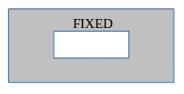
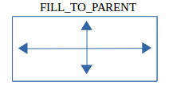
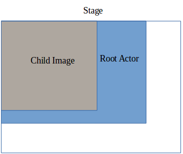

# Layout Management


DALi provides rule-based layout management (size negotiation), which is used to allocate the actor sizes on the stage based on the dependency rules between the actors.

## Dimensions

The notions of width and height are generalized into the concept of a dimension. Several functions take the `Dimension` parameter. The `Dali::Dimension::Type` enum (in [mobile](../../../api/mobile/latest/namespaceDali_1_1Dimension.html#a4e123928ac3109e971b70874653d1b8b) and [wearable](../../../api/wearable/latest/namespaceDali_1_1Dimension.html#a4e123928ac3109e971b70874653d1b8b) applications) specifies the available dimensions as bit fields:

- `Dimension::WIDTH`
- `Dimension::HEIGHT`

If a function can process width and height at the same time, the `Dimension::ALL_DIMENSIONS` mask can be specified.

## Resize Policies

The `Dali::ResizePolicy::Type` enum (in [mobile](../../../api/mobile/latest/namespaceDali_1_1ResizePolicy.html#a8c47ec1e0b9c73e0fa8e40cfdd99276a) and [wearable](../../../api/wearable/latest/namespaceDali_1_1ResizePolicy.html#a8c47ec1e0b9c73e0fa8e40cfdd99276a) applications) specifies a range of options for controlling the way actors resize. These rules enable automatic resizing.

**Table: Resizing rules**

| Resize policy                            | Description                              | Illustration                             |
|------------------------------------------|------------------------------------------|------------------------------------------|
| `ResizePolicy::FIXED`                    | Use this option to maintain a specific size as set by the `SetSize()` function. This is the default for all actors. |  |
| `ResizePolicy::USE_NATURAL_SIZE`         | Use this option for objects, such as images or text, to get their natural size. This can mean the dimensions of an image or the size of text with no wrapping. You can also use this option with table views when the size of the table depends on its children. |  |
| `ResizePolicy::FILL_TO_PARENT`           | The size of the actor is similar to its parent's size with proportionate filling considered. |  |
| `ResizePolicy::SIZE_RELATIVE_TO_PARENT`  | The size of the actor is similar to its parent's size with a relative scale. Use the `SetSizeModeFactor()` function to specify the ratio. |                                          |
| `ResizePolicy::SIZE_FIXED_OFFSET_FROM_PARENT` | The size of the actor is similar to its parent's size with a fixed offset using the `SetSizeModeFactor()` function. |                                          |
| `ResizePolicy::FIT_TO_CHILDREN`          | The size of the actor is scaled around the size of its children. For example, the height of a pop-up can be resized according to its content. |  |
| `ResizePolicy::DIMENSION_DEPENDENCY`     | This option covers rules, such as width-for-height and height-for-width. You can specify that one dimension depends on another. |  |

## Actor Layout Examples

This section describes layout examples with a actor.

### Specifying Size Policies

Actors have different size policies by default. For example, the `Dali::Toolkit::ImageView` is set to `USE_NATURAL_SIZE`. This ensures that an image view uses its natural size by default when it is placed on the stage. However, if the `SetSize()` function is used with sizes other than 0 on the image view, the current resize policy is overridden by the `FIXED` policy and the actor takes the specified size.

You can specify how an actor is size-negotiated using the `SetResizePolicy()` function. You can specify different policies for the different dimensions of width and height to archive different layouts.

The following example shows the `control` with its width set to `ResizePolicy::FILL_TO_PARENT` and its height set to `ResizePolicy::FIT_TO_CHILDREN`. It has the `imageView` added to it with an explicit call to `USE_NATURAL_SIZE` in both dimensions. This creates the `control` that fills the space of its parent in the width dimension and fits its child in the height dimension. As the `imageView` child is using its natural size, the height of the `control` fits the height of the child image.

```
Control control = Control::New();
control.SetAnchorPoint( AnchorPoint::TOP_LEFT );
control.SetBackgroundColor( Color::BLUE );
control.SetResizePolicy( ResizePolicy::FILL_TO_PARENT, Dimension::WIDTH );
control.SetResizePolicy( ResizePolicy::FIT_TO_CHILDREN, Dimension::HEIGHT );
Stage::GetCurrent().Add( control );

ImageView imageView = ImageView::New( MY_IMAGE_PATH );
imageView.SetAnchorPoint( AnchorPoint::TOP_LEFT );
imageView.SetResizePolicy( ResizePolicy::USE_NATURAL_SIZE, Dimension::ALL_DIMENSIONS );
control.Add( imageView );
```

The following figure shows the before and after layouts for this code example.

**Figure: Before and after setting the resize policy**

 

### Adjusting the Negotiated Size

When an actor must maintain the aspect ratio of its natural size, use the `SetSizeScalePolicy()` function with the `Dali::SizeScalePolicy::Type` enum (in [mobile](../../../api/mobile/latest/namespaceDali_1_1SizeScalePolicy.html#affa6f549dbc4400ff47af52b1675a6af) and [wearable](../../../api/wearable/latest/namespaceDali_1_1SizeScalePolicy.html#affa6f549dbc4400ff47af52b1675a6af) applications). This is useful to ensure that images maintain their aspect ratio while still fitting the bounds they have been allocated.

You can use the following resize policies:

- `SizeScalePolicy::USE_SIZE_SET`

  This is the default policy.

- `SizeScalePolicy::FIT_WITH_ASPECT_RATIO`

  Fits the actor within the bounds it has been allocated while maintaining the aspect ratio.

- `SizeScalePolicy::FILL_WITH_ASPECT_RATIO`

  Fills all available space, potentially overflowing its bounds, while maintaining aspect ratio.

### Using Actors in Containers

When using actors in containers, such as a table view, you can specify the padding surrounding the actor with the `SetPadding()` function. The padding specifies the left, right, bottom, and top padding value.

> **Note**  
> Beware of infinite dependency loops!
>
> For example, when the resize policy of a parent actor is set to `ResizePolicy::FIT_TO_CHILDREN` with a child that has a resize policy of `ResizePolicy::FILL_TO_PARENT`, an infinite loop occurs.
>
> Similarly, consider a situation where a parent actor has a width policy of `ResizePolicy::DIMENSION_DEPENDENCY` with a height policy of `ResizePolicy::FIT_TO_CHILDREN`. If the parent has a single child with a height policy `ResizePolicy::DIMENSION_DEPENDENCY` with width, and the child's width policy is `ResizePolicy::FILL_TO_PARENT`, a loop occurs.
>
> Loops can occur over larger spreads of parent-child relationships. These loops are detected by the relayout algorithm, which allocates the actors 0 sizes.

## Related Information
- Dependencies
  - Tizen 2.4 and Higher for Mobile
  - Tizen 3.0 and Higher for Wearable
