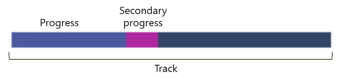

# ProgressBar

The progress bar is a control to give the user an indication of the progress of an operation. The base class for the progress bar control is `Dali::Toolkit::ProgressBar`.

In this tutorial, the following subjects are covered:

[ProgressBar events](#1)<br>
[Creating a ProgressBar](#2)<br>
[ProgressBar Properties](#3)<br>
[Customizing the ProgressBar Appearance](#4)<br>

## Overview

The ProgressBar has two modes to represent the progress.

- **Determinate mode** shows a specific quantity of progress occurred. Use `PROGRESS_VALUE` property to set a specific percentage (number). This is the default mode. If the user has not specified a value, the default is taken as 0.

  **Figure: Determinate progress bar**

  


- **Indeterminate mode** shows the progress without any specific percentage of progress indicated. If you want to indicate an indeterminate progress bar, then set `INDETERMINATE` mode to enabled. You can also show an animation using the `INDETERMINATE_VISUAL_ANIMATION` property.

  **Figure: Indeterminate progress bar**

  

<a name="1"></a>
## ProgressBar events

The following table lists the basic signal provided by the `Dali::Toolkit::ProgressBar` class.

**Table: Dali::Toolkit::ProgressBar input signal**

| Input signal              | Description                                 |
| ------------------------- | ------------------------------------------- |
| `ValueChangedSignal()`    | Emitted when the ProgressBar value changes. |

<a name="2"></a>
## Creating a ProgressBar

The following basic example shows how to create a `Dali::Toolkit::ProgressBar` object:

```
ProgressBar progressBar = ProgressBar::New();
progressBar.SetParentOrigin(ParentOrigin::TOP_CENTER);
progressBar.SetAnchorPoint(AnchorPoint::TOP_CENTER);
progressBar.SetResizePolicy(ResizePolicy::FILL_TO_PARENT, Dimension::WIDTH);
progressBar.SetResizePolicy(ResizePolicy::USE_NATURAL_SIZE, Dimension::HEIGHT);
progressBar.ValueChangedSignal().Connect( this, &ProgressBarExample::OnValueChanged );
Stage::GetCurrent().Add( progressBar );
```

<a name="3"></a>
## ProgressBar Properties

You can modify the progress bar appearance and behavior through its properties.

To change a property from its default value, use the `SetProperty()` function:

```
// Create a timer to update the progress of all progress bars
mTimer = Timer::New( 50 );
mTimer.TickSignal().Connect( this, &ProgressBarExample::OnTimerTick );
mTimer.Start();

...

// To set the values, use SetProperty()
bool OnTimerTick()
{
  mProgressValue += 0.01f; // float
  mSecondaryProgressValue = mProgressValue + 0.1f; // float
  progressBar.SetProperty( ProgressBar::Property::PROGRESS_VALUE, mProgressValue );
  progressBar.SetProperty( ProgressBar::Property::SECONDARY_PROGRESS_VALUE, mSecondaryProgressValue );

  // Only call again if progress has NOT got to the end
  return ( mProgressValue < 1.0f );
}
```

The following table lists the available progress bar properties.

**Table: ProgressBar properties**

| Property                   | Type    | Description                                   |
| -------------------------- | ------- | --------------------------------------------- |
| `PROGRESS_VALUE`           | FLOAT   | Stores the progress value of progress bar. It ranges between 0 and 1. |
| `SECONDARY_PROGRESS_VALUE` | FLOAT   | Stores the secondary progress value of progress bar. It ranges between 0 and 1. |
| `INDETERMINATE`            | BOOLEAN | Sets the progress bar in indeterminate state. |
| `TRACK_VISUAL`             | MAP     | Sets the appearance of the track of progress bar. It is a full progress area which appears behind PROGRESS_VISUAL. |
| `PROGRESS_VISUAL`          | MAP     | Sets the appearance of the progress region of progress bar. The size of the progress visual is changed based on PROGRESS_VALUE. |
| `SECONDARY_PROGRESS_VISUAL` | MAP     | Sets the appearance of the secondary progress region of progress bar. The size of the secondary progress visual is changed based on SECONDARY_PROGRESS_VALUE. |
| `INDETERMINATE_VISUAL`     | MAP     | Sets the appearance of the indeterminate visual of progress bar. |
| `INDETERMINATE_VISUAL_ANIMATION` | MAP or ARRAY | Stores the transition data for indeterminate visual animation. |
| `LABEL_VISUAL`             | MAP     | Stores the label visual of progress bar.      |

<a name="4"></a>
## Customizing the ProgressBar Appearance

The progress bar control has a set of in-built images. These are used as default if you do not specify anything else specifically.

To customize the appearance of the progress bar, you can assign external images using the `Property::Map` class. This also requires you to set the size of the track, a progress region, a secondary progress region, and an indeterminate visual.

The following example shows how to customize the progress bar:

```
// Customize the progress bar
Property::Map trackVisual;
trackVisual["url"] = mImageDirectory + "new-progress-bar-track.9.png"; // Set the track image
progressBar.SetProperty( ProgressBar::Property::TRACK_VISUAL, trackVisual );

Property::Map progressVisual;
progressVisual["url"] = mImageDirectory + "new-progress-bar-progress.9.png"; // Set the progress image
progressBar.SetProperty( ProgressBar::Property::PROGRESS_VISUAL, progressVisual );
```

## Related Information
- Dependencies
  - Tizen 4.0 and Higher for Mobile
  - Tizen 4.0 and Higher for Wearable
