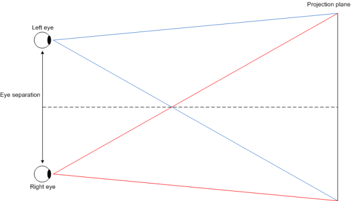
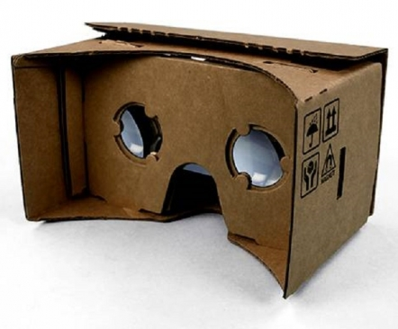

# Rendering and Effects


DALi provides stereoscopic viewing modes, and supports the following viewing modes:

- `MONO`
- `STEREO_HORIZONTAL`
- `STEREO_VERTICAL`

`MONO` is the default viewing mode. When using the `MONO` mode, only 1 image per scene is produced in every update. In this setup, DALi creates a default render task, which renders everything added to the stage root layer, and 1 default camera for that render task.

The `STEREO_HORIZONTAL` and `STEREO_VERTICAL` modes allow the application to produce stereo images. Stereoscopy is a technique for creating or enhancing the illusion of depth in an image. Stereo rendering technique produces 2 images of the scene with an slight offset between them, which is presented to the left and the right eye independently. In this setup, DALi creates 2 additional render tasks, 1 for the right eye and 1 for the left, each with its own camera. Those cameras are parented to the default camera. The method to generate the projection transformation for each camera is known as "parallel axis asymmetric frustum perspective projection" and is illustrated in the following figure.

**Figure: Stereoscopic projection**



The separation between the 2 cameras is configurable but, typically, it ranges between 50 and 70 millimeters. Too large a separation can be hard to resolve and is known as hyperstereo. The convergence plane for both frustums is the 2D plane, so the projection of anything lying in the 2D plane is coincident for both left and right eye, resulting in no parallax. Objects that lie in front of the projection plane appear to be in front of the screen and objects behind the projection plane appear to be "into" the screen. Objects behind the projection plane (positive parallax) are easier to look at without straining the eyes.

To view stereoscopic images correctly, each image must be presented to each eye independently. There are devices on the market for this, such as a head-mounted display, which is a display device worn in the head that has 2 small displays, one for each eye. A cheaper alternative to this often expensive device is the Google cardboard viewer.

**Figure: Google cardboard viewer**



With the Google cardboard viewer or a similar device, you can transform your phone into a basic virtual reality headset.

For more information on DALi rendering and practical examples of rendering shapes and SVG graphics, see [Shape Drawing](rendering-tutorial.md) and [SVG Rendering](svg-rendering.md).

## Stereoscopic Rendering in DALi

The `STEREO_HORIZONTAL` mode presents the left image on the top half of the screen and the right image on the bottom half. It is intended to be used in landscape orientation, so the images are rotated 90 degrees counter-clockwise. The `STEREO_VERTICAL` mode, on the other hand, renders the left image on the left half of the screen and the right image on the right half.

To define the viewing mode to be used, use the `SetViewMode()` function of the `Application` class, passing the mode as a parameter. You can query the view mode being used by calling the `GetViewMode()` function. To define the separation between the left and right cameras, use the `SetStereoBase()` function, passing the distance in millimeters as a parameter. This distance can be queried using the `GetStereoBase()` function. You can also set the viewing mode and offset at initialization time using 2 command line arguments for this purpose: `-view-mode` (or `-v`) and `0` for `MONO`, `1` for `STEREO_HORIZONTAL`, `2` for `STEREO_VERTICAL`, and `-stereo-base` (or `-s`) and the separation in millimeters.

## Restrictions

There are certain restrictions when writing stereoscopic applications using DALi:

- When a stereo mode is selected, the default render task source actor is set to an uninitialized actor so it does not render anything. Changing the default render task source actor later produces undesired results, as the user does not want to see anything rendered by the default camera when stereo mode is on.

- Stereo cameras are parented to the default camera, so if the application needs to change the camera position or orientation, it must change the default camera transformation. The handle to the default camera can be obtained from the default render task as follows:

  ```
  Dali::RenderTask defaultRenderTask = Dali::Stage::GetCurrent().GetRenderTaskList().GetTask( 0 );
  Dali::CameraActor defaultCamera = defaultRenderTask.GetCameraActor();
  ```

- Stereo render tasks render everything added to the stage's root layer. If the application must render an object hierarchy to an off-screen buffer, it must set the exclusive flag on that render task so that the stereo tasks do not render that particular subtree. To set the exclusive flag in a render task, use the `SetExclusive()` function defined in the render task.

> **Note**  
> DALi stereoscopic viewing mode is still under development, and may not be mature enough for commercialized applications at the moment. For example, distortion correction is not supported yet. Tizen continues to improve the stereoscopic mode to give you a chance to provide a more exciting and immersive user experience to your customers.

## Related Information
- Dependencies
  - Tizen 2.4 and Higher for Mobile
  - Tizen 3.0 and Higher for Wearable
