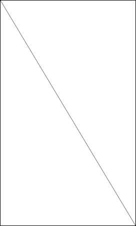

# Shape Drawing


DALi offers a low-level rendering API. Do not use it for building user interfaces - DALi UI controls must be used instead. For example, if you need to display an icon, you can do it using the rendering API, but it requires a lot more effort than simply creating an ImageView UI control.

This topic shows how to use the rendering API through examples that draw a line, triangle, and cube.

## Drawing a Line

To draw a line with the renderer API:

1. Create the shader source code:

   1. You must create a shader suitable for drawing lines. The vector (x,y) position for each point on the line is passed using the `aPosition` attribute. The vertex shader transforms this to match the size and position of an actor.

      ```
      const char* VERTEX_SHADER = DALI_COMPOSE_SHADER(
        attribute mediump vec2 aPosition;
        uniform mediump mat4 uMvpMatrix;
        uniform mediump vec3 uSize;
        void main()
        {
          mediump vec4 vertexPosition = vec4( aPosition, 0.0, 1.0 );
          vertexPosition.xyz *= uSize;
          gl_Position = uMvpMatrix * vertexPosition;
        }
      );
      ```

   2. The fragment shader applies the actor's color:

      ```
      const char* FRAGMENT_SHADER = DALI_COMPOSE_SHADER(
        uniform lowp vec4 uColor;
        void main()
        {
          gl_FragColor = uColor;
        }
      );
      ```

2. Create geometry.

   Specify a vertex format matching the shader attributes: the format is specified using a list of string/value pairs in a `Property::Map`. The vertex format and data (in this case 2 points) are stored in a `PropertyBuffer`. Finally, a `LINES`-type `Geometry` object is created.

   ```
   Property::Map vertexFormat;
   vertexFormat["aPosition"] = Property::VECTOR2;
   PropertyBuffer vertices = PropertyBuffer::New( vertexFormat );

   struct Vertex { Vector2 position1; };
   Vertex vertexData[2] =
   {
     { Vector2(  0.5f, 0.5f) },
     { Vector2( -0.5f, -0.5f) }
   };
   const unsigned short INDEX_LINES[] = { 0, 1 };
   vertices.SetData( vertexData, 2 );

   Geometry geometry = Geometry::New();
   geometry.AddVertexBuffer( vertices );
   geometry.SetIndexBuffer( &INDEX_LINES[0], sizeof(INDEX_LINES)/sizeof(INDEX_LINES[0]) );
   geometry.SetType( Geometry::LINES );
   ```

3. Create a renderer.

   You can create a renderer with the shader source and geometry. In order to position the renderer on-screen, it must be added to an actor which must be placed on the stage.

   ```
   Shader shader = Shader::New( VERTEX_SHADER, FRAGMENT_SHADER );
   Renderer renderer = Renderer::New( geometry, shader );

   Stage stage = Stage::GetCurrent();
   stage.SetBackgroundColor( Color::WHITE );

   Actor actor = Actor::New();
   actor.SetSize( stage.GetSize() );
   actor.SetParentOrigin( ParentOrigin::CENTER );
   actor.SetAnchorPoint( AnchorPoint::CENTER );
   actor.SetColor( Color::BLACK );
   actor.AddRenderer( renderer );
   stage.Add( actor );
   ```

   In this example, the line is rendered from one corner of the screen to the other.

   

## Drawing a Triangle

To draw a triangle, use the same shader and renderer set-up as in the previous "Drawing a Line" example, and simply modify the geometry to draw the triangle:

```
Vertex vertexData[3] =
{
  { Vector2(  0.45f, 0.45f) },
  { Vector2( -0.45f, 0.45f) },
  { Vector2(  0.0f, -0.45f) }
};
const unsigned short INDEX_TRIANGLES[] = { 0, 1, 2 };
vertices.SetData( vertexData, 3 );

Geometry geometry = Geometry::New();
geometry.AddVertexBuffer( vertices );
geometry.SetIndexBuffer( &INDEX_TRIANGLES[0], sizeof(INDEX_TRIANGLES)/sizeof(INDEX_TRIANGLES[0]) );
geometry.SetType( Geometry::TRIANGLES );
```

You can also call the `Actor::SetColor(Color::RED)` function to get a more colorful end result, as shown in the following figure.

**Figure: Triangle**


## Drawing a Cube

To draw a colored cube, you need a slightly more complicated shader and geometry format:

1. Create the shader source code:

   1. The `aPosition` attribute must be changed to `vec3`, since the cube has 3 dimensions:

      ```
      const char* VERTEX_SHADER = DALI_COMPOSE_SHADER(
        attribute mediump vec3 aPosition;
        attribute mediump vec3 aColor;
        uniform mediump mat4 uMvpMatrix;
        uniform mediump vec3 uSize;
        varying mediump vec4 vColor;
        void main()
        {
          mediump vec4 vertexPosition = vec4( aPosition, 1.0 );
          vertexPosition.xyz *= uSize;
          gl_Position = uMvpMatrix * vertexPosition;
          vColor = vec4( aColor, 1.0 );
        }
      );
      ```

   2. Each face of the cube is given a different color using the `vColor` varying:

      ```
      const char* FRAGMENT_SHADER = DALI_COMPOSE_SHADER(
        varying mediump vec4 vColor;
        void main()
        {
          gl_FragColor = vColor;
        }
      );
      ```

2. Create the cube geometry.

   The vertex format is extended to match the shader. Each of the 6 cube faces requires 4 vertices (24 in total). Each vertex consists of a `vec3` and RGB color component.

   ```
   Property::Map vertexFormat;
   vertexFormat["aPosition"] = Property::VECTOR3;
   vertexFormat["aColor"] = Property::VECTOR3;
   PropertyBuffer vertices = PropertyBuffer::New( vertexFormat );

   struct Vertex
   {
     Vector3 position;
     Vector3 color;
   };

   Vertex vertexData[24] =
   {
     { Vector3( -0.5, -0.5,  0.5 ), Vector3( 1.0, 0.0, 0.0 ) },
     { Vector3(  0.5, -0.5,  0.5 ), Vector3( 1.0, 0.0, 0.0 ) },
     { Vector3( -0.5,  0.5,  0.5 ), Vector3( 1.0, 0.0, 0.0 ) },
     { Vector3(  0.5,  0.5,  0.5 ), Vector3( 1.0, 0.0, 0.0 ) },
     { Vector3( -0.5, -0.5, -0.5 ), Vector3( 0.0, 1.0, 0.0 ) },
     { Vector3(  0.5, -0.5, -0.5 ), Vector3( 0.0, 1.0, 0.0 ) },
     { Vector3( -0.5,  0.5, -0.5 ), Vector3( 0.0, 1.0, 0.0 ) },
     { Vector3(  0.5,  0.5, -0.5 ), Vector3( 0.0, 1.0, 0.0 ) },
     { Vector3( -0.5, -0.5, -0.5 ), Vector3( 0.0, 0.0, 1.0 ) },
     { Vector3(  0.5, -0.5, -0.5 ), Vector3( 0.0, 0.0, 1.0 ) },
     { Vector3( -0.5, -0.5,  0.5 ), Vector3( 0.0, 0.0, 1.0 ) },
     { Vector3(  0.5, -0.5,  0.5 ), Vector3( 0.0, 0.0, 1.0 ) },
     { Vector3( -0.5,  0.5, -0.5 ), Vector3( 1.0, 1.0, 0.0 ) },
     { Vector3(  0.5,  0.5, -0.5 ), Vector3( 1.0, 1.0, 0.0 ) },
     { Vector3( -0.5,  0.5,  0.5 ), Vector3( 1.0, 1.0, 0.0 ) },
     { Vector3(  0.5,  0.5,  0.5 ), Vector3( 1.0, 1.0, 0.0 ) },
     { Vector3( -0.5, -0.5, -0.5 ), Vector3( 1.0, 0.0, 1.0 ) },
     { Vector3( -0.5,  0.5, -0.5 ), Vector3( 1.0, 0.0, 1.0 ) },
     { Vector3( -0.5, -0.5,  0.5 ), Vector3( 1.0, 0.0, 1.0 ) },
     { Vector3( -0.5,  0.5,  0.5 ), Vector3( 1.0, 0.0, 1.0 ) },
     { Vector3(  0.5, -0.5, -0.5 ), Vector3( 0.0, 1.0, 1.0 ) },
     { Vector3(  0.5,  0.5, -0.5 ), Vector3( 0.0, 1.0, 1.0 ) },
     { Vector3(  0.5, -0.5,  0.5 ), Vector3( 0.0, 1.0, 1.0 ) },
     { Vector3(  0.5,  0.5,  0.5 ), Vector3( 0.0, 1.0, 1.0 ) },
   };

   const unsigned short INDEX_CUBE[] = { 0,  2,  3,  0,  3,  1,
                                         5,  7,  6,  5,  6,  4,
                                         8, 10, 11,  8, 11,  9,
                                         14, 12, 13, 14, 13, 15,
                                         16, 17, 19, 16, 19, 18,
                                         22, 23, 21, 22, 21, 20 };

   vertices.SetData( vertexData, 24 );

   Geometry geometry = Geometry::New();
   geometry.AddVertexBuffer( vertices );
   geometry.SetIndexBuffer( &INDEX_CUBE[0], sizeof(INDEX_CUBE)/sizeof(INDEX_CUBE[0]) );
   geometry.SetType( Geometry::TRIANGLES );
   ```

3. Create a renderer.

   There is no `SetColor()` function needed for the actor, since you are not using the `uColor` uniform. Face culling is enabled to hide the backward facing sides of the cube.

   ```
   Shader shader = Shader::New( VERTEX_SHADER, FRAGMENT_SHADER );
   Renderer renderer = Renderer::New( geometry, shader );
   renderer.SetProperty( Renderer::Property::FACE_CULLING_MODE, FaceCullingMode::BACK );

   Actor actor = Actor::New();
   float length = stage.GetSize().width * 0.5f;
   actor.SetSize( length, length, length );
   actor.SetParentOrigin( ParentOrigin::CENTER );
   actor.AddRenderer( renderer );
   stage.Add( actor );

   mAnimation = Animation::New( 10.0f );
   mAnimation.AnimateTo( Property( actor, Actor::Property::ORIENTATION ), Quaternion( Radian( Degree( 180 ) ), Vector3::ZAXIS ) );
   mAnimation.AnimateTo( Property( actor, Actor::Property::ORIENTATION ), Quaternion( Radian( Degree( 180 ) ), Vector3::YAXIS ) );
   mAnimation.Play();
   ```

   The following figure shows the running animation.

   

## Related Information
- Dependencies
  - Tizen 3.0 and Higher for Mobile
  - Tizen 3.0 and Higher for Wearable
