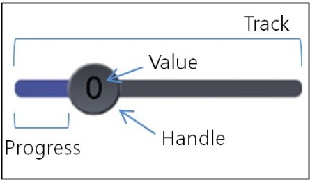

# Slider


The slider is a control used to indicate a value within a specific range. The user can drag a handle left or right to set the current value between a specified minimum and maximum. The base class for the slider control is `Dali::Toolkit::Slider`.

**Figure: Slider**



In this tutorial, the following subjects are covered:

[Slider events](#1)<br>
[Creating a Slider](#2)<br>
[Slider Properties](#3)<br>
[Customizing the Slider Appearance](#4)<br>

## Overview

The slider has 2 important elements:

- The handle is the indicator sliding within the range.

  You can draw the handle using the `HANDLE_VISUAL` property.

- The track is the bar along which the handle moves.

  The slider draws the track using 2 distinct images. The region between the start of the track and the handle is the progress region, and you can draw it using the `PROGRESS_VISUAL` property. The region between the handle and the end of the track is drawn using the `TRACK_VISUAL` property.

<a name="1"></a>
## Slider events

The following table lists the basic signals provided by the `Dali::Toolkit::Slider` class.

**Table: Dali::Toolkit::Slider input signals**

| Input signal              | Description                              |
|---------------------------|------------------------------------------|
| `ValueChangedSignal()`    | Emitted when the slider value changes.   |
| `SlidingFinishedSignal()` | Emitted when the sliding is finished.    |
| `MarkReachedSignal()`     | Emitted when the slider handle reaches a mark. |

<a name="2"></a>
## Creating a Slider

The following basic example shows how to create a `Dali::Toolkit::Slider` object:

```
Slider slider = Slider::New();
slider.SetSize( mStageWidth, mStageHeight * 0.2 );
slider.SetAnchorPoint( AnchorPoint::TOP_LEFT );
slider.SetPosition( 0.0f, mStageHeight * 0.1 );
Stage::GetCurrent().Add( slider );
```

<a name="3"></a>
## Slider Properties

You can modify the slider appearance and behavior through its properties.

To change a property from its default value, use the `SetProperty()` function:

```
// To set the basic values, use SetProperty()
slider.SetProperty( Slider::Property::LOWER_BOUND, 0.0f );
slider.SetProperty( Slider::Property::UPPER_BOUND, 3.0f );
slider.SetProperty( Slider::Property::VALUE, 0.5f );
slider.SetProperty( Slider::Property::SHOW_POPUP, true );
```

The following table lists the available slider properties.

**Table: Slider properties**

| Property             | Type    | Description                              |
| -------------------- | ------- | ---------------------------------------- |
| `LOWER_BOUND`        | FLOAT   | Minimum value of the track               |
| `UPPER_BOUND`        | FLOAT   | Maximum value of the track               |
| `VALUE`              | FLOAT   | Initial value of the slider              |
| `TRACK_VISUAL`       | MAP     | Appearance of the track between the handle and the end of the track |
| `HANDLE_VISUAL`      | MAP     | Appearance of the handle                 |
| `PROGRESS_VISUAL`    | MAP     | Appearance of the progress region of the track |
| `POPUP_VISUAL`       | MAP     | Appearance of the slider pop-up          |
| `POPUP_ARROW_VISUAL` | MAP     | Appearance of the pop-up arrow           |
| `DISABLED_COLOR`     | VECTOR4 | Color when the slider is disabled        |
| `VALUE_PRECISION`    | INTEGER | Precision of the floating point of the value |
| `SHOW_POPUP`         | BOOLEAN | Whether the slider shows pop-up          |
| `SHOW_VALUE`         | BOOLEAN | Whether the slider shows the value       |
| `MARKS`              | ARRAY   | Array of the marks                       |
| `SNAP_TO_MARKS`      | BOOLEAN | Whether the handle snaps to the marks    |
| `MARK_TOLERANCE`     | FLOAT   | Percentage of the slider width for which snapping to the marks occur |

<a name="4"></a>
## Customizing the Slider Appearance

The slider provides a set of default images, which are used automatically if you do not specify anything else.

If you want to customize the slider appearance, you can assign your own images using the `Property::Map` class. You can set the size and image of the track, handle, progress region, popup, and popup arrow.

The following example shows how to customize the handle:

```
// Customize the slider handle
Property::Map handleVisual;
handleVisual["size"] = Vector2( 120.0f, 120.0f ); // Set the handle size
handleVisual["url"] = mImageDirectory + "handle_img.png"; // Set the handle image
slider.SetProperty( Slider::Property::HANDLE_VISUAL, handleVisual );
```

## Related Information
- Dependencies
  - Tizen 3.0 and Higher for Mobile
  - Tizen 3.0 and Higher for Wearable
