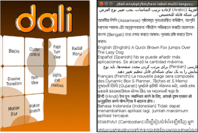
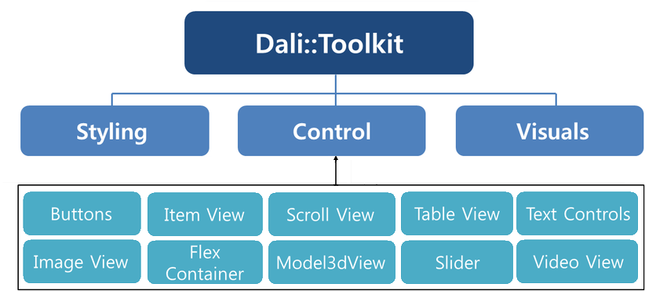

# UI Components

UI components are interactive components for layouting and scrolling the user interface. DALi provides UI components, such as buttons, item view, scroll view, table view, text controls, image view, flex container, model3dview, slider, and video view.

**Figure: DALi UI components**

The following table lists the available UI components.

**Table: DALi UI components**

| Control                           | Description                              | Related classes                          |
|-----------------------------------|----------------------------------------|----------------------------------------|
| [Buttons](buttons.md)             | A **push button** that can be pressed. A **check box button** that can be selected or cleared. A **radio button** that only one option can be selected. | `Button`, `PushButton`, `CheckBoxButton`, `RadioButton` |
| [FlexContainer](flexcontainer.md) | A layout model that allows responsive elements within a container, to automatically arrange the elements to different screen sizes or devices. | `FlexContainer`              |
| [ImageView](imageview.md)         | An image view to render an image.      | `ImageView`                              |
| [ItemView](itemview.md)           | An item view to enable render item sets in a scrollable layout. | `ItemView`, `ItemFactory`, `ItemLayout`, `Scrollable` |
| [Model3dView](model3dview.md)     | A model view to enable static 3D content display capability. | `Model3dView`                            |
| [ProgressBar](progressbar.md)     | A progress bar to give the user a recursive update on the progress of an ongoing operation. | `ProgressBar`                             |
| [ScrollView](scrollview.md)       | A scroll view to enable the scrollable function in the UI. | `ScrollView`, `Scrollable`, `ScrollViewEffect`, `ScrollViewPagePathEffect` |
| [Slider](slider.md)               | A slider to select a value within a predefined range. | `Slider`                                 |
| [TableView](tableview.md)         | A table view to enable align child actors in a grid like layout. | `TableView`                              |
| [TextLabel](textlabel.md)         | A text label to enable render a short text string. | `TextLabel`                              |
| [TextField](textfield.md)         | A text field to enable a field for a single-line of editable text. | `TextField`                              |
| [TextEditor](texteditor.md)       | A text field to enable a field for multiple lines of editable text. | `TextEditor`                             |
| [VideoView](videoview.md)         | A video view to enable control and display video playback. | `VideoView`                              |

The base class for the components is `Dali::Toolkit::Control` (in [mobile](../../../api/mobile/latest/classDali_1_1Toolkit_1_1Control.html) and [wearable](../../../api/wearable/latest/classDali_1_1Toolkit_1_1Control.html) applications). It can also be used to create your own custom UI components.

For more information of control class, see [Control](control-base.md). In this UI Components guide, both the terms **control** and **component** are used to refer to a UI component.

You can [customize the look of the UI components with stylesheets](styling.md). For a reusable rendering logic that can be used by all UI components, take advantage of [DALi visuals](visuals.md).

The following figure illustrates the hierarchy of the UI components.

**Figure: DALi UI component hierarchy**

## Related Information
- Dependencies
  - Tizen 2.4 and Higher for Mobile
  - Tizen 3.0 and Higher for Wearable
