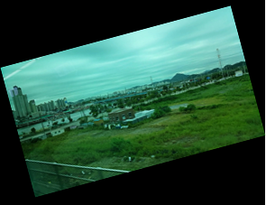

# VideoView


The `Dali::Toolkit::VideoView` is a control for video playback and display. It provides minimum functions for playback (play, pause, stop, forward, and backward). Some options, such as volume, can be controlled through the control properties. For the VideoView to work, a video plugin is needed. The Tizen 3.0 platform includes the required Dali video plugin.

**Figure: VideoView**



> **Note**  
> The VideoView control does not use any privileges APIs on its own. However, if you use video files in a specific device storage, the application can require privileges to access the storage. For more information, see the Player API Reference (in [mobile](../../../api/mobile/latest/group__CAPI__MEDIA__PLAYER__MODULE.html) and [wearable](../../../api/wearable/latest/group__CAPI__MEDIA__PLAYER__MODULE.html) applications).    

In this tutorial, the following subjects are covered:

[VideoView events](#1)<br>
[Creating a VideoView](#2)<br>
[VideoView Properties](#3)<br>

<a name="1"></a>
## VideoView events

The following table lists the basic signal provided by the `Dali::Toolkit::VideoView` class.

**Table: Dali::Toolkit::VideoView input signals**

| Input signal        | Description                                 |
|-------------------|-------------------------------------------|
| `FinishedSignal()`  | Emitted when a video playback is finished.  |

The `VideoView` class provides the `FinishedSignal()`, which is emitted when the video playback is finished. The related callback can support some basic actions.

```
void Create( Application& application )
{
  mView.FinishedSignal().Connect( this, &VideoViewController::OnFinished );
}

void OnFinished( VideoView& view )
{
  mFinished = true;
}
```

<a name="2"></a>
## Creating a VideoView

The following basic example shows how to create a `Dali::Toolkit::VideoView` object:

```
class VideoViewController: public ConnectionTracker
{
  public:
    VideoViewController( Application& application )
      : mApplication( application )
    {
      mApplication.InitSignal().Connect( this, &VideoViewController::Create );
    }

    void Create( Application& application )
    {
      // Set the handle
      mView = Toolkit::VideoView::New( "videofile.mp4" );
      Stage::GetCurrent().Add( mView );
      mView.SetParentOrigin( ParentOrigin::CENTER );
      mView.SetAnchorPoint( AnchorPoint::CENTER );
      mView.SetResizePolicy( ResizePolicy::USE_NATURAL_SIZE, Dimension::ALL_DIMENSIONS );
      mView.SetSize( WIDTH, HEIGHT );
      mView.Play();
    }

  private:
    Application& mApplication;
    VideoView mView;
}
```

> **Note**  
> You can set the video file to be played in the `VideoView::New()` function, or by modifying `VIDEO` property with `SetProperty( VideoView::Property::VIDEO, "videofile2.mp4" )`.

<a name="3"></a>
## VideoView Properties

You can modify the `VideoView` appearance and behavior through its properties.

The following table lists the available `VideoView` properties.

**Table: VideoView properties**

| Property   | Type          | Description                              |
|----------|-------------|----------------------------------------|
| `VIDEO`    | STRING or MAP | Video file URL string. This property can also provide additional features, such as a custom shader, by `Property::Map`. |
| `LOOPING`  | BOOLEAN       | Whether the playback loops               |
| `MUTED`    | BOOLEAN       | Whether the playback is muted            |
| `VOLUME`   | MAP           | Playback volume. The `Property::Map` must get left and right volume scalar as a float type. |
| `UNDERLAY` | BOOLEAN       | Video rendering by underlay              |

To change a property from its default value, use the `SetProperty()` function:

```
Property::Map oldMap;
Property::Value value = mView.GetProperty( VideoView::Property::VOLUME );
Value.Get( oldMap );

Property::Map newMap;
newMap.Insert( "volumeLeft", 1.0f );
newMap.Insert( "volumeRight", 0.5f );
mView.SetProperty( VideoView::Property::VOLUME, newMap );
```

## Related Information
- Dependencies
  - Tizen 3.0 and Higher for Mobile
  - Tizen 3.0 and Higher for Wearable
