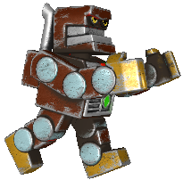
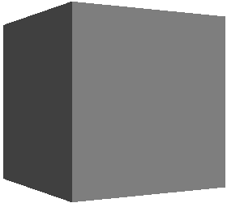
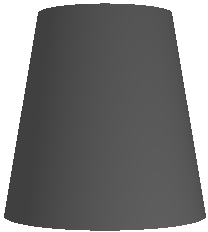
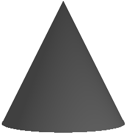
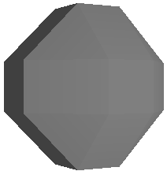
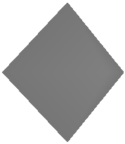

# Visuals


You can create a reusable rendering logic, which can be used by all controls, by using DALi visuals. Visuals are the main building block for controls. The `Dali::Toolkit::Visual` instance (in [mobile](../../../api/mobile/latest/namespaceDali_1_1Toolkit_1_1Visual.html) and [wearable](../../../api/wearable/latest/namespaceDali_1_1Toolkit_1_1Visual.html) applications) is used to display renderer content.

## Overview
DALi provides the following visuals:

- [Color](visuals.md#color)
- [Gradient](visuals.md#gradient)
- [Image](visuals.md#image)
- [N-Patch](visuals.md#n-patch)
- [SVG](visuals.md#svg)
- [Animated Image](visuals.md#animated-image)
- [Mesh](visuals.md#mesh)
- [Primitive](visuals.md#primitive)
- [Text](visuals.md#text)
- [Border](visuals.md#border)
- [Wireframe](visuals.md#wireframe)

The controls can provide properties that allow you to specify the visual type (`visualType`). You set visual properties through a property map. The `visualType` field in the property map specifies the visual to use or create. The visual type is required to avoid ambiguity as multiple visuals can be capable of rendering the same content.

The `Control::Property::BACKGROUND` is an example of a property which takes in a property map to create a visual.

Existing controls can be supplied with Visuals, and the visuals are defined with a Property Map and this map passes to the control.
The control parses this Property Map and creates the actual Visual.

The `Dali::Toolit::ImageView` control is a good example of this.
The image can be set with a property map or an url.

```
ImageView imageView = ImageView:New();

imageView.SetProperty( ImageView::Property::IMAGE,
                       Property::Map().Add( ImageVisual::Property::URL, "./images/apple.svg" )
                                      .Add( ImageVisual::Property::ATLASING, false  ) );
```

or

```
ImageView imageView = ImageView:New();

imageView.SetProperty( ImageView::Property::IMAGE, "./images/apple.svg" );
```

Visuals have common properties and specific ones.
Using the Property Map, Properties can be applied to the Image (ImageVisual).
In the second example with the url being passed in directly, the ImageView will internally create a Visual.

### Visual Depth Index

The 'depth index' is the draw order for visuals within a control.
Depth index increases automatically for each added visual.
The last registered visual is always on top.

<a name="color"></a>
## Color Visual

The color visual renders a solid color to the visual's quad geometry.

**Figure: Color visual**


The following table lists the supported properties. The visual type is `Visual::COLOR` or `"COLOR"`.

**Table: Image visual properties**

| Property                           | String     | Type    | Required | Description                  |
|------------------------------------|------------|---------|----------|------------------------------|
| `ColorVisual::Property::MIX_COLOR` | `mixColor` | VECTOR4 | Yes      | The solid color is required. |

**Usage:**

```
Dali::Toolkit::Control control = Dali::Toolkit::Control::New();
PropertyMap colorVisualMap;
colorVisualMap.Add( Visual::Property::TYPE,  Visual::Color ))
              .Add( ColorVisual::Property::MIX_COLOR, Color::RED );
control.SetProperty( Control::Property::BACKGROUND, colorVisualMap );
```

<a name="gradient"></a>
## Gradient Visual

The gradient visual renders a smooth transition of colors to the visual's quad. Both linear (left in the following figure) and radial (right in the following figure) gradients are supported.

**Figure: Gradient visual**

 

The following table lists the supported properties. The visual type is `Visual::GRADIENT` or `"GRADIENT"`.

**Table: Gradient visual properties**

| Property                                 | String          | Type              | Required        | Description                              |
|------------------------------------------|-----------------|-------------------|-----------------|------------------------------------------|
| `GradientVisual::Property::START_POSITION` | `startPosition` | VECTOR2           | For linear only | The start position of the linear gradient. |
| `GradientVisual::Property::END_POSITION` | `endPosition`   | VECTOR2           | For linear only | The end position of the linear gradient. |
| `GradientVisual::Property::CENTER`       | `center`        | VECTOR2           | For radial only | The center point of the radial gradient. |
| `GradientVisual::Property::RADIUS`       | `radius`        | FLOAT             | For radial only | The size of the radius.                  |
| `GradientVisual::Property::STOP_OFFSET`  | `stopOffset`    | ARRAY of FLOAT    | No              | All the stop offsets. If not supplied, the default is 0.0 and 1.0. |
| `GradientVisual::Property::STOP_COLOR`   | `stopColor`     | ARRAY of FLOAT    | Yes             | The color at the stop offsets. At least 2 are required to show a gradient. |
| `GradientVisual::Property::UNITS`        | `units`         | INTEGER or STRING | No              | The coordinate system.                   |
| `GradientVisual::Property::SPREAD_METHOD`| `spreadMethod`  | INTEGER or STRING | No              | Indicates what happens if a gradient starts or ends inside bounds. |

If the `GradientVisual::Property::STOP_OFFSET` and `GradientVisual::Property::STOP_COLOR` arrays do not have the same number of elements, the minimum of the 2 is used as the stop points.

### Units
The `GradientVisual::Property::UNITS` are used to define the coordinate system for the attributes:
- Start (x1, y1) and end (x2 and y2) points of a line, if using a linear gradient.
- Center point (cx, cy) and radius (r) of a circle, if using a radial gradient.

**Table: Unit values**

  | Enumeration                              | String                | Description                              |
  |------------------------------------------|-----------------------|------------------------------------------|
  | `GradientVisual::Units::OBJECT_BOUNDING_BOX` | `OBJECT_BOUNDING_BOX` | Default. Uses the normals for the start, end, and center points, so that the top-left is (-0.5, -0.5) and bottom-right is (0.5, 0.5). |
  | `GradientVisual::Units::USER_SPACE`      | `USER_SPACE`          | Uses the user coordinates for the start, end, and center points, so that in a 200 by 200 control, top-left is (0, 0) and bottom-right is (200, 200). |

### Spread Method
The `GradientVisual::Property::SPREAD_METHOD` indicates what happens if the gradient starts or ends inside the bounds of the target rectangle.

**Table: Spread method values**

  | Enumeration                             | String    | Description                              |
  |-----------------------------------------|-----------|------------------------------------------|
  | `GradientVisual::SpreadMethod::PAD`     | `PAD`     | Default. Uses the terminal colors of the gradient to fill the remainder of the quad. |
  | `GradientVisual::SpreadMethod::REFLECT` | `REFLECT` | Reflects the gradient pattern start-to-end, end-to-start, start-to-end, and so on, until the quad is filled. |
  | `GradientVisual::SpreadMethod::REPEAT`  | `REPEAT`  | Repeats the gradient pattern start-to-end, start-to-end, start-to-end, and so on, until the quad is filled. |

  ​           

 The gradient type is determined by the properties specified in the property map; for example, if both `START_POSITION` and `END_POSITION` are given, a linear gradient is shown, and if both `CENTER` and `RADIUS` are given, a radial gradient is shown.

**Usage:**

```
// Linear
Dali::Toolkit::Control control = Dali::Toolkit::Control::New();
Dali::Property::Map map;
map[Visual::Property::TYPE] = Dali::Toolkit::Visual::GRADIENT;
map[GradientVisual::Property::START_POSITION] = Vector2( 0.5f, 0.5f );
map[GradientVisual::Property::END_POSITION] = Vector2( -0.5f, -0.5f );
Dali::Property::Array stopOffsets;
stopOffsets.PushBack( 0.0f );
stopOffsets.PushBack( 0.3f );
stopOffsets.PushBack( 0.6f );
stopOffsets.PushBack( 0.8f );
stopOffsets.PushBack( 1.f );
map[GradientVisual::Property::STOP_OFFSET] = stopOffsets;

Dali::Property::Array stopColors;
stopColors.PushBack( Vector4( 129.f, 198.f, 193.f, 255.f )/255.f );
stopColors.PushBack( Vector4( 196.f, 198.f, 71.f, 122.f )/255.f );
stopColors.PushBack( Vector4( 214.f, 37.f, 139.f, 191.f )/255.f );
stopColors.PushBack( Vector4( 129.f, 198.f, 193.f, 150.f )/255.f );
stopColors.PushBack( Color::YELLOW );
map[GradientVisual::Property::STOP_COLOR] = stopColors;

control.SetProperty( Control::Property::BACKGROUND, map );
```

```
// Radial
Dali::Toolkit::Control control = Dali::Toolkit::Control::New();
Dali::Property::Map map;
map[Visual::Property::TYPE] = Dali::Toolkit::Visual::GRADIENT;
map[GradientVisual::Property::CENTER] = Vector2( 0.5f, 0.5f );
map[GradientVisual::Property::RADIUS] = 1.414f;
Dali::Property::Array stopOffsets;
stopOffsets.PushBack( 0.0f );
stopOffsets.PushBack( 0.3f );
stopOffsets.PushBack( 0.6f );
stopOffsets.PushBack( 0.8f );
stopOffsets.PushBack( 1.f );
map[GradientVisual::Property::STOP_OFFSET] = stopOffsets;

Dali::Property::Array stopColors;
stopColors.PushBack( Vector4( 129.f, 198.f, 193.f, 255.f )/255.f );
stopColors.PushBack( Vector4( 196.f, 198.f, 71.f, 122.f )/255.f );
stopColors.PushBack( Vector4( 214.f, 37.f, 139.f, 191.f )/255.f );
stopColors.PushBack( Vector4( 129.f, 198.f, 193.f, 150.f )/255.f );
stopColors.PushBack( Color::YELLOW );
map[GradientVisual::Property::STOP_COLOR] = stopColors;

control.SetProperty( Control::Property::BACKGROUND, map );
```

<a name="image"></a>
## Image Visual

The image visual renders an image into the visual's geometry. Depending on the extension of the image, a different visual is provided to render the image onto the screen:

- Normal (Quad)
- N-Patch
- SVG
- Animated Image

### Normal Image

The normal image visual renders a raster image (`.jpg`, `.png` etc.) into the visual's quad geometry.

**Figure: Normal image visual**


The following table lists the supported properties. The visual type is `Visual::IMAGE` or `"IMAGE"`.

**Table: Normal image visual properties**

| Property                                | String          | Type              | Required | Description                              |
|-----------------------------------------|-----------------|-------------------|----------|------------------------------------------|
| `ImageVisual::Property::URL`            | `url`           | STRING            | Yes      | The URL of the image.                    |
| `ImageVisual::Property::FITTING_MODE`   | `fittingMode`   | INTEGER or STRING | No       | Fitting options, used when resizing images to fit the desired dimensions. |
| `ImageVisual::Property::SAMPLING_MODE`  | `samplingMode`  | INTEGER or STRING | No       | Filtering options, used when resizing images to the sample original pixels. |
| `ImageVisual::Property::DESIRED_WIDTH`  | `desiredWidth`  | INTEGER           | No       | The desired image width. Actual image width is used, if not specified. |
| `ImageVisual::Property::DESIRED_HEIGHT` | `desiredHeight` | INTEGER           | No       | The desired image height. Actual image height is used, if not specified. |
| `ImageVisual::Property::PIXEL_AREA`     | `pixelArea`     | VECTOR4           | No       | The image area to be displayed, default value is [0.0, 0.0, 1.0, 1.0] |
| `ImageVisual::Property::WRAP_MODE_U`    | `wrapModeU`     | INTEGER or STRING | No       | Wrap mode for u coordinate.              |
| `ImageVisual::Property::WRAP_MODE_V`    | `wrapModeV`     | INTEGER or STRING | No       | Wrap mode for v coordinate.              |
| `ImageVisual::Property::ATLASING`       | `atlasing`      | BOOLEAN           | No       | Whether to use the texture Atlas, Default TRUE. |
| `ImageVisual::Property::ALPHA_MASK_URL` | `alphaMaskUrl`  |	STRING            | No       | URL of image to apply as a mask after image loading. |
| `ImageVisual::Property::MASK_CONTENT_SCALE` | `maskContentScale` | FLOAT           | No       | The scale factor to apply to the content before masking. |
| `ImageVisual::Property::CROP_TO_MASK`   | `cropToMask`    |	BOOLEAN           | No       | If the image should be cropped to match the mask size. |

**Usage:**

```
Dali::Toolkit::Control control = Dali::Toolkit::Control::New();
Dali::Property::Map map;
map[Visual::Property::TYPE] = Dali::Toolkit::Visual::IMAGE;
map[ImageVisual::Property::URL] = "path-to-image.jpg";
control.SetProperty( Control::Property::BACKGROUND, map );
```

<a name="n-patch"></a>
## N-Patch Image

The n-patch image visual renders an n-patch or a 9-patch image. Uses non-quad geometry.
Both geometry and texture are cached to reduce memory consumption if the same n-patch image is used elsewhere.

**Figure: N-patch image visual**


The following table lists the supported properties. The visual type is `Visual::N_PATCH`.

**Table: N-patch image visual properties**

| Property                             | String       | Type    | Required | Description                        |
|--------------------------------------|--------------|---------|----------|------------------------------------|
| `ImageVisual::Property::URL`         | `url`        | STRING  | Yes      | The URL of the n-patch image.      |
| `ImageVisual::Property::BORDER`      | `border`     | VECTOR4 | No       | The border of the image in the order : left, right, bottom, top |
| `ImageVisual::Property::BORDER_ONLY` | `borderOnly` | BOOLEAN | No       | If `true`, only draws the borders. |

**Usage:**

```
Dali::Toolkit::Control control = Dali::Toolkit::Control::New();
Dali::Property::Map map;
map[Visual::Property::TYPE] = Dali::Toolkit::Visual::N_PATCH;
map[Dali::Toolkit::ImageVisual::Property::URL] = "path-to-image.9.png";
map[Dali::Toolkit::ImageVisual::Property::BORDER_ONLY] = true;
map[Dali::Toolkit::ImageVisual::Property::BORDER] = Vector4( 1.0f, 1.0f, 1.0f, 1.0f );
control.SetProperty( Control::Property::BACKGROUND, map );
```

<a name="svg"></a>
## SVG Image

The SVG image visual renders a SVG image into the visual's quad geometry. It supports the following features from the [SVG Tiny 1.2 Specification](https://www.w3.org/TR/SVGTiny12):

- Basic shapes
- Paths
- Solid color fill
- Gradient color fill
- Solid color stroke

The following features are not supported:

- Gradient color stroke
- Dash array stroke
- View box
- Text
- Clip path

**Figure: SVG image visual**


The following table lists the supported properties. The visual type is `Visual::SVG`.

**Table: SVG image visual properties**

| Property                     | String | Type   | Required | Description           |
|------------------------------|--------|--------|----------|-----------------------|
| `ImageVisual::Property::URL` | `url`  | STRING | Yes      | The URL of the image. |

**Usage:**

```
Dali::Toolkit::Control control = Dali::Toolkit::Control::New();
Dali::Property::Map map;
map[Visual::Property::TYPE] = Dali::Toolkit::Visual::SVG;
map[Dali::Toolkit::ImageVisual::Property::URL] = "path-to-image.svg";
control.SetProperty( Control::Property::BACKGROUND, map );
```

<a name="animated-image"></a>
## Animated Image Visual

The Animated image visual renders an animated image into the visual's quad geometry.

**Figure: Animated image visual**


The following table lists the supported properties. The visual type is `Visual::ANIMATED_IMAGE`.

**Table: Animated image visual properties**

| Property                             | String       | Type    | Required | Description           |
|------------------------------------|------------|-------|--------|---------------------|
| `ImageVisual::Property::BATCH_SIZE`  | `batchSize`  | INTEGER | No       | Number of images to pre-load before starting to play. Default value: 1 |
| `ImageVisual::Property::CACHE_SIZE`  | `cacheSize`  | INTEGER | No       | Number of images to keep cached ahead during playback. Default value: 1  |
| `ImageVisual::Property::FRAME_DELAY` | `frameDelay` | INTEGER | No       | The number of milliseconds between each frame. |

**Usage:**

```
Dali::Toolkit::Control control = Dali::Toolkit::Control::New();
Dali::Property::Map map;
map[Visual::Property::TYPE] = Dali::Toolkit::Visual::ANIMATED_IMAGE;
map[Dali::Toolkit::ImageVisual::Property::URL] = "animated-image-visual.gif";
map[Dali::Toolkit::ImageVisual::Property::BATCH_SIZE] = 4;
map[Dali::Toolkit::ImageVisual::Property::CACHE_SIZE] = 8;
map[Dali::Toolkit::ImageVisual::Property::FRAME_DELAY] = 100;
control.SetProperty( Control::Property::BACKGROUND, map );
```

<a name="mesh"></a>
## Mesh Visual

The mesh visual renders a mesh using a `.obj` file, optionally with textures provided by a `.mtl` file. The mesh is scaled to fit the control.

**Figure: Mesh visual**



The following table lists the supported properties. The visual type is `Visual::MESH` or `"MESH"`.

**Table: Mesh visual properties**

| Property                                 | String           | Type              | Required          | Description                              |
|------------------------------------------|------------------|-------------------|-------------------|------------------------------------------|
| `MeshVisual::Property::OBJECT_URL`       | `objectUrl`      | STRING            | Yes               | The location of the `.obj` file.         |
| `MeshVisual::Property::MATERIAL_URL`     | `materialUrl`    | STRING            | No                | The location of the `.mtl` file. Leave blank for a textureless object. |
| `MeshVisual::Property::TEXTURES_PATH`    | `texturesPath`   | STRING            | If using material | The path to the directory the textures (including gloss and normal) are stored in. |
| `MeshVisual::Property::SHADING_MODE`     | `shadingMode`    | INTEGER or STRING | No                | The type of the shading mode that the mesh uses. |
| `MeshVisual::Property::USE_MIPMAPPING`   | `useMipmapping`  | BOOLEAN           | No                | Whether to use mipmaps for textures. By default, `true`. |
| `MeshVisual::Property::USE_SOFT_NORMALS` | `useSoftNormals` | BOOLEAN           | No                | Whether to average normals at each point to smooth textures. By default, `true`. |
| `MeshVisual::Property::LIGHT_POSITION`   | `lightPosition`  | VECTOR3           | No                | The position, in stage space, of the point light that applies lighting to the model. |

### Shading Mode

 When specifying the `MeshVisual::Property::SHADING_MODE`, if anything the mode requires is missing, a simpler mode that can be handled with what has been supplied is used instead.

  | Enumeration                              | String                                   | Description                              |
  |------------------------------------------|------------------------------------------|------------------------------------------|
  | `MeshVisual::ShaderType::TEXTURELESS_WITH_DIFFUSE_LIGHTING` | `TEXTURELESS_WITH_DIFFUSE_LIGHTING`      | Simplest. One color that is lit by ambient and diffuse lighting. |
  | `MeshVisual::ShaderType::TEXTURED_WITH_SPECULAR_LIGHTING` | `TEXTURED_WITH_SPECULAR_LIGHTING`        | Uses only the visual image textures provided with specular lighting in addition to ambient and diffuse lighting. |
  | `MeshVisual::ShaderType::TEXTURED_WITH_DETAILED_SPECULAR_LIGHTING` | `TEXTURED_WITH_DETAILED_SPECULAR_LIGHTING` | Uses all textures provided including a gloss, normal, and texture map along with specular, ambient, and diffuse lighting. |

  ​          

**Usage:**

```
Dali::Toolkit::Control control = Dali::Toolkit::Control::New();
Dali::Property::Map map;
map[Visual::Property::TYPE] = Dali::Toolkit::Visual::MESH;
map[Visual::Property::MIX_COLOR] = Color::BLUE;
map[MeshVisual::Property::OBJECT_URL] = "home/models/Dino.obj";
map[MeshVisual::Property::MATERIAL_URL] = "home/models/Dino.mtl";
map[MeshVisual::Property::TEXTURES_PATH] = "home/images/";
map[MeshVisual::Property::SHADING_MODE] = Dali::Toolkit::MeshVisual::ShadingMode::TEXTURELESS_WITH_DIFFUSE_LIGHTING;
map[MeshVisual::Property::LIGHT_POSITION] = Vector3( 5.0f, 10.0f, 15.0f );
control.SetProperty( Control::Property::BACKGROUND, map );
```

<a name="primitive"></a>
## Primitive Visual

The primitive visual renders a simple 3D shape, such as a cube or sphere. The shape is scaled to fit the control. The shapes are generated with clockwise winding and back-face culling on by default.

**Figure: Primitive visual**



The following table lists the supported properties. The visual type is `Visual::PRIMITIVE` or `"PRIMITIVE"`.

**Table: Primitive visual properties**

| Property                                 | String              | Type              | Description                              | Default Value                            | Range                                    |
|------------------------------------------|---------------------|-------------------|------------------------------------------|------------------------------------------|------------------------------------------|
| `PrimitiveVisual::Property::SHAPE`       | `shape`             | INTEGER or STRING | The specific shape to render.            | `PrimitiveVisual::Shape::SPHERE` or `"SPHERE"` | See the [Shape values](visuals.md#shapes) table. |
| `PrimitiveVisual::Property::MIX_COLOR`   | `mixColor`          | VECTOR4           | The color of the shape.                  | (0.5, 0.5, 0.5, 1.0)                     | 0.0 - 1.0 for each                       |
| `PrimitiveVisual::Property::SLICES`      | `slices`            | INTEGER           | The number of slices as you go around the shape. | 128                                      | 1 - 255                                  |
| `PrimitiveVisual::Property::STACKS`      | `stacks`            | INTEGER           | The number of stacks as you go down the shape. | 128                                      | 1 - 255                                  |
| `PrimitiveVisual::Property::SCALE_TOP_RADIUS` | `scaleTopRadius`    | FLOAT             | The scale of the radius of the top circle of a conical frustrum. | 1.0                                      | >= 0.0                                   |
| `PrimitiveVisual::Property::SCALE_BOTTOM_RADIUS` | `scaleBottomRadius` | FLOAT             | The scale of the radius of the bottom circle of a conical frustrum. | 1.5                                      | >= 0.0                                   |
| `PrimitiveVisual::Property::SCALE_HEIGHT` | `scaleHeight`       | FLOAT             | The scale of the height of a conic.      | 3.0                                      | > 0.0                                    |
| `PrimitiveVisual::Property::SCALE_RADIUS` | `scaleRadius`       | FLOAT             | The scale of the radius of a cylinder.   | 1.0                                      | > 0.0                                    |
| `PrimitiveVisual::Property::SCALE_DIMENSIONS` | `scaleDimension`    | VECTOR3           | The dimensions of a cuboid. Scales in the same fashion as a 9-patch image. | `Vector3::ONE`                           | > 0.0 for each                           |
| `PrimitiveVisual::Property::BEVEL_PERCENTAGE` | `bevelPercentage`   | FLOAT             | Defines how beveled the cuboid must be, based on the smallest dimension. | 0.0 (no bevel)                           | 0.0 - 1.0                                |
| `PrimitiveVisual::Property::BEVEL_SMOOTHNESS` | `bevelSmoothness`   | FLOAT             | Defines how smooth the beveled edges must be. | 0.0 (sharp edges)                        | 0.0 - 1.0                                |
| `PrimitiveVisual::Property::LIGHT_POSITION` | `lightPosition`     | VECTOR3           | The position, in stage space, of the point light that applies lighting to the model. | (Offset outwards from the center of the screen.) | Unlimited                                |

### Shapes

There are six shapes that you can choose from `PrimitiveVisual::Property::SHAPE`, some of which are simplified specializations of another.

<a name="shapes"></a>

  | Enumeration                              | String             | Description                              | Parameters                               |
  |------------------------------------------|--------------------|------------------------------------------|------------------------------------------|
  | `PrimitiveVisual::Shape::SPHERE`         | `SPHERE`           | Default                                  | `color`, `slices`, `stacks`              |
  | `PrimitiveVisual::Shape::CONICAL_FRUSTRUM` | `CONICAL_FRUSTRUM` | The area bound between 2 circles (basically, a cone with the tip removed) | `color`, `scaleTopRadius`, `scaleBottomRadius`, `scaleHeight`, `slices` |
  | `PrimitiveVisual::Shape::CONE`           | `CONE`             | Equivalent to a conical frustrum with the top radius of zero. | `color`, `scaleBottomRadius`, `scaleHeight`, `slices` |
  | `PrimitiveVisual::Shape::CYLINDER`       | `CYLINDER`         | Equivalent to a conical frustrum with equal radii for the top and bottom circles. | `color`, `scaleRadius`, `scaleHeight`, `slices` |
  | `PrimitiveVisual::Shape::CUBE`           | `CUBE`             | Equivalent to a beveled cube with a bevel percentage of zero. | `color`, `scaleDimensions`               |
  | `PrimitiveVisual::Shape::OCTAHEDRON`     | `OCTAHEDRON`       | Equivalent to a beveled cube with a bevel percentage of 1. | `color`, `scaleDimensions`               |
  | `PrimitiveVisual::Shape::BEVELLED_CUBE`  | `BEVELLED_CUBE`    | A cube/cuboid with all edges flattened to some degree. | `color`, `scaleDimensions`, `bevelPercentage`, `bevelSmoothness` |

**Usage:**

```
// Sphere
Dali::Toolkit::Control control = Dali::Toolkit::Control::New();
Dali::Property::Map map;
map[Visual::Property::TYPE] = Dali::Toolkit::Visual::PRIMITIVE;
map[PrimitiveVisual::Property::SHAPE] = PrimitiveVisual::Shape::SPHERE;
map[PrimitiveVisual::Property::MIX_COLOR] = Vector4( 1.0f, 0.5f, 0.0f, 1.0f );
control.SetProperty( Control::Property::BACKGROUND, map );

// Conical frustrum
Dali::Toolkit::Control control = Dali::Toolkit::Control::New();
Dali::Property::Map map;
map[Visual::Property::TYPE] = Dali::Toolkit::Visual::PRIMITIVE;
map[PrimitiveVisual::Property::SHAPE] = PrimitiveVisual::Shape::CONICAL_FRUSTRUM;
map[PrimitiveVisual::Property::MIX_COLOR] = Vector4( 1.0f, 0.5f, 0.0f, 1.0f );
map[PrimitiveVisual::Property::SCALE_TOP_RADIUS] = 1.0f;
map[PrimitiveVisual::Property::SCALE_BOTTOM_RADIUS] = 1.5f;
map[PrimitiveVisual::Property::SCALE_HEIGHT] = 3.0f;
control.SetProperty( Control::Property::BACKGROUND, map );

// Beveled cube
Dali::Toolkit::Control control = Dali::Toolkit::Control::New();
Dali::Property::Map map;
map[Visual::Property::TYPE] = Dali::Toolkit::Visual::PRIMITIVE;
map[PrimitiveVisual::Property::SHAPE] = PrimitiveVisual::Shape::BEVELLED_CUBE;
map[PrimitiveVisual::Property::MIX_COLOR] = Vector4( 1.0f, 0.5f, 0.0f, 1.0f );
map[PrimitiveVisual::Property::BEVEL_PERCENTAGE] = 0.4f;
map[PrimitiveVisual::Property::BEVEL_SMOOTHNESS] = 0.0f;
map[PrimitiveVisual::Property::SCALE_DIMENSIONS] = Vector3( 1.0f, 1.0f, 0.3f );
control.SetProperty( Control::Property::BACKGROUND, map );
```

### Primitive Visual Examples

**Sphere:**

  

**Conics:**

| Frustrum   |      Cone    |   Cylinder |
|----------|------------|----------|
|  |  |  |

**Bevel:**
Bevel percentage ranges from 0.0 to 1.0. It affects the ratio of the outer face widths to the width of the overall cube.

|   0.0 (cube)  |     0.3      |      0.7     |   1.0 (octahedron)  |
|-------------|------------|------------|-------------------|
|  |  |  |  |

**Slices:**
For spheres and conical frustrums, "slices" determine how many divisions there are as you go around the object.


**Stacks:**
For spheres, "stacks" determines how many layers there are as you go down the object.


<a name="text"></a>
## Text Visual

The text visual renders text within a control.

**Figure: Text visual**


The following table lists the supported properties. The visual type is `Visual::TEXT`.

**Table: Text visual properties**

| Property                                | String         | Type    | Required | Description                              |
|---------------------------------------|--------------|-------|--------|----------------------------------------|
| `TextVisual::Property::TEXT`            | `text`         | STRING  | Yes      | The text to display in UTF-8 format.     |
| `TextVisual::Property::FONT_FAMILY`     | `fontFamily`   | STRING  | No       | The requested font family to use.        |
| `TextVisual::Property::FONT_STYLE`      | `fontStyle`    | MAP     | No       | The requested font style to use.         |
| `TextVisual::Property::POINT_SIZE`      | `pointSize`    | FLOAT   | Yes      | The size of font in points.              |
| `TextVisual::Property::MULTI_LINE`      | `multiLine`    | BOOLEAN | No       | The single-line or multi-line layout option.        |
| `TextVisual::Property::HORIZONTAL_ALIGNMENT` | `horizontalAlignment` | STRING  | No       | The line horizontal alignment: "BEGIN", "CENTER", "END"      |
| `TextVisual::Property::VERTICAL_ALIGNMENT`   | `verticalAlignment`   | STRING  | No       | The line vertical alignment: "TOP", "CENTER", "BOTTOM"       |
| `TextVisual::Property::TEXT_COLOR`      | `textColor`    | VECTOR4 | No       | The color of the text.                   |
| `TextVisual::Property::ENABLE_MARKUP`   | `enableMarkup` | BOOLEAN | No       | If mark up should be enabled.            |
| `TextVisual::Property::SHADOW`          | `shadow`       | MAP     | No       | Shadow effect for all text.              |
| `TextVisual::Property::UNDERLINE`       | `underline`    | MAP     | No       | Underline effect for all text.           |

**Usage:**

```
Dali::Toolkit::Control control = Dali::Toolkit::Control::New();
Dali::Property::Map map;
map[Visual::Property::TYPE] = Dali::Toolkit::Visual::TEXT;
map[TextVisual::Property::TEXT] = "hello world";
map[TextVisual::Property::TEXT_COLOR] = Color::WHITE;
map[TextVisual::Property::POINT_SIZE] = 7.0f;
map[TextVisual::Property::HORIZONTAL_ALIGNMENT] = HorizontalAlignment::CENTER;
map[TextVisual::Property::VERTICAL_ALIGNMENT] = VerticalAlignment::CENTER;
control.SetProperty( Control::Property::BACKGROUND, map );
```

<a name="border"></a>
## Border Visual

The border visual renders a solid color as an internal border to the control's quad.

**Figure: Border visual**


The following table lists the supported properties. The visual type is `Visual::BORDER` or `"BORDER"`.

**Table: Border visual properties**

| Property                                | String         | Type    | Required | Description                              |
|-----------------------------------------|----------------|---------|----------|------------------------------------------|
| `BorderVisual::Property::COLOR`         | `borderColor`  | VECTOR4 | Yes      | The color of the border.                 |
| `BorderVisual::Property::SIZE`          | `borderSize`   | FLOAT   | Yes      | The width of the border (in pixels).     |
| `BorderVisual::Property::ANTI_ALIASING` | `antiAliasing` | BOOLEAN | No       | Whether anti-aliasing of the border is required. |

**Usage:**

```
Dali::Toolkit::Control control = Dali::Toolkit::Control::New();
Dali::Property::Map map;
map[Visual::Property::TYPE] = Dali::Toolkit::Visual::BORDER;
map[BorderVisual::Property::COLOR] = Color::BLUE;
map[BorderVisual::Property::SIZE] = 5.0f;
control.SetProperty( Control::Property::BACKGROUND, map );
```


<a name="wireframe"></a>
## Wireframe Visual

The wireframe visual renders a wireframe around a control's quad. It is mainly used for debugging and is the visual that replaces all other visuals when **Visual Debug Rendering** is switched on. To switch **Visual Debug Rendering** on, set the `DALI_DEBUG_RENDERING` environment variable to 1 before launching the DALi application.

**Figure: Wireframe visual**


The visual type is `Visual::WIREFRAME` or `"WIREFRAME"`.

**Usage:**

```
Dali::Toolkit::Control control = Dali::Toolkit::Control::New();
Dali::Property::Map map;
map[Visual::Property::TYPE] = Dali::Toolkit::Visual::WIREFRAME;
control.SetProperty( Control::Property::BACKGROUND, map );
```

## Related Information
- Dependencies
  - Tizen 3.0 and Higher for Mobile
  - Tizen 3.0 and Higher for Wearable
