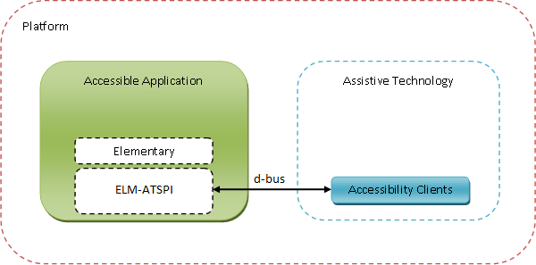
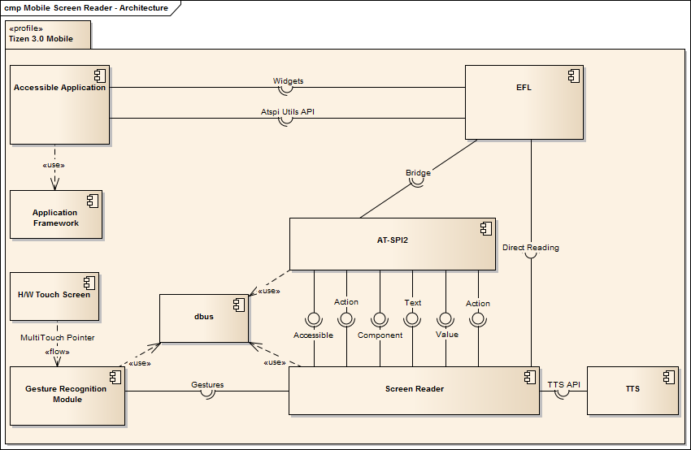

# Accessibility Architecture

The Assistive Technology Service Provider Interface (or AT-SPI2) is an API for developing accessible applications for open platforms. The accessibility implementation for the Tizen platform is based on a solution available for the desktop versions of Elementary, such as Elementary ATSPI.

The [Elementary ATSPI](https://phab.enlightenment.org/w/elementary_atspi/) enables applications to interact with graphical Elementary components visible on the screen. For example, an accessibility client, such as a screen reader, can access the text in labels and descriptions of any application running on the screen, read it to the user, or interpret a UI component using its defined role.

The following figure shows the general view of the accessibility framework architecture for Tizen 3.0.

**Figure: Accessibility framework architecture**

The following figure and table show the component model of the accessibility framework architecture for Tizen 3.0 and the related components.

**Figure: Component model**

**Table: Components**

| Component name             | Description                              |
|--------------------------|----------------------------------------|
| Screen reader              | Assistive technology client              |
| Application framework      | Tizen platform module providing the API to manage the application life-cycle |
| EFL                        | User interface toolkit providing the components to build the UI in Tizen native applications |
| Accessible application     | Tizen application using EFL Elementary components |
| H/W touch screen           | Hardware allowing user interaction with the device |
| Gesture recognition module | Window Manager (Enlightenment) module responsible for broadcasting information about gestures detected from multi-touch pointer events emitted by the H/W touch screen |
| dbus                       | Linux Inter Process Communication using the Remote Procedure Calls |
| AT-SPI2                    | Open accessibility standard for Linux    |
| TTS                        | Text-to-speech synthesizer on Tizen      |

The following figure shows the EFL Elementary ATSPI implementation architecture.

**Figure: Implementation architecture**

## Operational Model of the Screen Reader

The general outline of the screen reader navigation operation recognizes gestures based on multi-touch pointer events. It queries the accessibility object tree of the active application, and determines which UI element must be highlighted and read.

The following figure shows the operational model.

**Figure: Screen reader operational model**

## Related Information
- Dependencies
  - Tizen 3.0 and Higher for Mobile
  - Tizen 3.0 and Higher for Wearable
