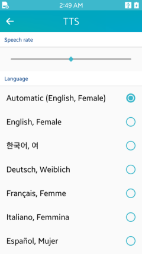
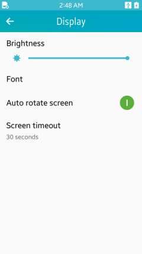
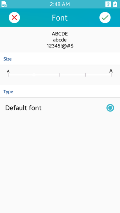

# Configuring Accessibility on a Device

Tizen provides the following accessibility features:

- **Screen reader**

  Visually-impaired users can interact with a Tizen device through intuitive touch screen gestures. The screen reader reacts to the gestures by examining the elements of the graphical user interface, reading aloud, and highlighting the currently focused content of the screen.

- **Font size**

  The user can configure system-wide font size settings, such as enlarge the fonts to suit visually-impaired users' needs.

You can enable 1 or more accessibility features at the same time to better suit the device to your needs and preferences. Some features (such as the screen reader) require the use of a small set of specific gestures to operate them, while others (such as changing font size) only need to be enabled in the device settings.

## Enabling the Screen Reader

To enable the screen reader:

1. Install and launch the **UI Components** application.

   UI Components is a mobile native sample application included in the Tizen Studio. You can install it through the Tizen Studio.

2. Select **Accessibility > Screen Reader**.
3. Enable the **Screen Reader (TTS)** setting.

**Figure: Enabling the screen reader**

  

Once the screen reader is enabled, you can configure it by setting the speech rate and the language:

- To set the speech rate, which is the speed of the voice output provided by the screen reader:

  1. In the built-in Settings application, select **Language and Input > TTS**.
  2. Select the preferred speech rate by hovering one finger over the **Speech rate** scale. The sample voice output is produced at a corresponding speech rate.

  **Figure: Setting the speech rate**

    

- To set the language, which is the language of the voice output provided by the screen reader:

  1. In the built-in Settings application, select **Language and Input > TTS**.
  2. Select the preferred language for the voice output from the **Language** list, which contains all supported languages.

## Setting the Font Size

> **Note**
>
> Changing the font size in the accessibility settings overrides the font size in all applications.

To change the system font size:

1. In the built-in Settings application, select **Display > Font**.
2. Select the font size:
   - To select a preferred font size, hover a finger over the **Size** scale. The sample text in a corresponding font size is displayed above the size scale.
   - To restore the font size predefined by the manufacturer, select **Default font**.

**Figure: Changing the font size**

  

## Related Information
- Dependencies
  - Tizen 2.4 and Higher for Mobile
  - Tizen 3.0 and Higher for Wearable
