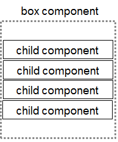
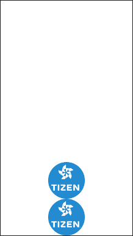
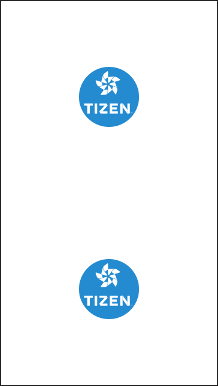
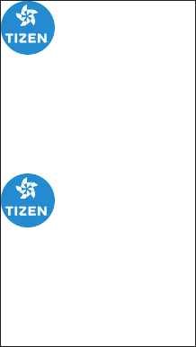
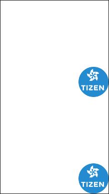

# Box

The box container arranges UI components in a linear order, horizontally or vertically. It is a non-graphical object: it adds no graphics to or around the objects it holds. For more information, see the Box API (in [mobile](../../../api/mobile/latest/group__Elm__Box.html) and [wearable](../../../api/wearable/latest/group__Elm__Box.html) applications).

**Figure: Box component structure**



## Basic Usage

To build a layout with a box:

1. Add a box with the `elm_box_add()` function:

   ```
   Evas_Object *box;

   box = elm_box_add(parent);
   ```

2. Set the direction of the box with the `elm_box_horizontal_set()` function. A box is vertical by default.

   ```
   elm_box_horizontal_set(box, EINA_TRUE);
   ```

3. Add objects and pack them into the box using various functions, depending on where in the box you want to add the objects (for example, `elm_box_pack_end()` and `elm_box_pack_start()`):

   ```
   Evas_Object *box;
   Evas_Object btn;

   btn = elm_button_add(parent);
   elm_box_pack_end(box, btn);
   ```

The following example shows a simple use case of the box component, where 5 button objects are packed into a vertical box. The `elm_box_pack_end()` function is used to pack each button into the end of the box.

**Example: Box use case**

 

```
Evas_Object *win;
Evas_Object *conf;
Evas_Object *nf;
Evas_Object *box;
Evas_Object *btn;
char tmp[16];
int i;

/* Starting right after the basic EFL UI layout code */
/* (win - conformant - naviframe) */

/* Add a box and push it into the naviframe */
box = elm_box_add(nf);
evas_object_show(box);
elm_naviframe_item_push(nf, "Box", NULL, NULL, box, NULL);

for (i = 1; i <= 5; i++) {
    btn = elm_button_add(box);
    snprintf(tmp, sizeof(tmp), "Button %d", i);
    elm_object_text_set(btn, tmp);

    /* Set size hints for weight and align */
    evas_object_size_hint_weight_set(btn, EVAS_HINT_EXPAND, EVAS_HINT_EXPAND);
    evas_object_size_hint_align_set(btn, EVAS_HINT_FILL, 0.5);

    evas_object_show(btn);
    elm_box_pack_end(box, btn);
}
```

In the above example, 2 functions are used to arrange buttons inside the box:

- `evas_object_size_hint_weight_set()` sets a hint on how to resize a given child object within a container area.
- `evas_object_size_hint_align_set()` sets a hint on how to align a child object inside the boundaries of a container.

If you change the weight or align hint value, the result changes.

## Box Layouts

When building a box layout, you must use [size hint functions](ui-layouts.md#size-hints) to adjust the size and position of each element inside it:

- Basically, an object contained in a box takes up space based on its minimum size.
- If the sum of the objects' minimum size is bigger than the size of the box parent, the box takes up all the space occupied by the parent, and the size of the parent may be extended to hold the box.
- If the sum of the objects' minimum size is smaller than the space given for the box, the objects are positioned at the center by default.

You can adjust the position of the image objects using the `elm_box_align_set()` function. The function takes 2 double values, a horizontal value and a vertical value, representing the percentage between 0.0 and 1.0 of the alignment in the horizontal and vertical axes. Remember that a box has a linear structure: the alignment only takes effect in the opposite direction than the one defined with the `elm_box_horizontal_set()` function.

In the following example, 2 images are packed into a box. The minimum size hints are set to the image objects with the `elm_object_size_hint_min_set()` function. Since the sum of the minimum size is smaller than the box area, which is equal to the window area in this case, the images are bound together and positioned at the center.

**Table: Various box layouts**


```
image = elm_image_add(box);
elm_image_file_set(image, ICON_DIR"/tizen.png", NULL);
evas_object_size_hint_min_set(image, 200, 200);
evas_object_show(image);
elm_box_pack_end(box, image);

image = elm_image_add(box);
elm_image_file_set(image, ICON_DIR"/tizen.png", NULL);
evas_object_size_hint_min_set(image, 200, 200);
evas_object_show(image);
elm_box_pack_end(box, image);
```


```
image = elm_image_add(box);
elm_image_file_set(image, ICON_DIR"/tizen.png", NULL);
evas_object_size_hint_min_set(image, 200, 200);
evas_object_show(image);
elm_box_pack_end(box, image);

image = elm_image_add(box);
elm_image_file_set(image, ICON_DIR"/tizen.png", NULL);
evas_object_size_hint_min_set(image, 200, 200);
evas_object_show(image);
elm_box_pack_end(box, image);

elm_box_align_set(box, 0.5, 0.0);
```



```
image = elm_image_add(box);
elm_image_file_set(image, ICON_DIR"/tizen.png", NULL);
evas_object_size_hint_min_set(image, 200, 200);
evas_object_show(image);
elm_box_pack_end(box, image);

image = elm_image_add(box);
elm_image_file_set(image, ICON_DIR"/tizen.png", NULL);
evas_object_size_hint_min_set(image, 200, 200);
evas_object_show(image);
elm_box_pack_end(box, image);

elm_box_align_set(box, 0.5, 1.0);
```



```
image = elm_image_add(box);
elm_image_file_set(image, ICON_DIR"/tizen.png", NULL);
evas_object_size_hint_min_set(image, 200, 200);
evas_object_show(image);
elm_box_pack_end(box, image);

evas_object_size_hint_weight_set(image, EVAS_HINT_EXPAND, EVAS_HINT_EXPAND);

image = elm_image_add(box);
elm_image_file_set(image, ICON_DIR"/tizen.png", NULL);
evas_object_size_hint_min_set(image, 200, 200);
evas_object_show(image);
elm_box_pack_end(box, image);

evas_object_size_hint_weight_set(image, EVAS_HINT_EXPAND, EVAS_HINT_EXPAND);
```



```
image = elm_image_add(box);
elm_image_file_set(image, ICON_DIR"/tizen.png", NULL);
evas_object_size_hint_min_set(image, 200, 200);
evas_object_show(image);
elm_box_pack_end(box, image);

evas_object_size_hint_weight_set(image, EVAS_HINT_EXPAND, EVAS_HINT_EXPAND);
evas_object_size_hint_align_set(image, 0.0, 0.0);

image = elm_image_add(box);
elm_image_file_set(image, ICON_DIR"/tizen.png", NULL);
evas_object_size_hint_min_set(image, 200, 200);
evas_object_show(image);
elm_box_pack_end(box, image);

evas_object_size_hint_weight_set(image, EVAS_HINT_EXPAND, EVAS_HINT_EXPAND);
evas_object_size_hint_align_set(image, 0.0, 0.0);
```



```
image = elm_image_add(box);
elm_image_file_set(image, ICON_DIR"/tizen.png", NULL);
evas_object_size_hint_min_set(image, 200, 200);
evas_object_show(image);
elm_box_pack_end(box, image);

evas_object_size_hint_weight_set(image, EVAS_HINT_EXPAND, EVAS_HINT_EXPAND);
evas_object_size_hint_align_set(image, 1.0, 1.0);

image = elm_image_add(box);
elm_image_file_set(image, ICON_DIR"/tizen.png", NULL);
evas_object_size_hint_min_set(image, 200, 200);
evas_object_show(image);
elm_box_pack_end(box, image);

evas_object_size_hint_weight_set(image, EVAS_HINT_EXPAND, EVAS_HINT_EXPAND);
evas_object_size_hint_align_set(image, 1.0, 1.0);
```


```
image = elm_image_add(box);
elm_image_file_set(image, ICON_DIR"/tizen.png", NULL);
evas_object_size_hint_min_set(image, 200, 200);
evas_object_show(image);
elm_box_pack_end(box, image);

evas_object_size_hint_weight_set(image, EVAS_HINT_EXPAND, EVAS_HINT_EXPAND);
evas_object_size_hint_align_set(image, EVAS_HINT_FILL, EVAS_HINT_FILL);

image = elm_image_add(box);
elm_image_file_set(image, ICON_DIR"/tizen.png", NULL);
evas_object_size_hint_min_set(image, 200, 200);
evas_object_show(image);
elm_box_pack_end(box, image);

evas_object_size_hint_weight_set(image, EVAS_HINT_EXPAND, EVAS_HINT_EXPAND);
evas_object_size_hint_align_set(image, EVAS_HINT_FILL, EVAS_HINT_FILL);
```


```
image = elm_image_add(box);
elm_image_file_set(image, ICON_DIR"/tizen.png", NULL);
evas_object_size_hint_min_set(image, 200, 200);
evas_object_show(image);
elm_box_pack_end(box, image);

evas_object_size_hint_weight_set(image, EVAS_HINT_EXPAND, 0.3);
evas_object_size_hint_align_set(image, EVAS_HINT_FILL, EVAS_HINT_FILL);

image = elm_image_add(box);
elm_image_file_set(image, ICON_DIR"/tizen.png", NULL);
evas_object_size_hint_min_set(image, 200, 200);
evas_object_show(image);
elm_box_pack_end(box, image);

evas_object_size_hint_weight_set(image, EVAS_HINT_EXPAND, 0.7);
evas_object_size_hint_align_set(image, EVAS_HINT_FILL, EVAS_HINT_FILL);
```

> **Note**  
> Except as noted, this content is licensed under [LGPLv2.1+](http://opensource.org/licenses/LGPL-2.1).

## Related Information
- Dependencies
  - Tizen 2.4 and Higher for Mobile
  - Tizen 2.3.1 and Higher for Wearable
