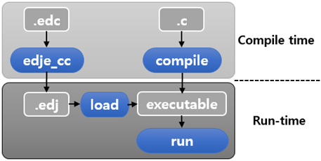
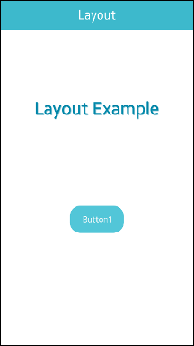

# Layout

The layout container enables you to define a look and feel of the UI with animation and basic event response by using an Edje design file. For more information, see the Layout API (in [mobile](../../../api/mobile/latest/group__Elm__Layout.html) and [wearable](../../../api/wearable/latest/group__Elm__Layout.html) applications).

EDC (Edje data collection) is a script language provided by Edje, which is a library in charge of the high-level layouting in EFL. An EDC file describes how the elements of the UI are positioned. An EDC file has an extension `.edc`. For more information on the syntax of EDC, see [Layouting with EDC](learn-edc-intro-n.md).

**Figure: EDC file behavior**



## Basic Usage

You can customize a layout by writing an EDC file, or use a predefined layout provided by Tizen.

### Customized Layout

Unlike when using other UI containers, you must write C code and an EDC script to customize a layout using a layout component. You need to create a project for a basic EDC UI application.

1. Create an EDC file in the `/res/edje/` directory and define a layout in the EDC file.

   ```
   collections {
      group {
         name: "main";
         parts {
         }
      }
   }
   ```

   If you add an `example.edc` file, the Tizen Studio calls Edje tools automatically to build the final `example.edj` file when building the project. The EDJ file is installed in the application data path.

2. In the C code, add a layout with the `elm_layout_add()` function:

   ```
   Evas_Object *layout;

   layout = elm_layout_add(parent);
   ```

3. Load the EDJ file with the `elm_layout_file_set()` function.

 You can get the full path of where the EDJ file is installed using the `app_get_resource()` function.

   ```
   char edj_path[128] = {0,};

   app_get_resource("/edje/example.edj", edj_path, 128);
   elm_layout_file_set(layout, edj_path, "main");
   ```

4. Set objects or texts to the layout with the `elm_object_part_content_set()` or `elm_object_part_text_set()` function.

5. Elementary can send Edje signals to the EDC part using the `elm_layout_signal_emit()` function. You can also use the `elm_layout_signal_callback_add()` function to receive signals.

 Use the following code to listen for any signals sent by the layout:

   ```
   elm_layout_signal_callback_add(layout, "*", "*", _signal_cb, NULL);

   static void
   _signal_cb(void *data, Evas_Object *obj, const char *emission, const char *source)
   {
       printf("Info received from layout: %s %s\n", emission, source);
   }
   ```

The following example shows a simple use case of the layout component, with a simple EDC script in the `example.edc` file and a connection from the resulting EDJ file to the C code.

**Example: Layout use case**

 

```
/* EDC file */

collections {
   base_scale: 1.0;
   group {
      name: "main";
      parts {
         part {
            name: "bg";
            type: RECT;
            description {
               state: "default" 0.0;
            }
         }
         part {
            name: "text";
            type: TEXT;
            scale: 1;
            effect: FAR_SOFT_SHADOW;
            description {
               state: "default" 0.0;
               rel1.relative: 0.0 0.0;
               rel2.relative: 1.0 0.5;
               color: 0 136 170 255;
               color2: 0 136 170 50;
               color3: 0 136 170 25;
               text {
                  size: 25;
                  font: "Sans";
                  text: "Layout Example";
                  align: 0.5 0.5;
               }
            }
         }
         part {
            name: "content";
            type: SWALLOW;
            description {
               state: "default" 0.0;
               rel1.relative: 0.5 0.6;
               rel2.relative: 0.5 0.6;
               min: 200 100;
            }
         }
      }
   }
}

/* C code file */

Evas_Object *win;
Evas_Object *conf;
Evas_Object *nf;
Evas_Object *layout;
Evas_Object *button;
char edj_path[128] = {0,};

/* Starting right after the conformant in the basic EFL UI layout code */
/* (win - conformant) */

layout = elm_layout_add(nf);
app_get_resource("edje/example.edj", edj_path, 128);
elm_layout_file_set(layout, edj_path, "main");
evas_object_size_hint_weight_set(layout, EVAS_HINT_EXPAND, EVAS_HINT_EXPAND);
eext_object_event_callback_add(layout, EEXT_CALLBACK_BACK, layout_back_cb, ad);

button = elm_button_add(layout);
elm_object_text_set(button, "Button1");
elm_layout_content_set(layout, "content", button);
evas_object_show(button);

elm_naviframe_item_push(nf, "Layout", NULL, NULL, layout, NULL);
```

### Predefined Layout

You can skip the first step (writing an EDC script) and set a theme to the layout with the `elm_layout_theme_set()` function instead of the `elm_layout_file_set()` function.

The following predefined themes are available in the mobile profile:

- `application/default`: This layout can be used to display content inside a window.

  ```
  elm_layout_theme_set(layout, "layout", "application", "default");
  elm_object_part_content_set(ly, "elm.swallow.content", view);
  ```

- `drawer/panel`: This layout can be used to display 2 different views: a background and a main content.

  ```
  elm_layout_theme_set(ly, "layout", "drawer", "panel");
  elm_object_part_content_set(ly, "elm.swallow.content", main_view);
  elm_object_part_content_set(ly, "elm.swallow.background", background);
  ```

- `nocontents/default`: This layout can be used when there is no content to display, such as in a contact or email list.

  You can only set texts. There are 2 different texts zones: `elm.text` and `elm.help.text`. To change the text:

  ```
  elm_layout_theme_set(ly, "layout", "nocontents", "default");
  elm_object_part_text_set(ly, "elm.text", "Hi All :)");
  elm_object_part_text_set(ly, "elm.help.text", "Hi All :)");
  ```

> **Note**
> Except as noted, this content is licensed under [LGPLv2.1+](http://opensource.org/licenses/LGPL-2.1).

## Related Information
- Dependencies
  - Tizen 2.4 and Higher for Mobile
  - Tizen 2.3.1 and Higher for Wearable
