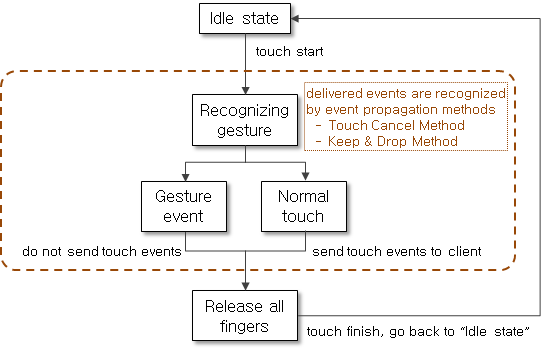
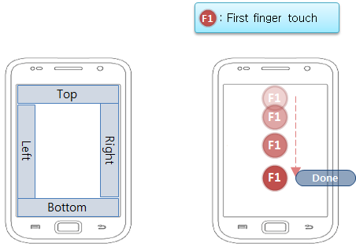
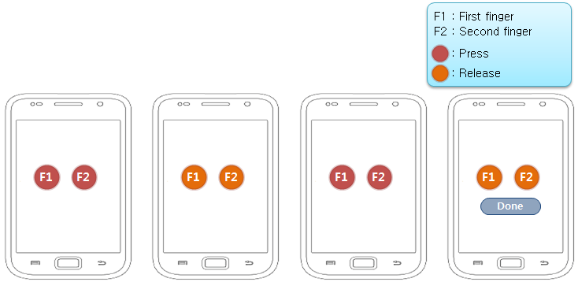
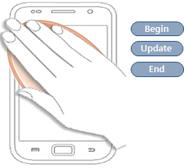
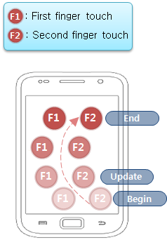
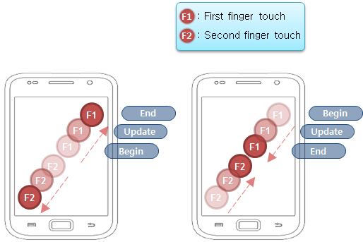

# EFL Utilities

You can take advantage of various EFL utilities in your application:

- Managing notification windows

  A window that belongs to the [notification layer](#window-layers-and-notification-levels) within the Tizen window layer hierarchy is called a "notification window". You can [create notification windows](#managing-notification-windows) and access their current notification levels (as long as they are of the EFL window type) using the EFL UTIL API (for [mobile](../../../api/mobile/latest/group__CAPI__EFL__UTIL__MODULE.html) and [wearable](../../../api/wearable/latest/group__CAPI__EFL__UTIL__MODULE.html) applications).

- Taking screenshots

  You can [capture screenshots](#taking-screenshots) and store the screenshot data as a TBM surface, using the EFL UTIL SCREENSHOT API (for [mobile](../../../api/mobile/latest/group__CAPI__EFL__UTIL__SCREENSHOT__MODULE.html) and [wearable](../../../api/wearable/latest/group__CAPI__EFL__UTIL__SCREENSHOT__MODULE.html) applications).

- Using the input generator

  You can generate input events using the EFL UTIL INPUT API (for [mobile](../../../api/mobile/latest/group__CAPI__EFL__UTIL__INPUT__MODULE.html) and [wearable](../../../api/wearable/latest/group__CAPI__EFL__UTIL__INPUT__MODULE.html) applications). You can generate [key input events](#generating-key-input-events) that emulate various hardware key presses and [touch input events](#generating-touch-input-events) that emulate screen touches.

- Handling global gestures

  You can handle [global gestures](#global-gestures) using the EFL UTIL GESTURE API (for [mobile](../../../api/mobile/latest/group__CAPI__EFL__UTIL__GESTURE__MODULE.html) and [wearable](../../../api/wearable/latest/group__CAPI__EFL__UTIL__GESTURE__MODULE.html) applications). You can [grab](#grabbing-gestures) and [deactivate](#deactivating-gestures) global gestures, and [select](#selecting-gestures) and [deactivate](#deactivating-gestures-in-a-window) them in a window.

## Window Layers and Notification Levels

Tizen windows have a layer hierarchy. Window layers are logical containers used to control the window stack order. Each window belongs to 1 layer and can change the stack order in the layer. Windows in same layer are always placed on or under a window in another layer. In addition to the default "normal layer", there exists a "notification layer", which is always placed above the normal layer.

**Figure: Window layers**


Each window is set to a specific layer according to its type or properties. Most application windows belong to the normal layer. However, for an important alarm or other information crucial to the user, you can set the window to belong to the notification layer. This ensures that the user notices the information immediately, because the window belonging to the notification layer is always shown above the windows in the normal layer.

The notification layer contains 4 levels, which define the priority of a notification window:

-   `EFL_UTIL_NOTIFICATION_LEVEL_DEFAULT`: Default level, to which most windows are set. It is used as a normal notification popup.
-   `EFL_UTIL_NOTIFICATION_LEVEL_MEDIUM`: Higher level than default; the windows on this level are always on top of the default level windows. It is used for the lock screen window in general.
-   `EFL_UTIL_NOTIFICATION_LEVEL_HIGH`: Higher level than medium; the windows on this level are always on top of the medium windows.
-   `EFL_UTIL_NOTIFICATION_LEVEL_TOP`: Highest level, which very few applications can use. It is used in case the user needs to be notified in any circumstances. For example, the incoming call popup uses this level.

**Figure: Notification levels**


## Global Gestures

Normal touch events are delivered to the active, visible window. Global gestures intercept these touch events and generate gesture events instead of propagating the touch events. Gestures can be recognized and delivered in 2 ways:

- Touch cancel method

  The server sends all touch events to the client immediately. When the server recognizes a touch event sequence as a global gesture, it sends a touch cancel event to the client. Based on the touch cancel event, the client cancels the already-received touch events.

- Keep and drop method

  The server keeps all touch events until it can determine whether they form a global gesture sequence. If the touch events are recognized as a gesture, the server drops the touch events. If no gesture is recognized, the server flushes and propagates the touch events to the client.

**Figure: Global gesture event propagation methods**


After gesture recognition, the server sends no further touch events until all fingers are released. The server renews the gesture recognition state only after all fingers are released.

**Figure: Global gesture life cycle**



Global gesture events are generated based on user touch behavior. Gestures have various states:

- `EFL_UTIL_GESTURE_MODE_BEGIN`: Begin a continuous gesture event.
- `EFL_UTIL_GESTURE_MODE_UPDATE`: Update a continuous gesture event.
- `EFL_UTIL_GESTURE_MODE_END`: End a continuous gesture event.
- `EFL_UTIL_GESTURE_MODE_DONE`: A non-continuous gesture event occurs.

Continuous gestures generate events in the begin, update, and end states, while non-continuous gestures generate events in the done state.

You can implement the following gesture types:

- `EFL_UTIL_GESTURE_TYPE_EDGE_SWIPE`: The user touches near a screen edge and moves the finger quickly toward the opposite side. Edge swipe is a non-continuous gesture.

 **Figure: Top edge 1-finger swipe gesture**



- `EFL_UTIL_GESTURE_TYPE_EDGE_DRAG`: The user touches near a screen edge and drags the finger toward the opposite side. Edge drag is a continuous gesture.

 **Figure: Top edge 1-finger drag gesture**

 

- `EFL_UTIL_GESTURE_TYPE_TAP`: The user touches the screen with their finger and quickly releases it. Tap is a non-continuous gesture.

 **Figure: 2-finger double tap gesture**

 

- `EFL_UTIL_GESTURE_TYPE_PALM_COVER`: The user places their palm over the screen. Palm cover is a continuous gesture.

 **Figure: Palm cover gesture**

 

- `EFL_UTIL_GESTURE_TYPE_PAN`: The user touches the screen with 2 or more fingers and moves them in the same direction. Pan is a continuous gesture.

 **Figure: 2-finger pan gesture**
 

- `EFL_UTIL_GESTURE_TYPE_PINCH`: The user touches the screen with 2 or more fingers and moves the fingers away from or toward each other. Pinch is a continuous gesture.

 **Figure: 2-finger pinch gesture**

 

- `EFL_UTIL_GESTURE_TYPE_PALM_SWIPE`: The user places their palm at a screen edge and swipes to the opposite side. Palm swipe is a non-continuous gesture.

 **Figure: Palm swipe gesture**

 

## Prerequisites

To use the functions and data types of the EFL UTIL API (in [mobile](../../../api/mobile/latest/group__CAPI__EFL__UTIL__MODULE.html) and [wearable](../../../api/wearable/latest/group__CAPI__EFL__UTIL__MODULE.html) applications), include the `<efl_util.h>` header file in your application:

```
#include <efl_util.h>
```

## Managing Notification Windows

To create notification windows and access the current notification level of an existing notification window:

- Create a notification window with the default notification level (`EFL_UTIL_NOTIFICATION_LEVEL_DEFAULT`):

  1. To create a new window and give it the `NOTIFICATION` type, call the `elm_win_add()` function with the third parameter set to `ELM_WIN_NOTIFICATION`:

     ```
     #include <Elementary.h>
     #include <dlog.h>

     static Evas_Object*
     create_win(const char *name)
     {
         Evas_Object *eo;
         efl_util_error_e error;
         /* Create the NOTIFICATION window object */
         eo = elm_win_add(NULL, name, ELM_WIN_NOTIFICATION);

         if (!eo)
             return NULL;
     ```

  2. To set the notification level, call the `efl_util_set_notification_window_level()` function.

     If the window is not of the notification type, the function returns the `EFL_UTIL_ERROR_NOT_SUPPORTED_WINDOW_TYPE` error. If the application does not have a permission to set a notification level, the function returns the `TIZEN_ERROR_PERMISSION_DENIED` error.

     ```
         /* Set the NOTIFICATION level */
         error = efl_util_set_notification_window_level(eo, EFL_UTIL_NOTIFICATION_LEVEL_1);
 		 if (error != EFL_UTIL_ERROR_NONE) {
             /* Error handling for each error code */
         }

         elm_win_title_set(eo, name);
         elm_win_autodel_set(eo, EINA_TRUE);
         evas_object_smart_callback_add(eo, "delete,request", _quit_cb, NULL);

         return eo;
     }
     ```

- Get the currently set notification level of a window by using the `efl_util_get_notification_window_level()` function.

  If the window is not of the notification type, the function returns the `EFL_UTIL_ERROR_NOT_SUPPORTED_WINDOW_TYPE` error.

  ```
  #include <Elementary.h>
  #include <dlog.h>

  void
  get_notification_level(Evas_Object *eo)
  {
      efl_util_error_e error;
      efl_util_notification_level_e notification_level;

      if (!eo)
          return;

      /* Get the window notification level */
      error = efl_util_get_notification_window_level(eo, &notification_level);

      /* Check the return value */
      if (error== EFL_UTIL_ERROR_NONE) {
          switch (notification_level) {
          case EFL_UTIL_NOTIFICATION_LEVEL_DEFAULT:
               /* Do something for default level */
               break;
          case EFL_UTIL_NOTIFICATION_LEVEL_MEDIUM:
              /* Do something for medium level */
              break;
          case EFL_UTIL_NOTIFICATION_LEVEL_HIGH:
              /* Do something for high level */
              break;
          case EFL_UTIL_NOTIFICATION_LEVEL_TOP:
              /* Do something for top level */
              break;
          }
      } else {
          /* Error handling */
      }
  }
  ```

## Taking Screenshots

To take a screenshot:

1. Create the `efl_util_screenshot_h` structure and initialize the structure members with the `efl_util_screenshot_initialize()` function:

   ```
   #include <tbm_surface.h>

   void
   capture()
   {
       efl_util_screenshot_h screenshot = NULL;
       tbm_surface_h tbm_surface = NULL;
       tbm_surface_info_s tsuri;

       screenshot = efl_util_screenshot_initialize(width, height);
   ```

2. To take the actual screenshot, create screen capture data and return it to the `tbm_surface` handler with the `efl_util_screenshot_take_tbm_surface()` function:

   ```
       if (screenshot) {
           tbm_surface = efl_util_screenshot_take_tbm_surface(screenshot);
           if (tbm_surface)
               /* Treat tbm_surface handler (screenshot data) */
   ```

3. When no longer needed, free the `efl_util_screenshot_h` structure with the `efl_util_screenshot_deinitialize()` function:

   ```
           efl_util_screenshot_deinitialize(screenshot);
       }
   }
   ```

## Generating Key Input Events

To generate key input events:

1. Create the `efl_util_inputgen_h` structure and initialize the structure members with the `efl_util_input_initialize_generator()` or `efl_util_input_initialize_generator_with_name()` function:

   ```
   void
   key_event_generator()
   {
       int ret = EFL_UTIL_ERROR_NONE;
       efl_util_inputgen_h inputgen = NULL;

       /* Create an input device with the default name: "Input Generator" */
       inputgen = efl_util_input_initialize_generator(EFL_UTIL_INPUT_DEVTYPE_KEYBOARD);
       /*
          Since Tizen 4.0, you can create an input generator with a given name (in this example, "Local Device"):
          inputgen = efl_util_input_initialize_generator_with_name(EFL_UTIL_INPUT_DEVTYPE_KEYBOARD, "Local_Device");
       */
       if (!inputgen) {
           /* Failed to initialize the input generator system */

           return;
       }
   ```

2. After setting the input device type, call the `efl_util_input_generate_key()` function to generate key input events:

   ```
       ret = efl_util_input_generate_key(inputgen, "XF86Menu", 1);
       if (ret != EFL_UTIL_ERROR_NONE) {
           /* Failed to generate a "XF86Menu" key press event */
           ret = efl_util_input_deinitialize_generator(inputgen);
           if (ret != EFL_UTIL_ERROR_NONE)
               /* Failed to deinitialize the input generator system */

           return;
       }

       ret = efl_util_input_generate_key(inputgen, "XF86Menu", 0);
       if (ret != EFL_UTIL_ERROR_NONE) {
           /* Failed to generate a "XF86Menu" key release event */
           ret = efl_util_input_deinitialize_generator(inputgen);
           if (ret != EFL_UTIL_ERROR_NONE)
               /* Failed to deinitialize the input generator system */

           return;
       }
   ```

3. When no longer needed, free the `efl_util_inputgen_h` structure with the `efl_util_input_deinitialize_generator()` function:

   ```
       ret = efl_util_input_deinitialize_generator(inputgen);
       if (ret != EFL_UTIL_ERROR_NONE)
           /* Failed to deinitialize the input generator system */
   }
   ```

## Generating Touch Input Events

To generate touch input events:

1. Create the `efl_util_inputgen_h` structure and initialize the structure members with the `efl_util_input_initialize_generator()` or `efl_util_input_initialize_generator_with_name()` function:

   ```
   void
   touch_event_generator()
   {
       int ret = EFL_UTIL_ERROR_NONE;
       efl_util_inputgen_h inputgen = NULL;

       /* Create an input device with the default name: "Input Generator" */
       inputgen = efl_util_input_initialize_generator(EFL_UTIL_INPUT_DEVTYPE_TOUCHSCREEN);
       /*
          Since Tizen 4.0, you can create an input device with a given name (in this example, "Local Device"):
          inputgen = efl_util_input_initialize_generator_with_name(EFL_UTIL_INPUT_DEVTYPE_TOUCHSCREEN, "Local_Device");
       */
       if (!inputgen) {
           /* Failed to initialize the input generator system */

           return;
       }
   ```

2. After setting the input device type, call the `efl_util_input_generate_touch()` function to generate touch input events:

   ```
       ret = efl_util_input_generate_touch(inputgen, 0, EFL_UTIL_INPUT_TOUCH_BEGIN, 100, 100);
       if (ret != EFL_UTIL_ERROR_NONE) {
           /* Failed to generate a first finger touch press event on (100, 100) */
           ret = efl_util_input_deinitialize_generator(inputgen);
           if (ret != EFL_UTIL_ERROR_NONE)
               /* Failed to deinitialize the input generator system */

           return;
       }
       ret = efl_util_input_generate_touch(inputgen, 0, EFL_UTIL_INPUT_TOUCH_UPDATE, 110, 110);
       if (ret != EFL_UTIL_ERROR_NONE) {
           /* Failed to generate a first finger touch move event to (110, 110) */
           ret = efl_util_input_deinitialize_generator(inputgen);
           if (ret != EFL_UTIL_ERROR_NONE)
               /* Failed to deinitialize the input generator system */

           return;
       }
       ret = efl_util_input_generate_touch(inputgen, 0, EFL_UTIL_INPUT_TOUCH_END, 110, 110);
       if (ret != EFL_UTIL_ERROR_NONE) {
           /* Failed to generate a first finger touch release event on (110, 110) */
           ret = efl_util_input_deinitialize_generator(inputgen);
           if (ret != EFL_UTIL_ERROR_NONE)
               /* Failed to deinitialize the input generator system */

           return;
       }
   ```

3. When no longer needed, free the `efl_util_inputgen_h` structure with the `efl_util_input_deinitialize_generator()` function:

   ```
       ret = efl_util_input_deinitialize_generator(inputgen);
       if (ret != EFL_UTIL_ERROR_NONE)
           /* Failed to deinitialize the input generator system */
   }
   ```

## Grabbing Gestures

To receive global gesture events, you must grab the gestures that you want. You can grab gestures in the background (without a window). Each gesture can only be grabbed by 1 client at a time. For example, if a client grabs a 2-finger double tap gesture, other clients cannot grab the same gesture but can grab a 2-finger triple tap gesture. You can grab edge swipe, edge drag, tap, and palm cover gestures.

To grab gestures:

1. Create callbacks for gesture events:

   ```
   /* EFL_UTIL_EVENT_GESTURE_EDGE_SWIPE */
   Eina Bool
   _edge_swipe_cb(void *data, int type, void *event)
   {
       efl_util_event_gesture_edge_swipe_s *ev;

       ev = (efl_util_event_gesture_edge_swipe_s *)event;

       printf("[Edge_Swipe] mode: %d, fingers: %d, start_point: (%d, %d), edge: %d\n",
              ev->mode, ev->fingers, ev->sx, ev->sy, ev->edge);

       return ECORE_CALLBACK_PASS_ON;
   }

   /* EFL_UTIL_EVENT_GESTURE_EDGE_DRAG */
   Eina Bool
   _edge_drag_cb(void *data, int type, void *event)
   {
       efl_util_event_gesture_edge_drag_s *ev;

       ev = (efl_util_event_gesture_edge_drag_s *)event;

       printf("[Edge_Drag] mode: %d, fingers: %d, center_point: (%d, %d), edge: %d\n",
              ev->mode, ev->fingers, ev->cx, ev->cy, ev->edge);

       return ECORE_CALLBACK_PASS_ON;
   }

   /* EFL_UTIL_EVENT_GESTURE_TAP */
   Eina Bool
   _tap_cb(void *data, int type, void *event)
   {
       efl_util_event_gesture_tap_s *ev;

       ev = (efl_util_event_gesture_tap_s *)event;

       printf("[Tap] mode: %d, fingers: %d, repeats: %d\n",
              ev->mode, ev->fingers, ev->repeats);

       return ECORE_CALLBACK_PASS_ON;
   }

   /* EFL_UTIL_EVENT_GESTURE_PALM_COVER */
   Eina Bool
   _palm_cover_cb(void *data, int type, void *event)
   {
       efl_util_event_gesture_palm_cover_s *ev;

       ev = (efl_util_event_gesture_palm_cover_s *)event;

       printf("[Palm_Cover] mode: %d, duration: %d, center_point: (%d, %d), size: %d, pressure: %lf\n",
              ev->mode, ev->duration, ev->cx, ev->cy, ev->size, ev->pressure);

       return ECORE_CALLBACK_PASS_ON;
   }
   ```

2. Create the `efl_util_gesture_h` structure and initialize the structure members with the `efl_util_gesture_initialize()` function:

   ```
   void
   grab_gesture()
   {
       int ret = EFL_UTIL_ERROR_NONE;
       efl_util_gesture_h h_gesture = NULL;
       efl_util_gesture_data d_edge_swipe = NULL;
       efl_util_gesture_data d_edge_drag = NULL;
       efl_util_gesture_data d_tap = NULL;
       efl_util_gesture_data d_palm_cover = NULL;

       /* Create a gesture handle */
       h_gesture = efl_util_gesture_initialize();

       if (!h_gesture) {
           ret = get_last_result();
           /* Failed to initialize the gesture system */

           return;
       }
   ```

3. Define the gesture data to grab using the `efl_util_gesture_xxx_new()` and `efl_util_gesture_xxx_size_set()` functions.

   Setting a size is optional. If a size is not set, the gesture is grabbed within a full-size edge.

   ```
       /* Define a top edge 1-finger swipe gesture */
       d_edge_swipe = efl_util_gesture_edge_swipe_new(h_gesture, 1, EFL_UTIL_GESTURE_EDGE_TOP);
       if (!d_edge_swipe) {
           ret = get_last_result();
           /* Failed to create edge swipe data */

           return;
       }
       /* Set the size */
       ret = efl_util_gesture_edge_swipe_size_set(d_edge_swipe, EFL_UTIL_GESTURE_EDGE_SIZE_PARTIAL, 0, 100);
       if (ret != EFL_UTIL_ERROR_NONE) {
           /* Failed to set size for edge swipe */

           return;
       }

       /* Define a left edge 1-finger drag gesture */
       d_edge_drag = efl_util_gesture_edge_drag_new(h_gesture, 1, EFL_UTIL_GESTURE_EDGE_LEFT);
       if (!d_edge_drag) {
           ret = get_last_result();
           /* Failed to create edge drag data */

           return;
       }
       /* Set the size */
       ret = efl_util_gesture_edge_drag_size_set(d_edge_drag, EFL_UTIL_GESTURE_EDGE_SIZE_PARTIAL, 0, 100);
       if (ret != EFL_UTIL_ERROR_NONE) {
           /* Failed to set size for edge drag */

           return;
       }

       /* Define a 2-finger double tap gesture */
       d_tap = efl_util_gesture_tap_new(h_gesture, 2, 2);
       if (!d_tap) {
           ret = get_last_result();
           /* Failed to create tap data */

           return;
       }

       /* Define a palm cover gesture */
       d_palm_cover = efl_util_gesture_palm_cover_new(h_gesture);
       if (!d_palm_cover) {
           ret = get_last_result();
           /* Failed to create palm cover data */

           return;
       }
   ```

4. To grab a gesture, use the `efl_util_gesture_grab()` function:

   ```
       /* Select the gesture you want to grab */
       ret = efl_util_gesture_grab(h_gesture, d_edge_swipe);
       /*
           You can grab multiple gestures:
           ret = efl_util_gesture_grab(h_gesture, d_edge_drag);
           ret = efl_util_gesture_grab(h_gesture, d_tap);
           ret = efl_util_gesture_grab(h_gesture, d_palm_cover);
       */
       if (ret != EFL_UTIL_ERROR_NONE) {
           /* Failed to grab a gesture */

           return;
       }
   ```

5. Define the gesture event handlers:

   ```
       /* Add handlers for the gestures that you want to receive */
       ecore_event_handler_add(EFL_UTIL_EVENT_GESTURE_EDGE_SWIPE, _edge_swipe_cb, NULL);
       /*
          You can handle multiple gestures:
          ecore_event_handler_add(EFL_UTIL_EVENT_GESTURE_EDGE_DRAG, _edge_drag_cb, NULL);
          ecore_event_handler_add(EFL_UTIL_EVENT_GESTURE_TAP, _tap_cb, NULL);
          ecore_event_handler_add(EFL_UTIL_EVENT_GESTURE_PALM_COVER, _palm_cover_cb, NULL);
       */
   ```

6. Run the main loop:

   ```
       /* Run Ecore main loop */
       ecore_main_loop_begin();
   ```

7. When no longer needed, free the resources and deinitialize the `efl_util_gesture_h` structure:

   ```
       /* Ungrab the gesture */
       ret = efl_util_gesture_ungrab(h_gesture, d_edge_swipe);
       /*
          Ungrab other gestures if necessary:
          ret = efl_util_gesture_ungrab(h_gesture, d_edge_drag);
          ret = efl_util_gesture_ungrab(h_gesture, d_tap);
          ret = efl_util_gesture_ungrab(h_gesture, d_palm_cover);
        */

       if (ret != EFL_UTIL_ERROR_NONE) {
           /* Failed to ungrab the gesture */

           return;
       }

       /* Free the gesture data */
       ret = efl_util_gesture_edge_swipe_free(h_gesture, d_edge_swipe);
       /*
          Free the data for all gestures:
          ret = efl_util_gesture_edge_drag_free(h_gesture, d_edge_drag);
          ret = efl_util_gesture_tap_free(h_gesture, d_tap);
          ret = efl_util_gesture_palm_cover_free(h_gesture, d_palm_cover);
        */
       if (ret != EFL_UTIL_ERROR_NONE) {
           /* Failed to free gesture data */

           return;
       }

       ret = efl_util_gesture_deinitialize(h_gesture);
       if (ret != EFL_UTIL_ERROR_NONE) {
           /* Failed to deinitialize the gesture system */

           return;
       }
   }
   ```

## Selecting Gestures

Unlike grabbing, selecting a gesture requires a window. By selecting a gesture, you can detect gesture events when the selected window is active. Selecting has a higher priority than grabbing. Only the palm cover gesture can be selected.

To select a gesture:

1. Create the required callbacks:

   - Create a callback for the gesture event:

      ```
      /* EFL_UTIL_EVENT_GESTURE_PALM_COVER */
      Eina Bool
      _palm_cover_cb(void *data, int type, void *event)
      {
          efl_util_event_gesture_palm_cover_s *ev;

          ev = (efl_util_event_gesture_palm_cover_s *)event;

          printf("[Palm_Cover] mode: %d, duration: %d, center_point: (%d, %d), size: %d, pressure: %lf\n",
                 ev->mode, ev->duration, ev->cx, ev->cy, ev->size, ev->pressure);

          return ECORE_CALLBACK_PASS_ON;
      }
      ```

   - Create the window destruction callback:

      ```
      /* Window destruction callback */
      void
      _window_delete_cb(void *data, Evas_Object *obj, void *event)
      {
          elm_exit();
      }
      ```

2. Create the `efl_util_gesture_h` structure and initialize the structure members with the `efl_util_gesture_initialize()` function:

   ```
   void
   select_gesture()
   {
       int ret = EFL_UTIL_ERROR_NONE;
       Evas_Object *window = NULL;
       efl_util_gesture_h h_gesture = NULL;
       efl_util_gesture_data d_palm_cover = NULL;

       /* Create a gesture handle */
       h_gesture = efl_util_gesture_initialize();

       if (!h_gesture) {
           ret = get_last_result();
           /* Failed to initialize the gesture system */

           return;
       }
   ```

3. Define the gesture data to select:

   ```
       /* Define the palm cover gesture */
       d_palm_cover = efl_util_gesture_palm_cover_new(h_gesture);
       if (!d_palm_cover) {
           ret = get_last_result();
           /* Failed to create palm cover gesture data */

           return;
       }
   ```

4. Create and show a window in which you want to select a gesture.

   This example uses the `efl_win_add()` function, but you can create the window in many ways.

   ```
       window = elm_win_add(NULL, "Gesture Select Window", ELM_WIN_BASIC);
       if (window) {
           elm_win_title_set(window, "Gesture Select Window");
           elm_win_borderless_set(window, EINA_TRUE);
           evas_object_smart_callback_add(window, "delete,request", _window_delete_cb, NULL);
           elm_win_indicator_mode_set(window, ELM_WIN_INDICATOR_SHOW);
       }
   ```

5. To select the gesture, use the `efl_util_gesture_select()` function:

   ```
       ret = efl_util_gesture_select(h_gesture, window, d_palm_cover);
       if (ret != EFL_UTIL_ERROR_NONE) {
           /* Failed to select the gesture */

           return;
       }
   ```

6. Define the gesture event handler:

   ```
       /* Add a palm cover event handler */
       ecore_event_handler_add(EFL_UTIL_EVENT_GESTURE_PALM_COVER, _palm_cover_cb, NULL);
   ```

7. Run the main loop:

   ```
       /* Run Elm */
       elm_run();
   ```

8. When no longer needed, free the resources and deinitialize the `efl_util_gesture_h` structure:

   ```
       /* Deselect the palm cover gesture */
       ret = efl_util_gesture_deselect(h_gesture, d_palm_cover);
       if (ret != EFL_UTIL_ERROR_NONE) {
           /* Failed to deselect the palm cover gesture */

           return;
       }

       /* Free the gesture data */
       ret = efl_util_gesture_palm_cover_free(h_gesture, d_palm_cover);
       if (ret != EFL_UTIL_ERROR_NONE) {
           /* Failed to free gesture data */

           return;
       }

       /* Delete the window */
       evas_object_del(window);

       ret = efl_util_gesture_deinitialize(h_gesture);
       if (ret != EFL_UTIL_ERROR_NONE) {
           /* Failed to deinitialize the gesture system*/

           return;
       }
   }
   ```

## Deactivating Gestures

Gestures are activated by default.

To deactivate and re-activate gestures:

1. Create the `efl_util_gesture_h` structure and initialize the structure members with the `efl_util_gesture_initialize()` function:

   ```
   void
   activate_gesture()
   {
       int ret = EFL_UTIL_ERROR_NONE;
       efl_util_gesture_h h_gesture = NULL;
       efl_util_gesture_data d_palm_cover = NULL;
       unsigned int type = 0;
       Eina_Bool active = EINA_FALSE;

       /* Create a gesture handle */
       h_gesture = efl_util_gesture_initialize();

       if (!h_gesture) {
           ret = get_last_result();
           /* Failed to initialize the gesture system */

           return;
       }
   ```

2. To deactivate a gesture type, use the `efl_util_gesture_activate_set()` function:

   ```
       /* Select the gesture types to deactivate */
       type = EFL_UTIL_GESTURE_TYPE_EDGE_SWIPE;
       /*
          You can select multiple gesture types using bitwise operation, for example:
          type = EFL_UTIL_GESTURE_TYPE_TAP | EFL_UTIL_GESTURE_TYPE_PAN;
       */
       /* Deactivate the gesture (active is EINA_FALSE) */
       ret = efl_util_gesture_activate_set(h_gesture, type, active);
       if (ret != EFL_UTIL_ERROR_NONE) {
           /* Failed to set activation status */

           return;
       }
   ```

3. Run the main loop:

   ```
       /* Run Elm */
       elm_run();
   ```

4. When no longer needed, re-activate the gestures and deinitialize the `efl_util_gesture_h` structure:

   ```
       /* Re-activate any deactivated gestures */
       active = EINA_TRUE;
       ret = efl_util_gesture_activate_set(h_gesture, type, active);
       if (ret != EFL_UTIL_ERROR_NONE) {
           /* Failed to activate gesture */

           return;
       }

       ret = efl_util_gesture_deinitialize(h_gesture);
       if (ret != EFL_UTIL_ERROR_NONE) {
           /* Failed to deinitialize the gesture system */

           return;
       }
   }
   ```

## Deactivating Gestures in a Window

Gestures are activated by default.

To deactivate and re-activate gestures in a window:

1. Create the window destruction callback:

   ```
   /* Window destruction callback */
   void
   _window_delete_cb(void *data, Evas_Object *obj, void *event)
   {
       elm_exit();
   }
   ```

2. Create the `efl_util_gesture_h` structure and initialize the structure members with the `efl_util_gesture_initialize()` function:

   ```
   void
   activate_gesture()
   {
       int ret = EFL_UTIL_ERROR_NONE;
       efl_util_gesture_h h_gesture = NULL;
       efl_util_gesture_data d_palm_cover = NULL;
       Evas_Object *window = NULL;
       unsigned int type = 0;
       Eina_Bool active = EINA_FALSE;

       /* Create a gesture handle */
       h_gesture = efl_util_gesture_initialize();

       if (!h_gesture) {
           ret = get_last_result();
           /* Failed to initialize the gesture system */

           return;
       }
   ```

3. Create and show a window in which you want to deactivate a gesture.

   This example uses the `efl_win_add()` function, but you can create the window in many ways.

   ```
       window = elm_win_add(NULL, "Gesture Select Window", ELM_WIN_BASIC);
       if (window) {
           elm_win_title_set(window, "Gesture Select Window");
           elm_win_borderless_set(window, EINA_TRUE);
           evas_object_smart_callback_add(window, "delete,request", _window_delete_cb, NULL);
           elm_win_indicator_mode_set(window, ELM_WIN_INDICATOR_SHOW);
       }
   ```

4. To deactivate a gesture type, use the `efl_util_gesture_activate_set_on_window()` function:

   ```
       /* Select the gesture types to deactivate */
       type = EFL_UTIL_GESTURE_TYPE_EDGE_SWIPE;
       /*
          You can select multiple gesture types using bitwise operation, for example:
          type = EFL_UTIL_GESTURE_TYPE_TAP | EFL_UTIL_GESTURE_TYPE_PAN;
       */
       /* Deactivate the gesture (active is EINA_FALSE) */
       ret = efl_util_gesture_activate_set_on_window(h_gesture, window, type, active);
       if (ret != EFL_UTIL_ERROR_NONE) {
           /* Failed to set activation status */

           return;
       }
   ```

5. Run the main loop:

   ```
       /* Run Elm */
       elm_run();
   ```

6. When no longer needed, re-activate the gestures, delete the window, and deinitialize the `efl_util_gesture_h` structure:

   ```
       /* Re-activate any deactivated gestures */
       active = EINA_TRUE;
       ret = efl_util_gesture_activate_set_on_window(h_gesture, window, type, active);
       if (ret != EFL_UTIL_ERROR_NONE) {
           /* Failed to activate gesture */

           return;
       }

       /* Delete the window */
       evas_object_del(window);

       ret = efl_util_gesture_deinitialize(h_gesture);
       if (ret != EFL_UTIL_ERROR_NONE) {
           /* Failed to deinitialize the gesture system*/

           return;
       }
   }
   ```

## Related Information
- Dependencies
   - Tizen 2.4 and Higher for Mobile
   - Tizen 2.3.1 and Higher for Wearable
