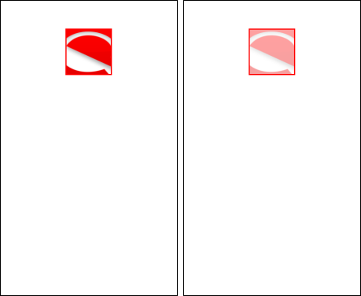
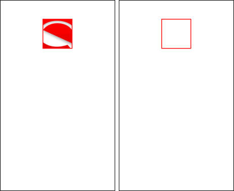
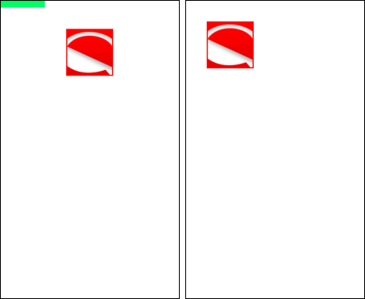

# Manipulating Graphical Objects

This topic introduces the basic manipulations available for the `Evas_Object` object. Most Evas objects can be manipulated using generic functions.

The list of available basic actions does not depend on the object's type. Evas implements functionality that allows you to perform basic manipulation, such as showing, hiding, setting and getting geometry, bringing a layer up or down, managing color, clipping, and reference counting.

## Creating Evas Objects

To start working with Evas:

1. Create an Evas instance (usually a window) or get the Evas canvas on which an already allocated Evas object lives on:

   ```
   /* Create Evas instance */
   ad->win = elm_win_util_standard_add(PACKAGE, PACKAGE);
   elm_win_autodel_set(ad->win, EINA_TRUE);

   /* Get the canvas */
   Evas *evas = evas_object_evas_get(ad->win);
   ```

2. When you have an instance of the Evas object and the Evas canvas, you can create basic Evas objects as child objects for the parent Evas canvas.

   The following example creates a background `Evas_Object` with white color, a size of 480 x 800, a position on the window at 0,0 on X and Y axes, and shows the object on the screen:

   ```
   ad->bg = evas_object_rectangle_add(evas);
   evas_object_color_set(ad->bg, 255, 255, 255, 255);
   evas_object_resize(ad->bg, 480, 800);
   evas_object_move(ad->bg, 0, 0);
   evas_object_show(ad->bg);
   ```

   **Figure: White background object**

   

## Clipping an Object

You can set an Evas object as a clipper for another Evas object. To create the clipper object, create an Evas object, set its width and height parameters, and call the `evas_object_clip_set()` function to set the object as a clipper for other Evas objects:

```
/* Create the image object */
ad->img = evas_object_image_filled_add(evas);
_app_get_resource("images/enlightenment.png", image_path, PATH_MAX);
evas_object_image_file_set(ad->img, image_path, NULL);
if (evas_object_image_load_error_get(ad->img) != EVAS_LOAD_ERROR_NONE)
    return;

/* Set the image object properties */
evas_object_geometry_get(ad->spacer, NULL, NULL, &w, &h);
evas_object_name_set(ad->img, "background");
evas_object_resize(ad->img, WIDTH, HEIGHT);
evas_object_move(ad->img, w, h);
evas_object_show(ad->img);

/* Create the clipper object */
ad->clipper = evas_object_rectangle_add(evas);
evas_object_geometry_get(ad->img, &x, &y, &w, &h);
evas_object_move(ad->clipper, WIDTH / 4 + x, HEIGHT / 4 + y);
evas_object_resize(ad->clipper, w / 2, h / 2);

/* Set the clipper object to clip the image object */
evas_object_clip_set(ad->img, ad->clipper);
evas_object_show(ad->clipper);
```

**Figure: Clipping an image**


To disable the clipping, you can unset the clipper object using the `evas_object_clip_unset()` function. As a result, both the originally clipped object and the clipper object become fully visible, in the creation order. In the following example, the rectangle (the clipper object) is on top of the image object, because it was created after the image object.

```
static void
_clipper_cb(void *data, Evas *e, Evas_Object *obj, void *event_info)
{
    App_Data *ad = (App_Data *)data;

    const char *object_name = evas_object_name_get(ad->img);
    if (strcmp(object_name, "background") != 0)
        return;

    /* If the clipper object currently clips the image object */
    if (evas_object_clip_get(ad->img) == ad->clipper) {
        /* Disable the clipping */
        evas_object_clip_unset(ad->img);
    } else {
        /* Otherwise, clip the image object */
        evas_object_clip_set(ad->img, ad->clipper);
    }
}
```

**Figure: Disabling the clipping**


## Changing Colors and Visibility

To manage the object color and visibility:

- To change the color of a valid `Evas_Object`, use the `evas_object_color_set()` function and pass a new color value:

  ```
  static void
  _color_cb(void *data, Evas *e, Evas_Object *obj, void *event_info)
  {
      App_Data *ad = (App_Data *)data;

      int alpha;
      int r;
      int g;
      int b;

      /* Retrieve the current clipper color */
      evas_object_color_get(ad->clipper, &r, &g, &b, &alpha);

      /* Define the new color attributes */
      evas_color_argb_unpremul(alpha, &r, &g, &b);
      if (g > 0)
          g = b = 0;
      else
          g = b = 255;
      evas_color_argb_premul(alpha, &r, &g, &b);

      /* Set the new color */
      evas_object_color_set(ad->clipper, r, g, b, alpha);
  }
  ```

  **Figure: Applying a color**

  

- To change the opacity of the object:

  ```
  static void
  _opacity_cb(void *data, Evas *e, Evas_Object *obj, void *event_info)
  {
      App_Data *ad = (App_Data *)data;

      int alpha;
      int r;
      int g;
      int b;

      /* Retrieve the current clipper color and opacity */
      evas_object_color_get(ad->clipper, &r, &g, &b, &alpha);

      /* Define the new color attributes and alpha value for opacity */
      evas_color_argb_unpremul(alpha, &r, &g, &b);
      alpha -= 20;
      if (alpha < 0)
          alpha = 255;
      evas_color_argb_premul(alpha, &r, &g, &b);

      /* Set the new color and opacity */
      evas_object_color_set(ad->clipper, r, g, b, alpha);
  }
  ```

  **Figure: Changing the opacity**

  

- To hide the object when it is not needed:

  ```
  static void
  _visibility_cb(void *data, Evas *e, Evas_Object *obj, void *event_info)
  {
      App_Data *ad = (App_Data *)data;

      /* If the clipper is visible */
      if (evas_object_visible_get(ad->clipper)) {
          /* Hide it */
          evas_object_hide(ad->clipper);
      } else {
          /* Otherwise, show it */
          evas_object_show(ad->clipper);
      }
  }
  ```

  **Figure: Changing visibility**

  

## Using Reference Counts

Evas has a simple reference counting mechanism that is useful in scenarios where, for example, callbacks inside a code block possibly delete an object that is operated on afterwards outside the code block.

To increment the reference count of an object, use the `evas_object_ref()` function. If the reference count is greater than 0, the `evas_object_del()` function defers the deletion until all references are released. References cannot go below 0 and are limited to 2^32 - 1 for each object.

```
/* Create a green rectangle */
ad->spacer = evas_object_rectangle_add(evas);
evas_object_color_set(ad->spacer, 0, 255, 100, 255);
evas_object_move(ad->spacer, 0, 0);
evas_object_resize(ad->spacer, 120, 20);
evas_object_show(ad->spacer);
/* Increase the reference count */
evas_object_ref(ad->spacer);

static void
_unref_cb(void *data, Evas *e, Evas_Object *obj, void *event_info)
{
    App_Data *ad = (App_Data *)data;

    if (!ad->spacer)
        return;

    if (evas_object_ref_get(ad->spacer) != 0) {
        /* Decrease the reference count */
        evas_object_unref(ad->spacer);

        return;
    }

    int x;
    int y;
    int w;
    int h;

    /* Modify the image and clipper object positions */
    evas_object_geometry_get(ad->spacer, &x, &y, NULL, NULL);
    evas_object_move(ad->img, x, y);
    evas_object_geometry_get(ad->img, &x, &y, &w, &h);
    evas_object_move(ad->clipper, x + (w / 4), y + (h / 4));
    evas_object_move(ad->clipper_border, x + (w / 4) - 3, y + (h / 4) - 3);

    /* Delete the green rectangle, if the reference count is 0 */
    evas_object_del(ad->spacer);
    ad->spacer = NULL;
}
```

In the above example, a green rectangle is used as padding and the clipper object calculates its X, Y coordinates based on the rectangle position. When the rectangle is created, its reference count is increased to 1 by calling the `evas_object_ref()` function. When the `_unref_cb()` callback is triggered, the reference count value is higher than 0 and the `evas_object_unref()` function is called to decrease it. At the end of the callback, the reference count is 0 and the `evas_object_del(ad->spacer)` function marks the rectangle object for deletion.

**Figure: Removing padding**



## Changing the Object Order on the Canvas

To handle the object order on the canvas:

- By default, objects are placed on the canvas based on their creation order:

  ```
  /* Create a red rectangle */
  ad->order_rect1 = evas_object_rectangle_add(evas);
  evas_object_name_set(ad->order_rect1, "red");
  evas_object_color_set(ad->order_rect1, 255, 0, 0, 255);
  evas_object_move(ad->order_rect1, 120, 310);
  evas_object_resize(ad->order_rect1, 200, 200);
  /* Show the red rectangle */
  evas_object_show(ad->order_rect1);

  /* Create a blue rectangle */
  ad->order_rect2 = evas_object_rectangle_add(evas);
  evas_object_name_set(ad->order_rect2, "blue");
  evas_object_color_set(ad->order_rect2, 0, 0, 255, 255);
  evas_object_move(ad->order_rect2, 180, 350);
  evas_object_resize(ad->order_rect2, 200, 200);
  /* Show the blue rectangle on top of the red rectangle */
  evas_object_show(ad->order_rect2);
  ```

  **Figure: Default object order on the canvas**

  

- To change the object order, use the `evas_object_stack_below()` function:

  ```
  static void
  _object_order_cb(void *data, Evas *e, Evas_Object *obj, void *event_info)
  {
      App_Data *ad = (App_Data *)data;

      /* Get the object below the blue rectangle (the red one) */
      Evas_Object *rect = evas_object_below_get(ad->order_rect2);
      if (!rect)
          return;

      const char *name = evas_object_name_get(rect);
      if (name) {
          /* If the object is the red rectangle */
          if (strcmp(name, "red") == 0) {
              /* Move the blue rectangle below the red one */
              evas_object_stack_below(ad->order_rect2, rect);

              return;
          }
      }
  }
  ```

  **Figure: Changed object order**

  

- To place an object to the top or bottom of its layer on the canvas object stack, use the `evas_object_raise()` or `evas_object_lower()` function.

  In the following example, the `_lower_cb()` callback puts the canvas background at the bottom, showing both the rectangles that are on higher levels. On the other hand, the `_raise_cb()` callback puts the background to the top, hiding both the rectangles that are now on lower levels.

  ```
  static void
  _lower_cb(void *data, Evas *e, Evas_Object *obj, void *event_info)
  {
      App_Data *ad = (App_Data *)data;

      /* Move the background to the bottom */
      evas_object_lower(ad->bg);
  }

  static void
  _raise_cb(void *data, Evas *e, Evas_Object *obj, void *event_info)
  {
      App_Data *ad = (App_Data *)data;

      /* Move the background to the top */
      evas_object_raise(ad->bg);
      ad->isBgOnTop = EINA_TRUE;
  }
  ```

  **Figure: Canvas background at the bottom (left) and on the top (right)**

  

## Related Information
- Dependencies
  - Tizen 2.4 and Higher for Mobile
  - Tizen 2.3.1 and Higher for Wearable
