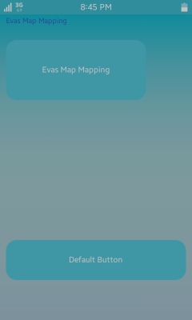
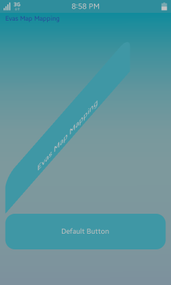

# Creating Evas Map Effects

The following examples demonstrate how you can use UV mapping and Evas map functions. UV mapping allows you to map points in the 2D Evas source object to 3D space positions in the target object ("U" and "V" denote the axes of the 2D texture). You can then modify the map point U and V texture source points with Evas map mapping APIs to create various effects.

## Creating the Example Application UI

To illustrate the map effects in an application, create an application project in the Tizen Studio and implement a UI with a title text and 2 buttons:

1. To use the required APIs, include the following libraries:

   ```
   #include <app.h>
   #include <Elementary.h>
   #include <system_settings.h>
   #include <efl_extension.h>
   ```

2. Create an Evas object for an Elementary window and 2 buttons:

   ```
   struct appdata {
       Evas_Object *win;
       Evas_Object *button;
       Evas_Object *default_btn;
   };
   typedef struct appdata appdata_s;
   ```

3. Create the UI window and title text:

   - To create an Elementary window, use the `elm_win_util_standard_add()` function and give the name and title of the application.
   - To set a callback for the hardware **Back** key, use the `eext_object_event_callback_add()` function.
   - To create and display the title text as an Evas object, use the `evas_object_evas_get()` and `evas_object_show()` functions.

   ```
   static void
   create_base_gui(appdata_s *ad)
   {
       Evas_Object *evas_text = NULL;
       Evas *evas = NULL;

       /* Window */
       ad->win = elm_win_util_standard_add("Extra object function", "Extra object function");
       elm_win_autodel_set(ad->win, EINA_TRUE);

       /* Window callbacks */
       evas_object_smart_callback_add(ad->win, "delete,request", win_delete_request_cb, NULL);
       eext_object_event_callback_add(ad->win, EEXT_CALLBACK_BACK, win_back_cb, ad);

       evas = evas_object_evas_get(ad->win);

       evas_text = evas_object_text_add(evas);
       evas_object_text_text_set(evas_text, "Evas Map Mapping");
       evas_object_text_font_set(evas_text, "Sans", 18);
       evas_object_color_set(evas_text, 50, 100, 200, 255);
       evas_object_move(evas_text, 15, 40);
       evas_object_show(evas_text);

       evas_object_show(ad->win);
   }
   ```

4. Create the buttons for mapping.

   Use the `evas_object_move()` and `evas_object_resize()` functions to configure the button custom geometry.

   ```
   /* Create a button for mapping */
   ad->button = elm_button_add(ad->win);
   elm_object_text_set(ad->button, "Evas Map Mapping ");
   evas_object_move(ad->button, 15, 100);
   evas_object_resize(ad->button, 350, 150);
   evas_object_show(ad->button);

   /* Create a default button */
   ad->default_btn = elm_button_add(ad->win);
   elm_object_text_set(ad->default_btn, "Default Button ");
   evas_object_move(ad->default_btn, 15, 600);
   evas_object_resize(ad->default_btn, 450, 100);
   evas_object_show(ad->default_btn);
   ```

The following figure shows the example application UI before the map effects are added.

**Figure: Example application UI without map effects**



## Adding Map Effects

This use case adds a map effect to the **Evas Map Mapping** button in the example application UI. The effect changes the button shape and location, and maps the button image to be modified along with the button.

To create a map effect:

1. Get the `Evas_Map` object and create a map using the `evas_map_new()` function:

   ```
   Evas_Map *map;
   map = evas_map_new(4);
   ```

2. Set the coordinates for each map point using the `evas_map_point_coord_set()` function.

   The coordinates used in this example move the button and change its shape.

   ```
   /* Set map coordinates */
   evas_map_point_coord_set(map, 0, 15, 500, 0);
   evas_map_point_coord_set(map, 1, 365, 100, 0);
   evas_map_point_coord_set(map, 2, 365, 200, 0);
   evas_map_point_coord_set(map, 3, 15, 600, 0);
   ```

3. Set the image UV points using the `evas_map_point_image_uv_set()` function.

   These coordinates define how the button image is mapped.

   ```
   /* Set image UV */
   evas_map_point_image_uv_set(map, 0, 0, 0);
   evas_map_point_image_uv_set(map, 1, 360, 0);
   evas_map_point_image_uv_set(map, 2, 350, 90);
   evas_map_point_image_uv_set(map, 3, 0, 100);
   ```

4. To apply the map on the button, use the `evas_object_map_set()` function.
   ```
   /* Apply the map to the button Evas object */
   evas_object_map_set(ad->button, map);
   ```

5. To enable the map, use the `evas_object_map_enable_set()` function.

   When enabled, the original object geometry is saved, and the new map geometry is used to change the object position and size.
   ```
   /* Enable the map */
   evas_object_map_enable_set(ad->button, EINA_TRUE);
   ```

6. When no longer needed, free the map data and all memory associated with it:

   ```
   /* Free map resources */
   evas_map_free(map);
   ```

The following figure shows the example application UI with the map effects.

**Figure: Example application UI with map effects**



## Related Information
- Dependencies
  - Tizen 2.4 and Higher for Mobile
  - Tizen 2.3.1 and Higher for Wearable
