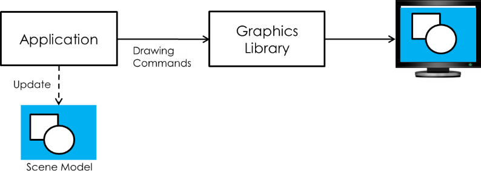
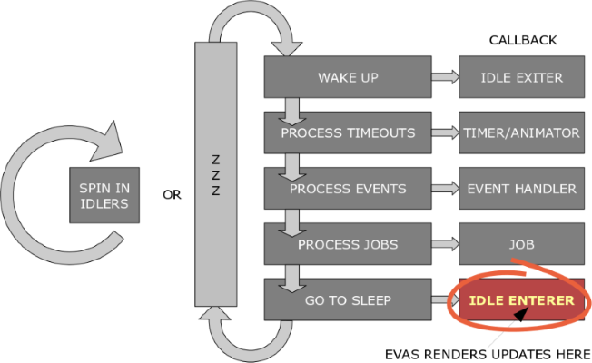
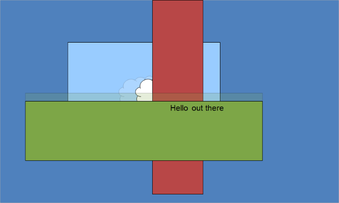
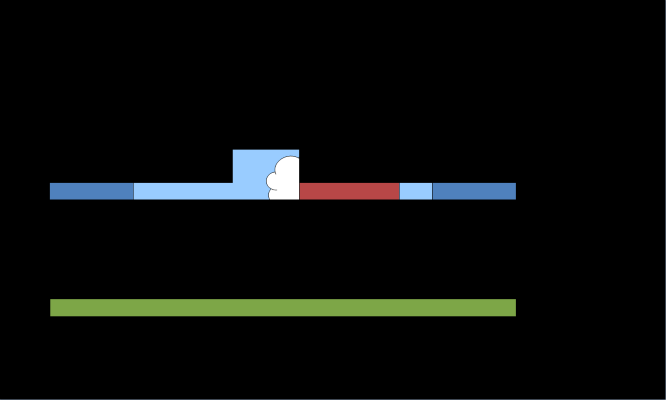

# Evas Rendering Concept and Method

Evas is a canvas display library where the canvas is structural and acts as a state engine. It differs from most display and windowing systems, which are immediate mode display targets. Evas handles the logic of the structural display using its state engine, and controls the target windowing system to produce rendered results of the current canvas's state on the display.

## UI Rendering Modes

Evas removes the need to know about the characteristics of your display system or what graphics calls are used to draw them and how. It operates at an object level, where all you do is create and manipulate objects on a canvas, set their properties, and the rest is done for you. This rendering method is called the retained mode, as opposed to the immediate mode used in most display and windowing systems:

- **Immediate mode**  

  The immediate mode is most commonly used in graphic toolkit libraries, such as GTK+, GDI, and GDI+. The application is responsible for repainting the invalid portion of the client area.  

  **Figure: Immediate mode**  
    

  Immediate mode display systems retain very little or no state. A program executes a series of commands, as in the following pseudo code:

  ```
  draw line from position (0, 0) to position (100, 200);

  draw rectangle from position (10, 30) to position (50, 500);

  bitmap_handle = create_bitmap();
  scale bitmap_handle to size 100 x 100;
  draw image bitmap_handle at position (10, 30);
  ```

  The series of commands is executed by the windowing system and the results are typically displayed on the screen. Once the commands are executed, the display system does not know how to reproduce this image again, and has to be instructed by the application on how to redraw sections of the screen, if needed. Each successive command is executed as instructed by the application and either emulated by the software or sent to the graphics hardware on the device to be performed.  

  The advantage of an immediate mode system is that it is simple and gives a program tight control over how something looks and is drawn. Given the increasing complexity of displays and demands for better looking interfaces, more work needs to be done at this level by the internals of UI component sets, custom display components, and other programs. This means that more logic and display rendering code needs to be written again each time the application needs to figure out how to minimize redraws for the display to be fast and interactive, and keep track of the redraw logic.  

  In the following pseudo code scene example, if the windowing system requires the application to redraw the area from 0, 0 to 50, 50 (also referred to as the "expose event"), you must manually calculate the updates and repaint the area:

  ```
  Redraw from position (0, 0) to position (50, 50):

  /* What was in area (0, 0, 50, 50)? */

      /* 1. intersection part of line (0, 0) to (100, 200)? */
      draw line from position (0, 0) to position (25, 50);

      /* 2. intersection part of rectangle (10, 30) to (50, 500)? */
      draw rectangle from position (10, 30) to position (50, 50);

      /* 3. intersection part of image at (10, 30), size 100 x 100? */
      bitmap_subimage = subregion from position (0, 0) to position (40, 20);
      draw image bitmap_subimage at position (10, 30);
  ```

  In the immediate mode, the application commands any drawing issues as it needs, and the display system draws some UI components. After the drawing is done, it appears in the destination. This mode allows you to have exact control over the render cycles. However, if the draw commands are misused, unnecessary drawing can be performed or drawing never happens at all. For example, if all elements in the scene are opaque, the system is doing useless paints: part of the line is behind the rectangle, and part of the rectangle is behind the image. These useless paints tend to be very costly.  

  The following code example shows the common usage of the immediate mode:

  ```
  void
  update()
  {
      Image *img = load_image(NEW_IMG);

      /* Switch button image to new one */
      update_button_image(img);

      /* Issue the invalid area (button area) to be redrawn on the screen */
      invalidate_area(button_x, button_y, button_w, button_h);

      /* Move rectangle from (200, 200) to (300, 300) */
      int rect_prev_x = rect_x;
      int rect_prev_y = rect_y;
      rectangle_x = 300;
      rectangle_y = 300;
      set_rect_position(rect_x, rect_y);

      /* Issue the invalid area (changed area) to be redrawn on the screen */
      int diff_x = rect_x – rect_prev_x;
      int diff_y = rect_y – rect_prev_y;
      invalidate_area(rect_prev_x, rect_prev_y, (rect_w + diff_x), (rect_h + diff_y));

      /* After setting the invalid area, request rendering to update the screen */
      render();

      /* Now you can see how the button image and rectangle position are changed */
  }
  ```

- **Retained mode**  

 A graphics system adopting the retained mode is basically responsible for responding to all repaint requests for rendering the application objects. Clients do not directly cause actual rendering, but objects are redrawn when parts of them are updated.  

 **Figure: Retained mode**  
   

 Evas is a structural system in which you create and manage display objects and their properties, and as a result of this higher-level state management, the canvas is able to redraw the set of objects when needed to represent the current state of the canvas.  

 A program creates the display objects and their properties as a series of commands, as in the following pseudo code:

  ```
  line_handle = create_line();
  set line_handle from position (0, 0) to position (100, 200);
  show line_handle;

  rectangle_handle = create_rectangle();
  move rectangle_handle to position (10, 30);
  resize rectangle_handle to size 40 x 470;
  show rectangle_handle;

  bitmap_handle = create_bitmap();
  scale bitmap_handle to size 100 x 100;
  move bitmap_handle to position (10, 30);
  show bitmap_handle;

  render scene;
  ```

  The pseudo code looks longer than in the immediate mode, but when the display needs to be refreshed or updated, you only need to move, resize, show, or hide the objects that need to change. You can think at the object logic level, and the canvas software does the rest of the work for you, figuring out what changed on the canvas since it was last drawn and how to most efficiently redraw the canvas and its contents to reflect the current state, and doing the actual drawing of the canvas.  

  The retained mode allows you to think in a more natural way when dealing with a display, and saves time and effort of working out how to load and display images in the current display system. Since Evas is portable across different display systems, you can port and display the code on different display systems with little work.  

  Evas is a display system somewhere between a UI component set and an immediate mode display system. It retains basic display logic, but does little high-level logic, such as scroll bars, sliders, or push buttons.  

  Since Evas works with the retained mode, there is no need to command any drawings. The following code example shows how to create UI components, set their properties and show them on the screen:

  ```
  void
  create_image()
  {
      /* Initialize an image object to be displayed on the screen */
      Evas_Object *img = evas_object_image_add(e);

      /* Set image resource */
      evas_object_image_file_set(img, IMG, NULL);

      /* Set image position */
      evas_object_move(img, 100, 100);

      /* Set image size */
      evas_object_resize(img, 200, 200);

      /* Set image visibility (show or hide) */
      evas_object_show(img);
  }

  void
  create_rectangle()
  {
      /* Initialize a rectangle object to be displayed on the screen */
      Evas_Object *rect = evas_object_rectangle_add(e);

      /* Set rectangle color */
      evas_object_color_set(rect, 255, 0, 0, 255);

      /* Set rectangle position */
      evas_object_move(rect, 200, 200);

      /* Set rectangle size */
      evas_object_resize(rect, 200, 200);

      /* Set rectangle visibility (show or hide) */
      evas_object_show(rect);
  }
  ```

  During the program execution, you can modify the created UI components: replace the image with another one and move the rectangle. You only need to set a new image file to the image object and move the rectangle object. Evas computes the invalid area and redraws the image and rectangle when it is time to render.

  ```
  void
  update()
  {
      /* Set new image resource */
      elm_image_file_set(img, NEW_IMG, NULL);

      /* Set new rectangle position */
      evas_object_move(rect, 300, 300);
  }
  ```

## Retained Rendering Example

Tizen native applications run on the Ecore main loop, which performs a few steps for every frame. At the end of the loop, when it goes to the idle enterer step, Evas redraws any changes in the objects by calculating the changed portions of all display objects and redrawing them. If there are no changes, Evas rendering is skipped.

**Figure: Evas rendering in the main loop**



To minimize the required rendering, Evas tracks the states of all display objects, such as their position, size, visibility, and color. If a state is changed while the object is hidden by other obscured objects, the object is not redrawn. In other words, Evas draws only the necessary changes in the screen.

The following figures illustrate how Evas redraws a changed area:

1. Originally, the screen contains a blue background object (a sky-blue color rectangle) and a partially hidden cloud image object. Above them, there are a red and green rectangle, and the "Hello out there" text printed on the green rectangle.

   

2. When some of the objects move (the cloud image is moved to right and the green rectangle is moved downwards), the screen must be rendered again.

   

3. Evas only renders the areas that require updates (changed areas of the objects have been removed in the following figure and only show the blue background). The unchanged parts of the screen are not rendered again.

   

4. Evas determines the invalid areas that require cleaning, and redraws them.

   

5. At the end, the updated screen shows the original screen with the updated areas visible.

   

If the immediate mode is used, the application must calculate the changed areas itself, adding extra work. With the retained mode, you can let Evas figure out the updates and you can yourself concentrate on the application, UI core, and logic.

## Evas Engines Concept

Evas delegates most of the actual rendering work to its engines. Engines are the backends that Evas uses to render primitive objects on a canvas. The canvas can be the screen, or a buffer in the memory.

Evas can work with and provides multiple engines, such as:

- `buffer`: All the rendering takes place in a buffer.
- `fb`: Rendering takes place in the system's framebuffer.
- `software_x11`: Renders to an X11 window; this is the most used engine.
- `gl_x11`: Renders to an X11 window, except that it uses OpenGL&reg;.

The engines implement the rendering of all the basic objects by themselves, because they can often be accelerated by the hardware or backend software libraries to provide fast rendering.

If a particular engine does not have the provision for a certain primitive object, it reverts back to using a default software version.

> **Note**  
> Except as noted, this content is licensed under [LGPLv2.1+](http://opensource.org/licenses/LGPL-2.1).

## Related Information
- Dependencies
  - Tizen 2.4 and Higher for Mobile
  - Tizen 2.3.1 and Higher for Wearable
