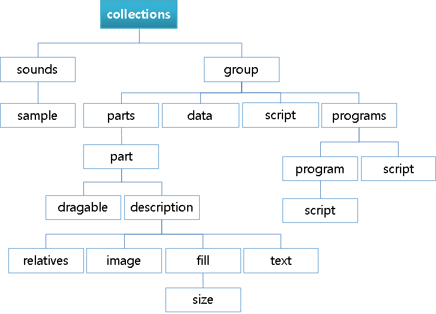

# Collections Block

The `collections` block is used to list the groups that compose the theme. Additional `collections` blocks do not prevent overriding group names.

**Figure: Collections block**



```
collections {
   base_scale: 1.8;
   sounds {
      tone: "tone-1" 2300;
      tone: "tone-2" 440;
      sample {
         name: "sound_file1" RAW;
         source: "sound_file1.wav";
      }
   }
   group {
      name: "groupname";
      alias: "anothername;"
      min: width height;
      max: width height;
      parts {}
      scripts {}
      limits {}
      data {}
      programs {}
   }
}
```

- `base_scale: [scale factor]`  

  Sets information about the scale factor in the EDC file.  

  Object scaling must be defined in the `config.xml` file of the application to show the application in a proper size on other devices. However, the scaling must be based on the scale 1.0. If the application is based on another scale, this scale must be defined in the `config.xml` file. This predefined scale is called the base scale.  

  The size of a scalable object is multiplied with the device scale value. If the scalable object with the size 10 is created on a device with scale 1.0, the size of the object is 20 on a device with scale 2.0, and 40 on a device with scale 4.0.  

  For more information on supporting multiple screens in one EDC, see the [Multiple Screen Support](./multiple-screens.md) guide.

- `sounds` block  

  The `sounds` block contains 1 or more sound sample and tone items.
  - `tone [tone name] [frequency]`  

    Sets the sound of the given frequency.

  - `sounds.sample` block  

    The `sample` block defines the sound sample.
    - `name [sample name] [compression type] (quality)`  

      Used to include each sound file. The full path to the directory holding the sounds can be defined later with the `edje_cc` tool's `-sd` option. The valid compression types are:	    
      - `RAW`: Uncompressed    
      - `COMP`: Lossless compression    
      - `LOSSY [-0.1 - 1.0]`: Lossy compression with quality from 0.0 to 1.0    
      - `AS_IS`: No compression or encoding, write the file information as it is

    - `source [file name]`  

      Sets the sound source file name (mono or stereo WAV file; only files with the 44.1 KHz sample rate are supported for now).

- `group` block  

  The [group](./learn-edc-group.md) block defines Edje Objects.

> **Note**  
> Except as noted, this content is licensed under [LGPLv2.1+](http://opensource.org/licenses/LGPL-2.1).

## Related Information
- Dependencies
  - Tizen 2.4 and Higher for Mobile
  - Tizen 2.3.1 and Higher for Wearable
