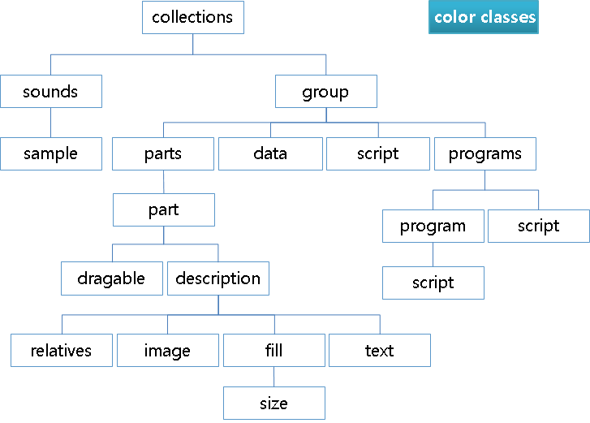

# Color Classes Block

The `color_classes` block contains 1 or more `color_class` blocks. Each `color_class` block allows you to name an arbitrary group of colors to be used in the theme. The application can use that name to alter the color values at runtime.

**Figure: Color classes block**



```
color_classes {
   color_class {
      name: "colorclassname";
      color: [0-255] [0-255] [0-255] [0-255];
      color2: [0-255] [0-255] [0-255] [0-255];
      color3color3: [0-255] [0-255] [0-255] [0-255];
   }
}
```

- `name [color class name]`  

  Sets the name for the color class, and is used as a reference by both the theme and the application.

- `color [red] [green] [blue] [alpha]`  

  Sets the main color.

- `color2 [red] [green] [blue] [alpha]`  

  Used as an outline in text and textblock parts.

- `color3 [red] [green] [blue] [alpha]`  

  Used as a shadow in text and textblock parts.

> **Note**  
> Except as noted, this content is licensed under [LGPLv2.1+](http://opensource.org/licenses/LGPL-2.1).

## Related Information
- Dependencies
  - Tizen 2.4 and Higher for Mobile
  - Tizen 2.3.1 and Higher for Wearable
