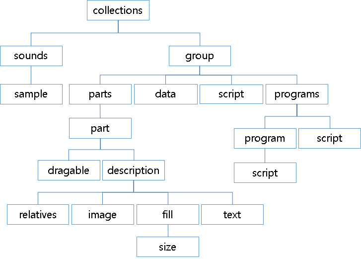

# Layouting with EDC

An EDC (Edje data collection) file is a text file that contains the code describing the position, size, and other parameters of graphical elements that compose the visual aspect of your application. In addition to graphical elements, it can also handle sounds. EDC is a description language where the objects of an interface are described by using a text description.

The EDC file has the `.edc` file extension. The syntax for the EDC files follows a simple structure of blocks that can contain properties and other blocks.

## Writing a Simple EDC File

The following example shows the basic structure of an EDC file:

```
color_classes {}
styles {}
collections {
   group {
      name: "my_group";
      parts {}
      programs {}
   }
}
```

The following chart shows the details of the top-level blocks.

**Table: EDC blocks**

| Block name                               | Description                              |
|----------------------------------------|----------------------------------------|
| [collections](./learn-edc-collections.md) | Used to list the groups that compose the theme. Additional collections blocks do not prevent overriding group names. |
| [group](./learn-edc-group.md) | Contains a list of parts and programs that compose a given Edje object. |
| [parts](./learn-edc-part.md) | Used to represent the most basic design elements of the theme, for example, a part block can represent a line in a border or a label on a button. Parts contain 1 or more part blocks. |
| [programs](./learn-edc-program.md) | Defines how your interface reacts to events. A program block can change the part state or trigger other events. Programs contain 1 or more program blocks. |
| [images](./learn-edc-images.md) | Used to list the image files used in the theme. The used compression methods are also defined here. |
| [data](./learn-edc-data.md) | Used for data that covers the whole theme, such as license information, version, and authors. |
| [color_classes](./learn-edc-color-classes.md) | Contains 1 or more color_class blocks. Each color_class block allows you to name an arbitrary group of colors to be used in the theme. |
| [styles](./learn-edc-styles.md) | Contains 1 or more style blocks. A style block is used to create style `<tags>` for advanced textblock formatting. |

The following figure shows the relationships between blocks.

**Figure: EDC block diagram**



The following example shows an EDC file that contains only 1 part and 1 program. The part is a rectangle with a blue state and a red state, and the program changes the state from blue to red when the user clicks the rectangle:

```
collections {
   group {
      name: "example";
      parts {
         /* Create the part */
         part {
            name: "rectangle";
            /* Set the type to RECT (rectangle) */
            type: RECT;
            /* Default state (blue color) */
            description {
               state: "default" 0.0;
               align: 0.0 0.0;
               /* Blue color */
               color: 0 0 255 255;
            }
            /* Second state (red color) */
            description {
               state: "red" 0.0;
               align: 0.0 0.0;
               /* Red color */
               color: 255 0 0 255;
            }
         }
      }
      programs {
         /* Create a program */
         program {
            name: "change_color";
            /* Program is triggered on a mouse click */
            signal: "mouse,clicked,*";
            source: "*";
            /* Set the red state of the "rectangle" part */
            action: STATE_SET "red" 0.0;
            target: "rectangle";
         }
      }
   }
}
```

The program is triggered when a signal arrives from a specific source (in the above example, all the sources are taken into account). When launched, the program does the action (changing the part state) on the target (the rectangle).

## Compiling an EDC File

An EDC file needs to be compiled into a `.edj` file using the Edje library tools. After compiling, the `.edj` file can be used by a native Tizen application. The Tizen Studio automatically calls the `edje_cc` tool during the project building, if it finds an EDC source file in the `../res/edje/` directory.

The following Tizen Studio compilation log extract shows that if your EDC file uses images, they must be copied to the `../edje/images` directory. Fonts and sounds go to the `../edje/fonts` and `../edje/sounds` directories. The Tizen Studio builds the `helloworld.edj` file in the `../res/edje/` folder.

```
Building file: ../res/edje/helloworld.edc
Invoking: EDC Resource Compiler
edje_cc -sd ../edje/sounds -fd ../edje/fonts -id ../edje/images ../res/edje/helloworld.edc
../res/edje/helloworld.edj
```

You need to connect the `.edj` file to the C code. It can be achieved by using a layout, one of containers. If you use the basic Tizen EFL project template, it reduces the time to worry about the connecting process. For more information on using the basic Tizen project template, see [Creating Your First Tizen Mobile Native Application](../../../getting-started/mobile/first-app.md) or [Creating Your First Tizen Wearable Native Application](../../../getting-started/wearable/first-app.md). If you want to know the way to use and connect a layout in detail, see [Layout](./container-layout.md).

> **Note**
>
> Except as noted, this content is licensed under [LGPLv2.1+](http://opensource.org/licenses/LGPL-2.1).

## Related Information
- Dependencies
  - Tizen 2.4 and Higher for Mobile
  - Tizen 2.3.1 and Higher for Wearable
