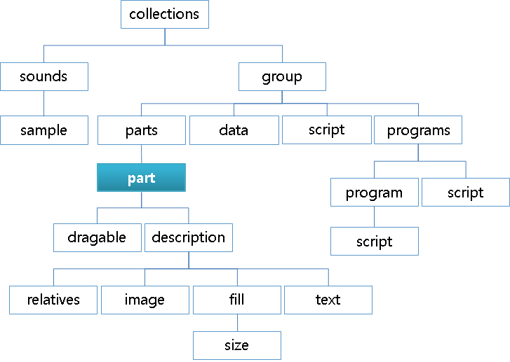
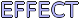
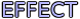
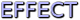

# Part Block

The `part` block is used to represent the most basic design elements of the theme, for example, a part can represent a line in a border or a label on a button.

You can also position parts on the screen. You can define a size and relative position for each part, and add offsets for the relative positioning. For more information, see [Positioning Parts](./learn-edc-positioning-parts.md).

**Figure: Part block**



```
part {
   /* Name the part */
   name: "partname";
   /* Inherit all the fields of another part */
   inherit: "partname";
   /* Set the part type */
   type: IMAGE;
   /* Enable mouse events on the part */
   mouse_events: 0/1;
   /* Repeat the mouse events to the parts below the current one */
   repeat_events: 0/1;
   ignore_flags: NONE;
   /* Set whether the part sizes scale with the Edje scaling factor */
   scale: 0/1;
   /* Set whether fully-transparent pixels are considered in collision detection */
   precise_is_inside: 0/1;
   /* Only render the area of the part that coincides with the given part */
   clip_to: "anotherpart";
   /* For group/textblock: swallow the given group (for textblock: goes below text) */
   source: "groupname";
   /* Same as the source but goes on top of text */
   source2: "groupname";
   /*
      For textblock: swallow the given group below the mouse cursor
      when it hovers over the part
   */
   source3: "groupname";
   /* Same as source3 but goes on top of the cursor */
   source4: "groupname";
   /* For textblock: swallow the given group below text anchors (<a>...</a>) */
   source5: "groupname";
   /* Same as source5 but goes on to top of the anchor */
   source6: "groupname";
   /* Add a shadow effect to the part */
   effect: SOFT_SHADOW (BOTTOM_RIGHT);
   /* For textblock: makes the text editable, possibly with a specific behavior */
   entry_mode: PASSWORD;
   /* For textblock: change how the text selection is triggered */
   select_mode: EXPLICIT;
   /* For editable textblock: where to draw the (blinking) cursor */
   cursor_mode: UNDER;
   /* For editable textblock: allow multiple lines */
   multiline: 0/1;
   /* For textblock: accessibility features are used */
   access: 0/1;
   /* No-one uses that */
   pointer_mode: AUTOGRAB;
   use_alternate_font_metrics: 0/1;
   /* Remove the given program; useful when it was inherited */
   program_remove: "programname";
   /* Remove the given part; useful when it was inherited */
   part_remove: "partname";
   /* Insert the current part below the given part, as if it were declared before */
   insert_before: "partname";
   /* Insert the current part above the given part, as if it were declared after */
   insert_after: "partname";
   /* Define a new part inside this one */
   part {
      <part definition>
   }
   draggable {
      /* Confine the current part to the given part */
      confine: "another part";
      /* Only start drag when it has moved enough to be outside the given part */
      threshold: "another part";
      /* Forward the drag events to the given part instead of handling them */
      events: "another draggable part";
      /* Enable the horizontal drag with step_size steps or with steps_count steps */
      x: 0/1 <step_size> <steps_count>;
      /* Same as x but vertical */
      y: 1 0 100;
   }
   /* For box or table */
   box/table {
      /* List of items */
      items {
            /* Name the item */
            item { name: "name";
            /* Define the item type, can only be GROUP */
            type: GROUP;
            /* Set the source for this item, or its content */
            source: "groupname";
            /* Set the minimum horizontal and vertical item sizes (-1 for expand) */
            min: -1 -1;
            /* Set the maximum horizontal and vertical item sizes (-1 for ignore) */
            max: 100 100;
            /* Set the item padding in pixels */
            padding: 2 2 2 2;
            spread: 1 1;
            /* Set the item alignment */
            align: 0.5 0.5;
            /* Set a weight hint in the box for the given object */
            weight: 1 1;
            /* Set the aspect ratio hint */
            aspect: 1 1;
            aspect_mode: BOTH;
            /* Set the number of columns and rows the item takes */
            span: 1 1;
         }
      }
   }
   description {
      /* Inherit another description */
      inherit: "default" 1.0;
      /* Name the current description */
      state: "default" 1.0;
      /*
         Use another part as content of the current proxy part
         This description only works in the proxy part and
         the current part mirrors the rendering content of the source part
      */
      source: "partname";
      /* Make the part (in)visible (invisible parts emit no signals) */
      visible: 0/1;
      /* Emit a signal when the given dimension becomes zero or stops being zero */
      limit: WIDTH;
      /* Set the horizontal and vertical alignment of the part inside its parent */
      align: 0.5 0.5;
      /* Set that the part does not change size */
      fixed: 0/1 0/1;
      /* Set the minimum size for the part */
      min: 200 200;
      /* Forcibly multiply the minimum sizes by the given factors */
      minmul: 1.2 1.2;
      /* Set the maximum size for the part */
      max: 400 400;
      /* Make vertical and horizontal resizes happen in steps */
      step: 0 0;
      /* Force the aspect ratio to be kept between min and max between resizes */
      aspect: 0.8 1.2;
      /* Set the dimension to which the aspect ratio applies */
      aspect_preference: BOTH;
      /* Use the given color class which can be used to factor font colors */
      color_class: "colorclassname";
      /* Set the text color */
      color: 255 0 0 255;
      /* Set the color of the text shadow */
      color2: 0 255 0 255;
      /* Set the color of the text outline */
      color3: 0 0 255 255;
      /* Define the positions of the top-left (rel1) and bottom-right (rel2) corners */
      rel1/rel2 {
         /* Make relative and offset use the given part for their positioning */
         to: "partname";
         /*
            Position the corner relative to the part given through to
            (0.0 being axis beginning, 1.0 being its end)
         */
         relative: 0.1 0.1;
         /* Add an absolute offset (in pixels) along each axis */
         offset: 10 10;
         /* Same as to but only for the X axis */
         to_x: "partname";
         /* Same as to but only for the Y axis */
         to_y: "partname";
      }
      /* Settings specific to parts of the image type */
      image {
         /* Set the name (not path) of the regular image */
         normal: "imagename";
         /*
            Set the image to use while transitioning to the normal image;
            use several times to create animations
         */
         tween: "imagename2";
         /*
            Set the number of pixels that make up each border of the image,
            and are not resized with the image
         */
         border: 4 4 4 4;
         /*
            Hide, strip from its alpha, or show (default)
            the non-border part of the image
         */
         middle: DEFAULT;
         border_scale_by: 1.0;
         /* Set whether to scale the border */
         border_scale: 0/1;
         scale_hint: STATIC;
         /* Set how the image is going to fill its part */
         fill {
            /* Set whether to smooth the image when scaling it */
            smooth: 0/1;
            spread: ??;
            /* Set whether to scale or tile to fit when resizing the image is needed */
            type: SCALE/TILE;
            /* Only display the image area below and to the right of the given point */
            origin {
               /* Specify top-left point as relative coordinates */
               relative: 0.1 0.1;
               /* Specify top-left point as a pixel offset */
               offset: 10 10;
            }
            /* Specify bottom-right point as relative coordinates */
            size {
               /* Specify bottom-right point as relative coordinates */
               relative: 0.1 0.1;
               /* Specify bottom-right point as a pixel offset */
               offset: 10 10;
            }
         }
      }
      /* Settings specific to parts of the text and textblock type */
      text {
         /* Set the part text */
         text: "some text";
         /* Set the text font */
         font: "Tizen Sans";
         /* Set the text size */
         size: 14;
         /* Set the text class which can be used to factor font and font-size settings */
         text_class: "classname";
         /* Set the styles defined in stylename */
         style: "stylename";
         /*
            For textblocks in the password mode,
            replace characters to hide with this string
         */
         repch: "*";
         /*
            Set the min and max font sizes allowed when
            resizing (default is 0 0, or unrestricted)
         */
         size_range: 6 18;
         /*
            Increase the font size as much as possible
            while still remaining in the container for both axes
         */
         fit: 0/1 0/1;
         /*
            Make the min size of the container equal to
            the min size of the current text (0 0 by default)
         */
         min: 0/1 0/1;
         /*
            Make the max size of the container equal to
            the max size of the current text (0 0 by default)
         */
         max: 0/1 0/1;
         /* Set the vertical and horizontal alignments of the text */
         align: 0.5 0.5;
         /* Reuse the text of another part */
         text_source: "partname";
         /*
            When the text is too long to fit, set the relative position
            at which to cut the text and put an ellipsis ("...")
         */
         ellipsis: 0.9;
      }
      /* Settings specific to parts of the box type */
      box {
         /* Set how children are arranged in the box */
         layout: horizontal_homogeneous;
         /* Set the vertical and horizontal alignments of the box */
         align: 0.5 0.5;
         /* Set the padding between items of the box */
         padding: 1 1;
         /*
            Make the box's min size the min size of its elements
            (make it shrinkable as much as its items)
         */
         min: 0 1;
      }
      table {
         /* Make items homogeneous */
         homogeneous: NONE;
         /* Set the vertical and horizontal alignments of the table */
         align: 0.5 0.5;
         /* Set the padding between items of the table */
         padding: 1 1;
         /*
            Make the table's min size the min size of its elements
            (make it shrinkable as much as its items)
         */
         min: 0 1;
      }
      map {
         perspective: "partname";
         light: "partname";
         on: 0/1;
         smooth: 0/1;
         alpha: 0/1;
         backface_cull: 0/1;
         perspective_on: 0/1;
         color: 0/1;
         rotation {
            center: "partname";
            x: 45;
            y: 120;
            z: 90;
         }
         perspective {
            zplane: 0/1;
            focal: 20;
         }
         /* Simpler syntax to create transitions to the current part */
         link {
            base: "edje,signal" "edje";
         }
      }
   }
}
```

- `inherit [part name]`

  Copies all properties except part name from the referenced part into the current part. All existing properties, except part name, are overwritten.

  > **Note**
  >
  > When inheriting any parts, descriptions without state names are not allowed.

- `program_remove [program name] (program name) (program name) ...`

  Removes the listed programs from an inherited group. Removing non-existing programs is not allowed.

	> **Note**
    >
	> This breaks program sequences if a program in the middle of the sequence is removed.

- `part_remove [part name] (part name) (part name) ...`

  Removes the listed parts from an inherited group. Removing non-existing parts is not allowed.

- `name [part name]`

  Sets the part name is used as a reference in the theme's relative positioning system, by programs and in some cases by the application. The part name must be unique within the group.

- `type [TYPE]`

  Sets the type (`IMAGE` by default). The valid types are:

  - `RECT`: Rectangle object in the screen
  - `TEXT`: Simple text
  - `IMAGE`: Image area
  - `SWALLOW`: Area where you can add an object
  - `TEXTBLOCK`: Complex text with, for example, multiple lines or mark-up elements
  - `GROUP`: Part which can include other groups in the same group
  - `BOX`: Container object as a container. It has a row or a column.
  - `TABLE`: Container object as a container. It has a row and column.
  - `PROXY`: Clone of another part in the same group. It shares the memory of the source part.
  - `SPACER`: Rectangle object, but invisible. Recommended for padding, because it does not allocate any memory.

- `part [part declaration]`

  Sets a nested part that adds hierarchy to Edje. A nested part inherits its location relative to the parent part. To declare a nested part, create a new part within the current part declaration. Define the parent part name before adding nested parts.

  ```
  part {
     name: "parent_rect";
     type: RECT;
     description {}
     part { name: "nested_rect";
        type: RECT;
        description {}
     }
  }
  ```

- `insert_before [another part's name]`

  Sets the part's name which this part is inserted before. One part cannot have both `insert_before` and `insert_after`. One part cannot refer to more than one part name by `insert_before`.

- `insert_after [another part's name]`

  Sets the part's name which this part is inserted after. One part cannot have both `insert_before` and `insert_after`. One part cannot refer to more than one part name by `insert_after`.

- `mouse_events [1 or 0]`

  Determines whether the part emits signals, although it is named `mouse_events`. Disabling (0) prevents the part from emitting a signal. The default value is 1, or the value set to `mouse_events` at the group level.

- `repeat_events [1 or 0]`

  Determines whether a part echoes a mouse event to other parts below the pointer (1). The default value is 0.

- `ignore_flags [FLAG] ...`

  Determines whether events with the given flags are ignored, or do not emit signals to the parts. Multiple flags must be separated by spaces, the effect is ignoring all events with one of the flags specified. Possible flags are:
  - `NONE`: Event is handled properly (default value)
  - `ON_HOLD`: Event is not handled or passed in this part

- `scale [1 or 0]`

  Determines whether the part scales its size with an Edje scaling factor. This is used to scale properties, such as font size or min/max size of the part, and it can also be used to scale based on DPI of the target device. The reason to be selective is that some parts are scaled well, others are not, so choose what works best. By default the scaling is off (0) and the default scale factor is 1.0, which means no scaling.

- `pointer_mode [MODE]`

  Sets the mouse pointer behavior for a given part. The default value is `AUTOGRAB`. The available modes are:
  - `AUTOGRAB`: When the part is clicked and the button remains pressed, the part is the source of all future mouse signals emitted, even outside the object, until the button is released
  - `NOGRAB`: Effect is limited to the part's container

- `precise_is_inside [1 or 0]`

  Enables precise point collision detection for the part, which is more resource-intensive. This setting is disabled by default.

- `use_alternate_font_metrics [1 or 0]`

  Determines whether Edje uses different size measurement functions. This setting only affects text and textblock parts, and is disabled by default.

- `clip_to [another part's name]`

  Renders only the area of the part that coincides with another part's container. Overflowing content is not displayed. Note that the part being clipped to can only be a rectangle part.

- `source [another group's name]`

  Swallows the specified group into the part's container if the source is a group. If the source is a textblock, it is used for the group to be loaded and used for selection display under the selected text. `source2` is used on top of the selected text, if `source2` is specified.

  Only available to group or textblock parts.

- `source2 [another group's name]`

  Used for the group to be loaded and used for selection display over the selected text. `source` is used under the selected text, if `source` is specified.

  Only available to textblock parts.

- `source3 [another group's name]`

  Used for the group to be loaded and used for cursor display under the cursor position. `source4` is used over the cursor text, if `source4` is specified.

  Only available to textblock parts.

- `source4 [another group's name]`

  Used for the group to be loaded and used for cursor display over the cursor position. `source3` is used under the cursor text, if `source3` is specified.

  Only available to textblock parts.

- `source5 [another group's name]`

  Used for the group to be loaded and used for anchors display under the anchor position. `source6` is used over the anchor text, if `source6` is specified.

  Only available to textblock parts.

- `source6 [another group's name]`

  Used for the group to be loaded and used for anchor display over the anchor position. `source5` is used under the anchor text, if `source5` is specified.

  Only available to textblock parts.

- `effect [effect]` (shadow direction)

  Applies the selected outline, shadow, or glow effect to a textblock. Note that this effect only works for the textblock. The following table lists the available effects.

  **Table: Effects**

  | Effect                | Example                                  |
  |-----------------------|------------------------------------------|
  | `PLAIN`               |  |
  | `OUTLINE`             |  |
  | `SOFT_OUTLINE`        |  |
  | `SHADOW`              |  |
  | `SOFT_SHADOW`         |  |
  | `OUTLINE_SHADOW`      |  |
  | `OUTLINE_SOFT_SHADOW` |  |
  | `FAR_SHADOW`          |  |
  | `FAR_SOFT_SHADOW`     |  |
  | `GLOW`                |  |

  The available shadow direction definitions are:
  - `BOTTOM_RIGHT` (default)
  - `BOTTOM`
  - `BOTTOM_LEFT`
  - `LEFT`
  - `TOP_LEFT`
  - `TOP`
  - `TOP_RIGHT`
  - `RIGHT`

- `entry_mode [mode]`

  Sets the edit mode for a textblock part. The available modes are:
  - `NONE`: Textblock is non-editable
  - `PLAIN`: Textblock is non-editable, but selectable
  - `EDITABLE`: Textblock is editable
  - `PASSWORD`: Textblock is editable if the Edje object has the keyboard focus and the part has the Edje focus (or selectable always regardless of focus). In password mode, the textblock is not selectable and all text characters are replaced with * characters, but they remain editable and pastable.

- `select_mode [mode]`

  Sets the selection mode for a textblock part. The available modes are:

  - `DEFAULT`: Selection mode is what you would expect on any desktop. Press mouse, drag, and release to end.
  - `EXPLICIT`: Mode requires the application controlling the Edje object to explicitly begin and end selection modes, and the selection itself is draggable at both ends

- `cursor_mode [mode]`

  Sets the cursor mode for a textblock part. The available modes are:

  - `UNDER`: Cursor draws below the character pointed at. This is the default setting.
  - `BEFORE`: Cursor is drawn as a vertical line before the current character, in the same way as many other GUI toolkits handle it.

- `multiline [1 or 0]`

  Enables multiple lines for editing in an editable a textblock.

- `access [1 or 0]`

  Determines whether the part uses the accessibility feature (1). The default value is 0.

- `draggable` block

  ```
  draggable {
     confine: "another part";
     threshold: "another part";
     events:  "another draggable part";
     x: 0 0 0;
     y: 0 0 0;
  }
  ```

  The `draggable` block enables the part to be dragged around the interface. Do not confuse this feature with external drag and drop. By default, Edje (and most applications) attempts to use the smallest possible size for a draggable part. If the `min` property is not set in the description, the part is (most likely) set to 0px width and 0px height, thus invisible.

  - `x [enable/disable] [step] [count]`

    Sets up dragging events for the X axis. The first parameter is used to enable (1 or -1) and disable (0) dragging along the axis. When enabled, 1 sets the starting point at 0.0 and -1 at 1.0. The second parameter takes any integer and limits the movement to values divisible by it, causing the part to jump from position to position. If the step is set to 0, it is calculated as the width of the `confine` part divided by count.

  - `y [enable/disable] [step] [count]`

    Sets up dragging events for the Y axis. The first parameter is used to enable (1 or -1) and disable (0) dragging along the axis. When enabled, 1 sets the starting point at 0.0 and -1 at 1.0. The second parameter takes any integer and limits the movement to values divisible by it, causing the part to jump from position to position. If the step is set to 0, it is calculated as the height of the `confine` part divided by count.

  - `confine [another part's name]`

    Limits the movement of the dragged part to another part's container. Set a min size for the part, or the dragged object does not show up.

  - `threshold [another part's name]`

    Allows (when set) the movement of the dragged part start only when it gets moved outside the threshold part.

  - `events [another draggable part's name]`

    Causes the part to forward the drag events to another part, thus ignoring the drag events for itself.

- `box` or `table` block

  - `box.items` or `table.items` block

    ```
    box/table {
       items {
          item {
             type: GROUP;
             source: "some source";
             min: -1 -1;
             max: 100 100;
             padding: 1 1 2 2;
          }
          item {
             name: "some name";
             type: GROUP;
             source: "some other source";
             align: 1.0 0.5;
          }
       }
    }
    ```

    On a box part, the `items` block is used to set other groups as elements of the box. These elements can be mixed with external objects set by the application through the `edje_object_part_box*()` functions.

    - `box.items.item` or `table.items.item` block

      The `item` block defines an element within the box or table.

      - `type [item type]`

        Sets the type of the object this item holds. The supported type is:

        - `GROUP` (default)

      - `name [name for the object]`

        Sets the name of the object using the `evas_object_name_set()` function.

      - `source [another group's name]`

        Sets the group this object is made of.

      - `min [width] [height]`

        Sets the minimum size hints for this object.

		> **Note**
        >
		> The minimum size hint must be -1 to get the expand behavior.

      - `spread [width] [height]`

        Replicates the item in a rectangle of size (width x height) box starting from the defined position of this item. The default value is 1 1.

      - `prefer [width] [height]`

        Sets the preferred size hints for this object.

      - `max [width] [height]`

        Sets the maximum size hints for this object.

      - `padding [left] [right] [top] [bottom]`

        Sets the padding hints for this object.

      - `align [x] [y]`

        Sets the alignment hints for this object.

      - `weight [x] [y]`

        Sets the weight hints for this object.

      - `aspect [w] [h]`

        Sets the aspect width and height hints for this object.

      - `aspect_mode [mode]`

        Sets the aspect control hints for this object. The available hints are:
        - `NONE`
        - `NEITHER`
        - `HORIZONTAL`
        - `VERTICAL`
        - `BOTH`

      - `options [extra options]`

        Sets extra options for the object.

      - `position [col] [row]`

        Sets the position this item has in the table. This is required for the table type parts only.

      - `span [col] [row]`

        Sets how many columns and rows this item uses. The default value is 1 1.

- `description` block

  ```
  description {
     inherit: "another_description" INDEX;
     state: "description_name" INDEX;
     visible: 1;
     min: 0 0;
     max: -1 -1;
     align: 0.5 0.5;
     fixed: 0 0;
     step: 0 0;
     aspect: 1 1;

     rel1 {
        ...
     }

     rel2 {
        ...
     }
  }
  ```

  The `description` block is used to define the style and layout properties of a part in a given state. Every part can have 1 or more description blocks.

  - `inherit [another description's name] [another description's index]`

    Sets the description from which all the properties are inherited. The properties defined in this part override the inherited properties, reducing the amount of necessary code for simple state changes. Note that inheritance in Edje is single level only.

  - `source [another part's name]`

    Causes the part to use another part's content as the content of this part. This works only with a proxy part.

  - `state [name for the description] [index]`

    Sets the name used to identify a description inside a given part. Multiple descriptions are used to declare different states of the same part, like `clicked` or `invisible`. All state declarations are also coupled with an index number between 0.0 and 1.0. All parts must have at least one description named `default 0.0`.

  - `visible [0 or 1]`

    Determines whether a part is visible (1). Non-visible parts do not emit signals. The default value is 1.

  - `limit [mode]`

    Emits a signal when the part size changes from zero or to zero (`limit,width,over`, `limit,width,zero`). By default, no signal is emitted. The valid values are:

    - `NONE`
    - `WIDTH`
    - `HEIGHT`
    - `BOTH`

  - `align [X axis] [Y axis]`

    When the displayed object's size is smaller or bigger than its container, this property moves it relatively along both axes inside its container. 0.0 means left/top edges of the object touching container's respective ones, and 1.0 stands for right/bottom edges of the object (on horizontal/vertical axis, respectively). The default value is `0.5 0.5`. For more information, see [Size Hints](./ui-layouts.md#size-hints).

  - `fixed [width, 0 or 1] [height, 0 or 1]`

    Sets the minimum size calculation. See the `edje_object_size_min_calc()` and `edje_object_size_min_restricted_calc()` functions of the Edje Object Geometry API (in [mobile](../../../api/mobile/latest/group__Edje__Object__Geometry__Group.html) and [wearable](../../../api/wearable/latest/group__Edje__Object__Geometry__Group.html) applications). The value tells the min size calculation routine where this part does not change size in width or height (1 for it does not, 0 for it does), so the routine does not try to expand or contract the part.

  - `min [width] [height] or SOURCE`

    Sets the minimum size of the state. When the property is set to `SOURCE`, it looks at the original image size and enforces its minimal size to match at least the original one. The part must be an `image` or a `group` part.

  - `minmul [width multiplier] [height multiplier]`

    Sets the multiplier forcibly applied to whatever minimum size is only during minimum size calculation.

  - `max [width] [height] or SOURCE`

    Sets the maximum size of the state. A size of -1.0 means that it is ignored in one direction. When the property is set to `SOURCE`, Edje enforces the part to be not more than the original image size. The part must be an `image` part.

  - `step [width] [height]`

    Restricts resizing of each dimension to values divisible by its value. This causes the part to jump from value to value while resizing. The default value is `0 0`, which disables stepping.

  - `aspect [min] [max]`

    Forces the width to height ratio to be kept between the minimum and maximum set. For example, `1.0 1.0` increases the width a pixel for every pixel added to height. The default value is `0.0 0.0`, which disables aspect. For more information, see [Size Hints](./ui-layouts.md#size-hints). Normally the width and height can be resized to any values independently.

  - `aspect_preference [DIMENSION]`

    Sets the dimensions to which the `aspect` property applies. The available options are:

    - `BOTH`
    - `VERTICAL`
    - `HORIZONTAL`
    - `SOURCE`
    - `NONE`

    For more information, see [Size Hints](./ui-layouts.md#size-hints).

  - `color_class [color class name]`

    Sets the part to use the color values of the named `color_class`. These values can be overridden by the `color`, `color2`, and `color3` properties.

  - `color [red] [green] [blue] [alpha]`

    Sets the main color to the specified values (between 0 and 255).

	> **Note**
    >
	> The textblock part is not affected by the color description. Set the color in the text style.

  - `color2 [red] [green] [blue] [alpha]`

    Sets the text shadow color to the specified values (0 to 255).

  - `color3 [red] [green] [blue] [alpha]`

    Sets the text outline color to the specified values (0 to 255).

  - `description.rel1` or `description.rel2` block

    ```
    description {
       rel1 {
          relative: 0.0 0.0;
          offset:     0   0;
       }
       rel2 {
          relative: 1.0 1.0;
          offset:    -1  -1;
       }
    }
    ```

    The `rel1` and `rel2` blocks are used to define the position of each corner of the part's container. `rel1` refers to the top-left corner and `rel2` to the bottom-right corner.

    - `relative [X axis] [Y axis]`

      Moves the corner to a relative position inside the container of the relative `to` part. Values from 0.0 (0%, beginning) to 1.0 (100%, end) on each axis.

    - `offset [X axis] [Y axis]`

      Affects the corner position a fixed number of pixels along each axis.

    - `to [another part's name]`

      Positions the corner relative to another part's container. Setting to `""` resets this value for inherited parts.

    - `to_x [another part's name]`

      Positions the corner relative to the X axis of another part's container. This affects the first parameter of the `relative` property. Setting to `""` resets this value for inherited parts.

    - `to_y [another part's name]`

      Positions the corner relative to the Y axis of another part's container. This affects the second parameter of the `relative` property. Setting to `""` resets this value for inherited parts.

<a name="description_image"></a>
  - `description.image` block

    ```
    description {
       image {
          normal: "filename.ext";
          tween:  "filename2.ext";
          tween:  "filenameN.ext";
          border:  left right top bottom;
          middle:  0/1/NONE/DEFAULT/SOLID;
          fill {}
       }
    }
    ```

    The `image` block defines the settings for an image used in a visual element.

    - `normal [image's filename]`

      Sets the name of the image to be used as previously declared in the `images` block. In an animation, this is the first and last image displayed. The file name is required in all image parts.

    - `tween [image's filename]`

      Sets the name of an image to be used in an animation loop. An `image` block can have none, one, or multiple tween declarations. Images are displayed in the order they are listed, during the transition to the state they are declared in; the `normal` image is the final state.

    - `border [left] [right] [top] [bottom]`

      Sets the width (in pixels) of each side of the image displayed as a fixed size border, from the side inwards, preventing the corners from being changed on a resize.

    - `middle [mode]`

      If a border is set, this value tells Edje whether the rest of the image (not covered by the defined border) is displayed or assumed to be solid (without alpha). The default value is `1/DEFAULT`. The available values are:
      - `0` or `NONE`
      - `1` or `DEFAULT`
      - `SOLID` (strip alpha from the image over the middle zone)

    - `border_scale_by [value]`

      If border scaling is enabled, normally the output border sizes scale accordingly. For example, if 3 pixels on the left edge are set as a border, then normally at scale 1.0, those 3 columns are always exactly 3 columns of output, or at scale 2.0 they are 6 columns, or 0.33 they merge into a single column. This property multiplies the input scale factor by this multiplier, allowing the creation of supersampled borders to make higher resolution outputs possible by always using the highest resolution artwork and then at runtime scaling it down. The value can be: 0.0 or bigger (0.0 or 1.0 to switch it off)

    - `border_scale [0/1]`

      Tells Edje whether the border is scaled by the object or global Edje scale factors.

    - `scale_hint [mode]`

      Sets the Evas image scale hint letting the engine more effectively save cached copies of the scaled image, if it makes sense. The valid values are:

      - `0` or `NONE`
      - `DYNAMIC`
      - `STATIC`

    - `description.image.fill` block

        ```
        image {
           fill {
              type: SCALE;
              smooth: 0-1;
              origin {}
              size {}
           }
        }
        ```

        The `fill` block is an optional block that defines the way an `image` part is going to be displayed inside its container. It can be used for tiling (repeating the image) or displaying only part of an image. For more information, see the `evas_object_image_fill_set()` function of the Image Object Functions API (in [mobile](../../../api/mobile/latest/group__Evas__Object__Image.html) and [wearable](../../../api/wearable/latest/group__Evas__Object__Image.html) applications).

        - `smooth [0 or 1]`

          Determines whether the image is smoothed on scaling (1). The default value is 1.

        - `spread`

        - `type [fill type]`

          Sets the image fill type. The `min` part property must be set, it is the size of the tiled image. If the `max` property is set, the tiled area has the size according to the `max` value. The valid values are:

          - `SCALE`: Image is scaled according to the value of the `relative` and `offset` properties from the `origin` and `size` blocks. This is the default value.
          - `TILE`: Image is tiled according to the value of the `relative` and `offset` properties from the `origin` and `size` blocks

        - `image.fill.origin` block

          ```
          image {
             fill {
                origin {
                   relative: 0.0 0.0;
                   offset: 0 0;
                }
             }
          }
          ```

          The `origin` block is used to place the starting point inside the displayed element that is used to render the tile. By default, the origin is set at the element's top-left corner.

          - `relative [X axis] [Y axis]`

            Sets the starting point relative to the displayed element's content.

          - `offset [X axis] [Y axis]`

            Affects the starting point a fixed number of pixels along each axis.

        - `image.fill.size` block

          ```
          image {
             fill {
                size {
                   relative: 1.0 1.0;
                   offset: -1 -1;
                }
             }
          }
          ```

          The `size` block defines the tile size of the content that is displayed.

          - `relative [width] [height]`

            Takes a pair of decimal values that represent the percentage of the original size of the element. For example, `0.5 0.5` represents half the size, while `2.0 2.0` represents double. The default value is `1.0 1.0`.

          - `offset [X axis] [Y axis]`

            Affects the size of the tile a fixed number of pixels along each axis.

  - `description.text` block

    ```
    text {
       text: "some string of text to display";
       font: "font_name";
       size: SIZE;
       text_class: "class_name";
       fit: horizontal vertical;
       min: horizontal vertical;
       max: horizontal vertical;
       align: X-axis Y-axis;
       source: "part_name";
       text_source: "text_part_name";
       style: "stylename";
    }
    ```

    The `text` block defines a text part element.

    - `text [a string of text, or nothing]`

      Sets the default content of a text part, normally the application is the one changing its value.

    - `text_class [text class name]`

      Sets the name used by the application to alter the font family and size at runtime (similar to `color_class`).

    - `font [font alias]`

      Sets the font family to one of the aliases set up in the `fonts` block. This can be overridden by the application settings.

    - `style [the style name]`

      Causes the part to use the default style and tags defined in the `style` block with the specified name.

    - `repch [the replacement character string]`

      In the password mode, this string is used to replace every character to hide the details of the entry. Normally * is used, but you can use any character you like.

    - `size [font size in points (pt)]`

      Sets the default font size for the text part. This can be overridden by the application settings.

    - `size_range [font min size in points (pt)] [font max size in points (pt)]`

      Sets the allowed font size for the text part. Setting min and max to 0 means that sizing is not restricted. This is also the default value.

    - `fit [horizontal] [vertical]`

      When any of the parameters is set to 1, Edje resizes the text for it to fit in its container. Both are disabled by default.

    - `min [horizontal] [vertical]`

      When any of the parameters is enabled (1), it forces the minimum size of the container to be equal to the minimum size of the text. The default value is `0 0`.

    - `max [horizontal] [vertical]`

      When any of the parameters is enabled (1), it forces the maximum size of the container to be equal to the maximum size of the text. The default value is `0 0`.

    - `align [horizontal] [vertical]`

      Changes the position of the point of balance inside the container. The default value is `0.5 0.5`.

    - `source [another TEXT part's name]`

      Causes the part to use the text properties (like font and size) of another part and update them as they change.

    - `text_source [another TEXT part's name]`

      Causes the part to display the text content of another part and update them as they change.

    - `ellipsis [point of balance]`

      Balances the text in a relative point from 0.0 to 1.0. This point is the last section of the string to be cut out if it is resized to a smaller size than the text itself. The default value is 0.0.

  - `description.box` block

    ```
    box {
       layout: "vertical";
       padding: 0 2;
       align: 0.5 0.5;
       min: 0 0;
    }
    ```

    The `box` block can contain other objects and display them in different layouts, any of the predefined set, or a custom one, set by the application.

    - `layout [primary layout] (fallback layout)`

      Sets the layout for the box:
      - `horizontal` (default)
      - `vertical`
      - `horizontal_homogeneous`
      - `vertical_homogeneous`
      - `horizontal_max` (homogeneous to the max sized child)
      - `vertical_max`
      - `horizontal_flow`
      - `vertical_flow`
      - `stack`
      - `some_other_custom_layout_set_by_the_application`

        Set a custom layout as a fallback. For more information, see the `edje_box_layout_register()` function in the Edje Box Part API (in [mobile](../../../api/mobile/latest/group__Edje__Part__Box.html) and [wearable](../../../api/wearable/latest/group__Edje__Part__Box.html) applications). If an unregistered layout is used, it defaults to `horizontal`.

    - `align [horizontal] [vertical]`

      Changes the position of the point of balance inside the container. The default value is 0.5 0.5.

    - `padding [horizontal] [vertical]`

      Sets the space between cells in pixels. The default value is `0 0`.

    - `min [horizontal] [vertical]`

      When any of the parameters is enabled (1), it forces the minimum size of the box to be equal to the minimum size of the items. The default value is `0 0`.

  - `description.table` block

    ```
    table {
       homogeneous: TABLE;
       padding: 0 2;
       align: 0.5 0.5;
       min: 0 0;
    }
    ```

    The `table` block can contain other objects packed in multiple columns and rows, and each item can span across more than one column or row.

    - `homogeneous [homogeneous mode]`

     Sets the homogeneous mode for the table:
      - `NONE`: Default
      - `TABLE`: Available space is evenly divided between children (the space overflows onto other children if too little space is available)
      - `ITEM`: Size of each item is the largest minimum size of all the items

    - `align [horizontal] [vertical]`

      Changes the position of the point of balance inside the container. The default value is `0.5 0.5`.

    - `padding [horizontal] [vertical]`

      Sets the space between cells in pixels. The default value is `0 0`.

    - `min [horizontal] [vertical]`

      When any of the parameters is enabled (1), it forces the minimum size of the table to be equal to the minimum size of the items. The default value is `0 0`.

  - `description.map` block

    ```
    map {
       perspective: "name";
       light: "name";
       on: 1;
       smooth: 1;
       perspective_on: 1;
       backface_cull: 1;
       alpha: 1;

       rotation {
          ...
       }
    }
    ```

    - `perspective [another part's name]`

      Sets the part that is used as the perspective point for giving a part a 3D look. The perspective point must have a perspective section that provides zplane and focal properties. The center of this part is used as the focal point, thus size, color, and visibility are not relevant; only the center point, zplane, and focal are used. This also implicitly enables perspective transforms.

    - `light [another part's name]`

      Sets the part that is used as the light for calculating the brightness (based on how directly the part's surface is facing the light source point). Like the perspective point part, the center point is used and zplane is used for the z position (0 being the zero-plane where all 2D objects normally live) and positive values being further away into the distance. The light part `color` property is used as the light color (alpha not used for light color). The `color2` property is used for the ambient lighting when calculating brightness (alpha also not used).

    - `on [1 or 0]`

      Enables mapping for the part. The default value is 0.

    - `smooth [1 or 0]`

      Enables smooth map rendering. This can be linear interpolation, anisotropic filtering, or anything the engine decides is smooth. This is a best-effort hint and it may not produce precisely the same results in all engines and situations. The default value is 1.

    - `alpha [1 or 0]`

      Enables the alpha channel when map rendering. The default value is 1.

    - `backface_cull [1 or 0]`

      Enables backface culling (when the rotated part that normally faces the camera is facing away after being rotated). This means that the object is hidden when the backface is culled.

    - `perspective_on [1 or 0]`

      Enables perspective when rotating even without a perspective point object. This uses a perspective set for the object itself or for the canvas as a whole as the global perspective with the `edje_perspective_set()` and `edje_perspective_global_set()` functions of the Edje Perspective API (in [mobile](../../../api/mobile/latest/group__Edje__Perspective.html) and [wearable](../../../api/wearable/latest/group__Edje__Perspective.html) applications).

    - `color [point] [red] [green] [blue] [alpha]`

      Sets the color of a vertex in the map. The colors are linearly interpolated between vertex points through the map. The default color of a vertex in a map is white solid (255, 255, 255, 255), which means it has no affect on modifying the part pixels. Currently only 4 points are supported:

      - 0: Top-left point of a part
      - 1: Top-right point of a part
      - 2: Bottom-left point of a part
      - 3: Bottom-right point of a part

    - `map.rotation` block

      ```
      rotation {
         center: "name";
         x: 45.0;
         y: 45.0;
         z: 45.0;
      }
      ```

      The `rotation` block rotates the part, optionally with the center on another part.

      - `center [another part's name]`

        Sets the part that is used as the center of rotation when rotating the part with this description. The part's center point is used as the rotation center when applying rotation around the X, Y and Z axes. If no center is given, the part's original center itself is used for the rotation center.

      - `x [X degrees]`

        Sets the rotation around the X axis of the part considering the center set. The value is given in degrees.

      - `y [Y degrees]`

        Sets the rotation around the Y axis of the part considering the center set. The value is given in degrees.

      - `z [Z degrees]`

        Sets the rotation around the Z axis of the part considering the center set. The value is given in degrees.

    - `map.perspective` block

      ```
      perspective {
         zplane: 0;
         focal: 1000;
      }
      ```

      The `perspective` block adds focal and plane perspective to the part. Active if the `perspective_on` property is `true`. This must be provided, if the part is being used by another part as its perspective target.

      - `zplane [unscaled Z value]`

        Sets the Z value that is not scaled. Normally this is 0 as that is the Z distance.

      - `focal [distance]`

        Sets the distance from the focal Z plane (zplane) and the camera, for example, equating to focal length of the camera.

    - `map.link` block

      ```
      link {
         base: "edje,signal" "edje";
         transition: LINEAR 0.2;
         in: 0.5 0.1;
         after: "some_program";
      }
      ```

      The `link` block can be used to create transitions to the enclosing part description state. The result of the above block is identical to creating a program with the following properties:

      ```
      action: STATE_SET "default";
      signal: "edje,signal";
      source: "edje";
      ```

      - `base [signal] [source]`

        Sets the signal and source which triggers the transition to this state. The source parameter is optional, and it is filled with the current group's default value if it is not provided.

> **Note**
>
> Except as noted, this Content is licensed under [LGPLv2.1+](http://opensource.org/licenses/LGPL-2.1).

## Related Information
- Dependencies
  - Tizen 2.4 and Higher for Mobile
  - Tizen 2.3.1 and Higher for Wearable
