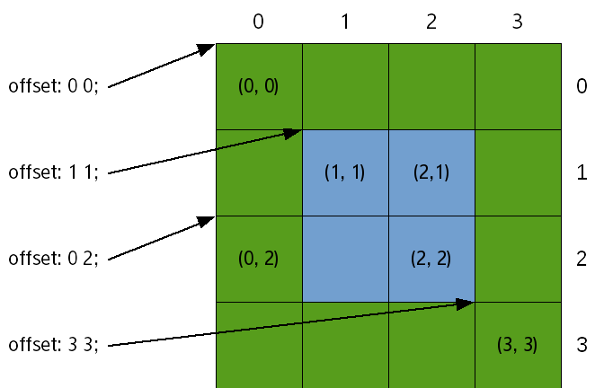
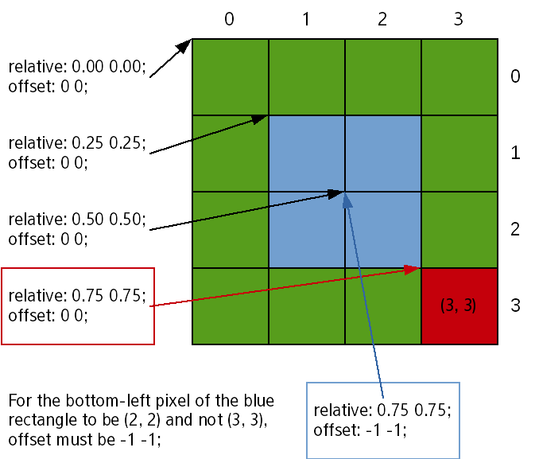

# Positioning Parts

To set the size and relative position of a part in the EDC file:

- Set the size of a part in pixels using the `min` and `max` properties.  

  The following example sets the minimum and maximum size of the rectangle part to 200 x 200 px:

  ```
  part {
     name: "rectangle";
     type: RECT;
     description {
        state: "blue" 0.0;
        align: 0.0 0.0;
        /* Set the size to 200x200 */
        min: 200 200;
        max: 200 200;
        /* Blue color */
        color: 0 0 255 255;
     }
  }
  ```

- Define the position of the part in the `rel1` and `rel2` blocks, which determine the top-left corner and the bottom-right corner of the part.  

  The position can be defined in relation to another part (with the `relative` property), or as an offset (with the `offset` property). When using relative positioning, the `to`, `to_x` and `to_y` properties are used to define in relation to which part the positioning is done. If nothing else is specified, the positioning is in relation to the parent's part.

  To demonstrate relative positioning, the following example creates another rectangle part and positions it under the first part created above. The top-left corner of the new part starts at the bottom-left corner of the previous one.

  ```
  part {
     name: "rectangle2";
     type: RECT;
     description {
        state: "green" 0.0;
        align: 0.0 0.0;
        /* Set the size to 200 x 200 */
        min: 200 200;
        max: 200 200;
        /* Green color */
        color: 0 255 0 255;
        /* Set the position */
        /* rel1 is relative to "rectangle" */
        rel1 {
           relative: 0.0 1.0;
           to: "rectangle";
        }
        /* rel2 is relative to the parent */
        rel2 {
           relative: 1.0 1.0;
        }
     }
  }
  ```

  > **Note**  
  > The `align` property defines how the parts align themselves in the main window if their size is smaller than the main window. If nothing is specified, the parts are aligned in the center of the window.

## Adding an Offset to Relative Positioning

The `rel1` and `rel2` blocks support offset, which is a complement to the relative positioning: the corners are first placed according to their relative parameters, and then adjusted using the offsets.

The following figure shows the pixel positions for a 4 x 4 rectangle. The indexes start in the top-left corner at (0, 0), and increase to the right and to the bottom. Since the indexes have started at 0, the fourth pixel has an index of 3. To create a 2 x 2 blue rectangle centered inside the green rectangle, the top-left corner must be (1, 1) and the bottom-right one (2, 2).

**Figure: Offset indexes**



To determine the relative position of the blue rectangle, Edje needs the following definitions:

- Part coordinates, depending on the size and position of the green rectangle
- Relative component of the positions must be the same: the top-left corner of the green rectangle
- Top-left pixel (1, 1) and bottom-right pixel (2, 2)

The following code example shows the definitions:

```
name: "blue rectangle";

rel1.to: "green rectangle";
rel1.relative: 0 0;
rel1.offset: 1 1;

rel2.to: "green rectangle";
rel2.relative: 0 0;
rel2.offset: 2 2;
```

For most tasks, relative positioning is simpler than using offsets. Offsets are usually left for fine-tuning and creating borders.

The following example is similar to the previous one but it uses relative positioning instead of offsets to achieve the same result for the 4 x 4 rectangle (though it can scale to larger sizes as well). The blue rectangle starts at 25% of the green rectangle (both vertically and horizontally) and ends at 75% of it (both vertically and horizontally). Like in the previous example, the blue rectangle is named and Edje is told what the object of reference is:

```
name: "blue rectangle";

rel1.to: "green rectangle";
rel1.relative: 0.25 0.25;

rel2.to: "green rectangle";
rel2.relative: 0.75 0.75;
```

The following figure shows how to refer to pixels using relative positioning when the offsets are (0, 0).

**Figure: Relative positioning**



Note that in addressing the pixels, (0, 0) is addressed through `relative: 0 0; offset 0 0;` and each additional 0.25 in the relative field gives a 1-pixel move. With this, the pixel addressed through `relative: 0.75 0.75; offset: 0 0;` is at (3, 3) and not (2, 2).

This addressing method comes from a design choice in Evas and Edje, favoring simplicity. In the examples shown in this topic, there are 4 pixels, and therefore when the `[0; 1]` range is divided in 4, the result is `[0; 0.25], [0.25; 0.50], [0.50; 0.75], [0.75; 0.100]`. With Edje, the value used to refer to each segment is the left bound, and therefore 0.75 refers to `[0.75; 0.100]` (the bottom-right pixel of the green rectangle shown in red).

To refer to the previous pixel (the bottom-right pixel of the blue rectangle), set the `rel2` block bound to `relative: 0.75 0.75;`, as expressed naturally, and define the offset as `-1 -1`. This definition can also be understood as extending the rectangle up to 75% of its parent with the upper bound excluded (the resulting range being `[0.50; 0.75]`).

Since `-1 -1` is the most common offset wanted for the `rel2` block, it is set as the default value.

> **Note**  
> Except as noted, this content is licensed under [LGPLv2.1+](http://opensource.org/licenses/LGPL-2.1).

## Related Information
- Dependencies
  - Tizen 2.4 and Higher for Mobile
  - Tizen 2.3.1 and Higher for Wearable
