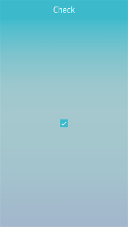

# Check

The check UI component accepts user input by the method of toggling. It is similar to the [radio](component-radio.md) component, except that it does not work as a group. For more information, see the [Check](../../../../api/mobile/latest/group__Elm__Check.html) API.

This feature is supported in mobile applications only.

## Basic Usage

To use a check component in your application:

1. Add a check component with the `elm_check_add()` function:

   ```
   Evas_Object *check;

   check = elm_check_add(parent);
   ```

2. Set a [style](#styles) and fill the check component with a text or an image according to the style:

   - Set a style to the check component with the `elm_object_style_set()` function. If you use the default style, you can skip this step.

     ```
     elm_object_style_set(check, "favorite");
     ```

   - Set a label to the check component with the `elm_object_text_set()` or `elm_object_part_text_set()` function:

     ```
     /* Default style */
     elm_object_text_set(check, "Check");

     /* on&off style */
     elm_object_part_text_set(check, "on", "True");
     elm_object_part_text_set(check, "off", "False");
     ```

   - Set an icon to the button with the `elm_object_part_content_set()` function and pass the `icon` part name as a parameter.

     ```
     Evas_Object *icon;

     elm_object_part_content_set(check, "icon", icon);
     ```

3. Register the [callback](#callbacks) functions.

   The following example shows how to define and register a callback for the `changed` signal:

   ```
   evas_object_smart_callback_add(check, "changed", changed_cb, data);

   void
   changed_cb(void *data, Evas_Object *obj, void *event_info)
   {
       dlog_print(DLOG_INFO, LOG_TAG, "The value has changed\n");
   }
   ```

The following example shows a simple use case of the check component.

**Example: Check use case**

 

```
Evas_Object *win;
Evas_Object *conf;
Evas_Object *nf;
Evas_Object *box;
Evas_Object *check;

/* Starting right after the basic EFL UI layout code */
/* win - conformant - naviframe */

/* Add a box to pack a check */
box = elm_box_add(nf);
elm_object_content_set(nf, box);
evas_object_show(box);
elm_naviframe_item_push(nf, "Check", NULL, NULL, box, NULL);

check = elm_check_add(box);
evas_object_show(check);
elm_box_pack_end(box, check);
```

## Styles

The following table lists the available component styles.

**Table: Check styles**

| Style      | Sample                                   | Text part  | Swallow part |
|----------|----------------------------------------|----------|------------|
| `default`  |  | `default`  | `icon`       |
| `favorite` |  | N/A        | N/A          |
| `on&off`   |  | `on`<br>`off` | N/A          |

## Callbacks

You can register callback functions connected to the following signals for a check object.

**Table: Check callback signals**

| Signal    | Description                        | `event_info` |
|---------|----------------------------------|------------|
| `changed` | The check component value changes. | `NULL`       |

> **Note**
>
> The signal list in the API reference can be more extensive, but only the above signals are actually supported in Tizen.

> **Note**
>
> Except as noted, this content is licensed under [LGPLv2.1+](http://opensource.org/licenses/LGPL-2.1).

## Related Information
- Dependencies
  - Tizen 2.4 and Higher for Mobile
