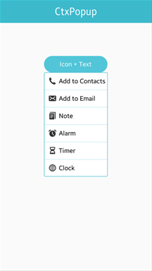
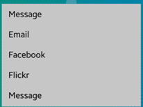

# Ctxpopup

The ctxpopup UI component pops up and shows a list of items inside it. For more information, see the [Ctxpopup](../../../../api/mobile/latest/group__Elm__Ctxpopup.html) API.

This feature is supported in mobile applications only.

## Basic Usage

To use a ctxpopup component in your application:

1. Add a ctxpopup with the `elm_ctxpopup_add()` function:

   ```
   Evas_Object *ctxpopup;

   ctxpopup = elm_ctxpopup_add(parent);
   ```

2. Configure the ctxpopup [features](#features).

3. Append items to the ctxpopup with the `elm_ctxpopup_item_append()` function. The function takes 5 parameters: the pointer of the ctxpopup, a file path of an icon, a text, a callback function to call when the item is clicked, and the parameter passed to the callback.

   ```
   elm_ctxpopup_item_append(ctxpopup, "icon.png", "Call", _item_selected_cb, NULL);
   ```

4. Register the [callback](#callbacks) functions.

When shown, the ctxpopup automatically selects an area inside its parent object's view to optimally fit into it. Set the object view with the `elm_ctxpopup_hover_parent_set()` function.

The following example shows a simple use case of the ctxpopup component.

**Example: Ctxpopup use case**



```
Evas_Object *win;
Evas_Object *conf;
Evas_Object *nf;
Evas_Object *box;
Evas_Object *btn;

/* Starting right after the basic EFL UI layout code */
/* win - conformant - naviframe */

box = elm_box_add(nf);
elm_object_content_set(nf, box);
evas_object_show(box);
elm_naviframe_item_push(nf, "Ctxpopup", NULL, NULL, box, NULL);

btn = elm_button_add(box);
elm_object_text_set(btn, "Click to see ctxpopup");
evas_object_smart_callback_add(btn, "clicked", _btn_clicked_cb, nf);
evas_object_size_hint_align_set(btn, EVAS_HINT_FILL, 0);
elm_box_pack_end(box, btn);
evas_object_show(btn);

static void
_btn_clicked_cb(void *data, Evas_Object *obj, void *event_info)
{
    Evas_Object *nf = data;
    Evas_Coord x, y, w, h;

    Evas_Object *ctxpopup = elm_ctxpopup_add(nf);

    elm_ctxpopup_item_append(ctxpopup, "Item 1", NULL, ctxpopup_item_select_cb, NULL);
    elm_ctxpopup_item_append(ctxpopup, "Item 2", NULL, ctxpopup_item_select_cb, NULL);
    elm_ctxpopup_item_append(ctxpopup, "Item 3", NULL, ctxpopup_item_select_cb, NULL);
    elm_ctxpopup_item_append(ctxpopup, "Item 4", NULL, ctxpopup_item_select_cb, NULL);

    evas_object_geometry_get(obj, &x, &y, &w, &h);
    evas_object_move(ctxpopup, x + (w / 2), y + (h / 2));
    evas_object_show(ctxpopup);
}
```

## Features

To configure the ctxpopup features:

- Set the ctxpopup orientation with the `elm_ctxpopup_horizontal_set()` function.

  In the following example, the orientation is set to horizontal:

  ```
  elm_ctxpopup_horizontal_set(ctxpopup, EINA_TRUE);
  ```

- Disable auto hiding.

  The ctxpopup can be hidden automatically when its parent is resized. The auto hide functionality is enabled by default. You can disable auto hiding by calling the `elm_ctxpopup_auto_hide_disabled_set()` function with `EINA_TRUE`:

  ```
  elm_ctxpopup_auto_hide_disabled_set(ctxpopup, EINA_TRUE);
  ```

- Set the priority of the direction where the ctxpopup appears from with the `elm_ctxpopup_direction_priority_set()` function:

  ```
  elm_ctxpopup_direction_priority_set(ctxpopup, ELM_CTXPOPUP_DIRECTION_UP, ELM_CTXPOPUP_DIRECTION_LEFT,
                                      ELM_CTXPOPUP_DIRECTION_DOWN, ELM_CTXPOPUP_DIRECTION_RIGHT);
  ```

- Hide the ctxpopup with an animation by calling the `elm_ctxpopup_dismiss()` function:

  ```
  elm_ctxpopup_dismiss(ctxpopup);
  ```

## Items

The ctxpopup can contain a small number of items. Each item can have a label, an icon, or both.

To manage the ctxpopup items:

1. Add an item with the `elm_ctxpopup_item_append()` function.

   To append an item with a `test` label, icon, and the `clicked` callback (`_ctxpopup_item_cb`):

   ```
   Elm_Object_Item *it;
   Evas_Object *icon;

   it = elm_ctxpopup_item_append(ctxpopup, "test", icon, _ctxpopup_item_cb, NULL);
   ```

2. Change the item label and icon, if the label and icon parameters are not `NULL` when the item is appended:

   - To change the item label to `New label`:
     ```
     elm_object_item_part_text_set(it, "default", "New label");
     ```

   - To set the icon to the standard `home` icon:

     ```
     Evas_Object *home_icon = elm_icon_add(ctxpopup);
     elm_icon_standard_set(home_icon, "home");

     elm_object_item_part_content_set(it, "icon", home_icon);
     ```

3. Define a callback that is triggered when the item is clicked:

   ```
   static void
   _ctxpopup_item_cb(void *data, Evas_Object *obj, void *event_info)
   {
       dlog_print(DLOG_INFO, LOG_TAG, "ctxpopup item selected\n");
   }
   ```

## Styles

The following table lists the available component styles.

In Tizen 2.4, dropdown styles are no longer supported. Use a [hoversel](component-hoversel.md) component for those instead.

**Table: Ctxpopup styles**

| Style                                    | Sample                                   |
|----------------------------------------|----------------------------------------|
| `elm/ctxpopup/layout/default`            |  |
| `elm/ctxpopup/layout/more/default`       |  |
| `elm/ctxpopup/layout/dropdown/list` (Tizen 2.3 only) |  |
| `elm/ctxpopup/layout/dropdown/label` (Tizen 2.3 only) |  |

## Callbacks

You can register callback functions connected to the following signals for a ctxpopup object.

**Table: Ctxpopup callback signals**

| Signal      | Description                | `event_info` |
|-----------|--------------------------|------------|
| `dismissed` | The ctxpopup is dismissed. | `NULL`       |

> **Note**
>
> The signal list in the API reference can be more extensive, but only the above signals are actually supported in Tizen.

> **Note**
>
> Except as noted, this content is licensed under [LGPLv2.1+](http://opensource.org/licenses/LGPL-2.1).

## Related Information
- Dependencies
  - Tizen 2.4 and Higher for Mobile
