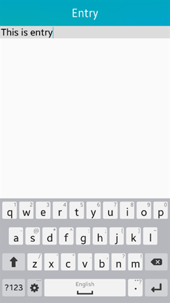
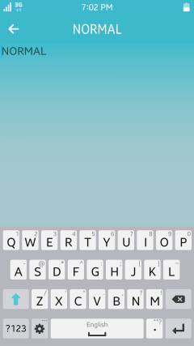
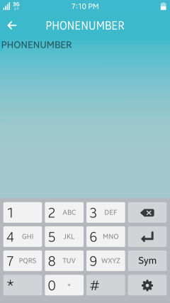
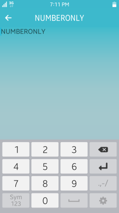
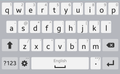
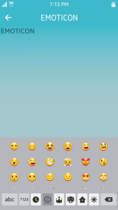

# Entry

This feature is supported in mobile applications only.

The entry component is a box where the user can enter text. It supports the following features:

- Multiline
- Scrolling
- Password mode
- Filtering text
- Read/write from a file
- Theme style overrides

The entry component includes an Evas [Textblock](../../../../api/mobile/latest/group__Evas__Object__Textblock.html) in it, which means that it supports the features of the textblock component, such as text wrapping and formatted markup text.

For more information, see the [Entry](../../../../api/mobile/latest/group__Elm__Entry.html) API.

**Figure: Entry component**

 

**Figure: Entry hierarchy**


## Adding an Entry Component

To create an entry component, use the `elm_entry_add()` function. You can set the text inside it with the `elm_entry_entry_set()` function.

```
Evas_Object *entry;
Evas_Object *parent;

entry = elm_entry_add(parent);
elm_entry_entry_set(entry, "A short text.");
```

## Managing the Text

To manage the entry component content:

- Add text to the entry:

  - Append text to the end of the existing content:

    ```
    elm_entry_entry_append(entry, "END");
    ```

  - Insert text at the current cursor position:

    ```
    elm_entry_entry_insert(entry, "CURSOR");
    ```

- Check whether the entry is empty:

  ```
  Eina_Bool Empty = elm_entry_is_empty(entry);
  ```

  If the entry has content, the function returns the Boolean `EINA_FALSE` variable.

- Select text:

  - Select all the content of the entry component:

    ```
    elm_entry_select_all(entry);
    ```

  - Select a part of the text with the `elm_entry_select_region_set()` function.

    The following example selects the first 20 characters of the entry content:
    ```
    elm_entry_select_region_set(entry, 0, 20);
    ```

  - Clear the current selection:

    ```
    elm_entry_select_none(entry);
    ```

- Retrieve the currently selected text:

  ```
  const char *selection;

  selection = elm_entry_selection_get(entry);
  ```

  If the entry text is empty, the function returns `NULL`.

- Copy or cut the selection to the clipboard:

  ```
  elm_entry_selection_cut(entry);
  ```

  Paste the selection in the same or a different entry:

  ```
  elm_entry_selection_paste(entry);
  ```

- Filter the text.

  You can filter the size and individual characters within the entry text by appending a filter with the `elm_entry_markup_filter_append()` function.

  - To limit the size of the entry to 8 characters:

    ```
    static Elm_Entry_Filter_Limit_Size
    limit_size =
    {
        .max_char_count = 8,
        .max_byte_count = 0
    };

    /*
       Append a new callback to the list, this function is called each time
       a text is inserted in the entry. Pass the previously created limit_size struct
       to set the maximum number of characters allowed to 8
    */

    elm_entry_markup_filter_append(entry, elm_entry_filter_limit_size, &limit_size);
    ```

  - To define a list of accepted or rejected characters, append the filter with the `Elm_Entry_Filter_Accept_Set` structure.

    The following example shows how to reject the '+', '-', '*', and '/' characters:

    ```
    static Elm_Entry_Filter_Accept_Set
    accept_set =
    {
      .accepted = NULL,
      .rejected = "+*-/"
    };

    elm_entry_markup_filter_append(entry, elm_entry_filter_accept_set, &accept_set);
    ```

You can define a file (for example, `/tmp/test.txt`) to save the entry content. The content in the file is implicitly loaded and displayed. After the file is set, any content changes in the entry are automatically saved after a short delay.

```
/* Set the file in which the entry text is saved */
/* Implicitly load the existing file content */
elm_entry_file_set(entry, "/tmp/test.txt", ELM_TEXT_FORMAT_MARKUP_UTF8);
```

You can also deactivate the automatic saving feature and explicitly save the content when needed:

```
/* Disable autosaving */
elm_entry_autosave_set(entry, EINA_FALSE);

/* Trigger saving when needed */
elm_entry_file_save(entry);
```

## Managing the Cursor

The cursor represents the current position in the entry, where the next action, for example, text insertion or deletion, is done. Usually, the cursor is represented as a blinking character, but its appearance depends on the theme configuration.

To manage the cursor position:

- Move the cursor to the beginning of the entry:

  ```
  elm_entry_cursor_begin_set(entry);
  ```

- Move the cursor to the end of the entry:

  ```
  elm_entry_cursor_end_set(entry);
  ```

- Move the cursor 1 line down or up:

  ```
  elm_entry_cursor_down(entry);
  elm_entry_cursor_up(entry);
  ```

- Move the cursor 1 character left or right:

  ```
  elm_entry_cursor_prev(entry);
  elm_entry_cursor_next(entry);
  ```

- Set the cursor at a specific position (15th character, for example):
  ```
  elm_entry_cursor_pos_set(entry, 15);
  ```

- Make a text selection while moving the cursor.

  The following example starts a selection at the current cursor position, moves 5 characters right, and ends the selection:

  ```
  elm_entry_cursor_selection_begin(entry);

  for (i = 0; i < 5; i++)
      elm_entry_cursor_next(entry);

  elm_entry_cursor_selection_end(entry);
  ```

## Configuring the Entry

To configure the entry functionality:

- Make the entry uneditable by the user.

  By default, the user can enter text in the entry component when it is in focus.

  ```
  elm_entry_editable_set(entry, EINA_FALSE);
  ```

  > **Note**
  >
  > Even when the entry component is set to be uneditable by the user, you can still use the `elm_entry_entry_append()` and `elm_entry_entry_insert()` functions to modify its text programmatically.

- Set the password mode.

  If the password mode is set, the entry component hides what the user is typing. In this mode, the display of any text is replaced by asterisks (*), and the entry is a single line (there is no line wrap).

  ```
  elm_entry_password_set(entry, EINA_TRUE);
  ```

  When the password mode is enabled, the `elm_object_text_get()` function returns an UTF-8 string for user convenience.

- Define the line mode and wrapping.

  The entry component has 2 line modes: single and multiline:

  - To set the entry to the single line mode:

    ```
    elm_entry_single_line_set(entry, EINA_TRUE);
    ```

    In this mode, the text does not wrap when reaching the edge, but the entry grows horizontally instead. Pressing the **Enter** key in this mode generates an `activate` event instead of adding a new line.

  - To set the entry to the multiline mode with wrapping:

    ```
    elm_entry_single_line_set(entry, EINA_FALSE);
    elm_entry_line_wrap_set(entry, ELM_WRAP_WORD);
    ```

    In this mode, the text wraps at the end of the entry and pressing the **Enter** key creates a new line.

    In multiline entries, the `elm_entry_line_wrap_set()` function provides a way to cut the text implicitly into a new line when it reaches the far edge of the UI component. The following wrap modes are available:

    - `ELM_WRAP_NONE`: No wrap
    - `ELM_WRAP_CHAR`: Wrap between characters
    - `ELM_WRAP_WORD`: Wrap in allowed wrapping points (as defined in the Unicode standard)
    - `ELM_WRAP_MIXED`: Word wrap, and if that fails, character wrap

## Modifying Formatting and Using Special Markups

You can format the entry text in many ways:

- Format the entry text with markup elements that are defined in the theme.

  For example, you can use the `<br>` element to insert a line break. For a list of available markup elements, see [Formatted text](../../../../api/mobile/latest/group__Elm__Entry.html#entry-markup).

- Add special markups within the entry text:

  - Anchors: `<a href = ..>...</a>`

    The anchors generate an `anchor,clicked` signal when the user clicks them. The `href` attribute is used to identify the anchor. The anchor also reacts to the `anchor,in` (mouse in), `anchor,out` (mouse out), `anchor,down` (mouse down), and `anchor,up` (mouse up) events.

  - Items: `<item size = .. vsize = .. href = ..>...</item>`

    The items provide a way to insert any `Evas_Object` in the text. The `Evas_Object` name must be specified in the `href` attribute.

    The `elm_entry_item_provider_append()` function appends a custom item provider to the list for that entry. You can also prepend a custom item provider to the list with the `elm_entry_item_provider_prepend()` function. The `elm_entry_item_provider_remove()` function removes a custom item provider from the list.

    ```
    static Evas_Object*
    item_provider(void *images EINA_UNUSED, Evas_Object *en, const char *item)
    {
        Evas_Object *o = NULL;
        char buf[1024];

        if (!strcmp(item, "itemprovider")) {
            snprintf(buf, sizeof(buf), "%s/tizen.png", ICON_DIR);
            o = evas_object_image_filled_add(evas_object_evas_get(en));
            evas_object_image_file_set(o, buf, NULL);
        }

        return o;
    }

    Evas_Object *entry;

    Entry = elm_entry_add(layout);
    elm_object_text_set(entry, "Item Provider"
                        "<item size=50x50 vsize=full href=itemprovider></item>");
    elm_entry_item_provider_append(entry, item_provider, NULL);
    ```

- Override the textblock object style.

  To tweak the style of the text within the entry component, you can override parts of the theme style to the textblock object using the `elm_entry_text_style_user_push()` function. The function pushes a new style on top of the user style stack that overrides the current style. Remove the style at the top of the user style stack with the `elm_entry_text_style_user_pop()` function.

  ```
  Evas_Object *entry;

  Entry = elm_entry_add(layout);
  elm_entry_text_style_user_push(entry, "DEFAULT='font=Tizen:style=Light font_size=50 color=#00f align=center'");
  ```

  The `DEFAULT` element sets the style properties to a default style that is applied to the complete text. For more information on style properties, such as font, font size, and color, see [Textblock Objects](evas-objects.md#textblock-objects).

  **Figure: Overriding style**

  

- Modify the content and text parts of the default theme:

  - You can modify 2 content parts of the default theme: `icon` and `end`.

    The following example shows how to set an icon in the `end` content part:

    ```
    Evas_Object *icon;

    ic = elm_icon_add(entry);
    elm_image_file_set(ic, "icon.png", NULL);
    elm_object_part_content_set(entry, "end", icon);
    ```

  - You can modify 2 text parts of the default theme: `default` (entry text) and `guide` (entry placeholder).

    The following example shows how to set the placeholder text to `Hello World`:

    ```
    elm_object_part_text_set(entry, "guide", "Hello World");
    ```

## Setting the Input Panel Layout and Return Key Type

The input panel has different input types, such as number, date, URL, and emoticon. You can specify the keyboard layout type you want for the entry component with the [Elm\_Input\_Panel\_Layout](../../../../api/mobile/latest/group__Elm__Entry.html#gabf2a52ba5bbfc9bd40f367c42b1a6619) enumerator, which defines the available input types.

To set the input panel layout to the phone number layout:

```
elm_entry_input_panel_layout_set(entry, ELM_INPUT_PANEL_LAYOUT_PHONENUMBER);
```

**Figure: Input panel layouts**

  

  

  

  

 

You can change the return key type in the input panel layout. You can specify the return key type you want for the entry component with the [Elm\_Input\_Panel\_Return\_Key\_Type](../../../../api/mobile/latest/group__Elm__Entry.html#ga24d4dcdebc49e633b8039f73b8aec3c3) enumerator, which defines the available return key types.

To set the return key type to the join key:

```
elm_entry_input_panel_return_key_type_set(entry, ELM_INPUT_PANEL_RETURN_KEY_TYPE_JOIN);
```

**Figure: Join and Send return key types**

 

The following component styles are available.

**Table: Entry styles**

| Style                    | Sample                                   | Text part                                | Notes                                    |
|--------------------------|------------------------------------------|------------------------------------------|------------------------------------------|
| `elm/entry/base/default` |  | `elm.guide`: for the guide text<br> `elm.text`: for the main text | The guide text is automatically erased when the main text is entered. |

## Callbacks

You can register callback functions connected to the following signals for an entry object.

**Table: Entry callback signals**

| Signal                  | Description                              | `event_info`                    |
|-------------------------|------------------------------------------|---------------------------------|
| `aborted`               | The **Escape** key is pressed on a single line entry. | `NULL`                          |
| `activated`             | The **Enter** key is pressed on a single line entry. | `NULL`                          |
| `anchor,clicked`        | An anchor is clicked.                    | `Elm_Entry_Anchor_Info` object  |
| `anchor,down`           | The mouse button is pressed on an anchor. | `Elm_Entry_Anchor_Info` object  |
| `anchor,hover,opened`   | The anchor is clicked.                   | `Elm_Entry_Anchor_Info` object  |
| `anchor,in`             | The mouse cursor is moved into an anchor. | `Elm_Entry_Anchor_Info` object  |
| `anchor,out`            | The mouse cursor is moved out of an anchor. | `Elm_Entry_Anchor_Info` object  |
| `anchor,up`             | The mouse button is released on an anchor. | `Elm_Entry_Anchor_Info` object  |
| `changed`               | The text within the entry is changed.    | `NULL`                          |
| `changed,user`          | The text within the entry is changed because of user interaction. | `Edje_Entry_Change_Info` object |
| `clicked`               | The entry is clicked (mouse press and release). | `NULL`                          |
| `clicked,double`        | The entry is double-clicked.             | `NULL`                          |
| `clicked,triple`        | The entry is triple-clicked.             | `NULL`                          |
| `cursor,changed`        | The cursor position is changed.          | `NULL`                          |
| `cursor,changed,manual` | The cursor position is changed manually. | `NULL`                          |
| `focused`               | The entry receives focus.                | `Elm_Focus_Info` object         |
| `unfocused`             | The entry loses focus.                   | `NULL`                          |
| `language,changed`      | The program language is changed.         | `NULL`                          |
| `longpressed`           | The mouse button is pressed and held for a couple of seconds. | `NULL`                          |
| `maxlength,reached`     | The maximum length is reached.           | `NULL`                          |
| `preedit,changed`       | The pre-edit string is changed.          | `NULL`                          |
| `press`                 | The mouse button is pressed on the entry. | `NULL`                          |
| `redo,request`          | The request is redone.                   | `NULL`                          |
| `selection,changed`     | The current selection is changed.        | `NULL`                          |
| `selection,cleared`     | The current selection is cleared.        | `NULL`                          |
| `selection,copy`        | A copy of the selected text into the clipboard is requested. | `NULL`                          |
| `selection,cut`         | A cut of the selected text into the clipboard is requested. | `NULL`                          |
| `selection,paste`       | A paste of the clipboard content is requested. | `NULL`                          |
| `selection,start`       | A selection is begun and no previous selection exists. | `NULL`                          |
| `text,set,done`         | The whole text is set to the entry.      | `NULL`                          |
| `theme,changed`         | The theme is changed.                    | `NULL`                          |
| `undo,request`          | The request is undone.                   | `NULL`                          |

> **Note**
>
> The signal list in the API reference can be more extensive, but only the above signals are actually supported in Tizen.

The following example shows how to define and register a callback for the `focused` signal:

```
evas_object_smart_callback_add(entry, "focused", focused_cb, data);

/* Callback for the "focused" signal */
/* Called when the entry receives the focus */
void
focused_cb(void *data, Evas_Object *obj, void *event_info)
{
    dlog_print(DLOG_INFO, LOG_TAG, "Entry focused\n");
}
```

> **Note**
>
> Except as noted, this content is licensed under [LGPLv2.1+](http://opensource.org/licenses/LGPL-2.1).

## Related Information
- Dependencies
  - Tizen 2.4 and Higher for Mobile
