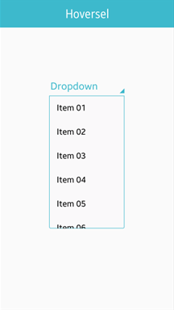

# Hoversel

This feature is supported in mobile applications only.

The hoversel component is a button that pops up a list of items (automatically choosing the direction to display).

The hoversel component inherits from the button component, which means that button functions can be used on the hoversel component.

For more information, see the [Hoversel](../../../../api/mobile/latest/group__Elm__Hoversel.html) API.

**Figure: Hoversel component**



**Figure: Hoversel hierarchy**


## Adding a Hoversel Component

To create a hoversel component, use the `elm_hoversel_add()` function:

```
Evas_Object *hoversel;
Evas_Object *parent;

/* Create a hoversel */
hoversel = elm_hoversel_add(parent);
```

When activated, the hoversel automatically selects the direction in which to display itself in its parent object's view.

## Configuring the Hoversel

To configure the hoversel:

- Set the hoversel orientation using the `elm_hoversel_horizontal_set()` function.

  In Tizen, the horizontal mode is not provided for the hoversel. You must set the hoversel to the vertical mode:

  ```
  elm_hoversel_horizontal_set(hoversel, EINA_FALSE);
  ```

- Set the hover parent with the `elm_hoversel_hover_parent_set()` function.

  The hoversel creates a hover component and puts a list of items in the hover when it is activated. The hover parent determines the area where the item list can be shown. The hover parent does not need to be the same as the hoversel parent.

  ```
  Evas_Object *hoversel;
  Evas_Object *parent;
  Evas_Object *win;

  hoversel = elm_hoversel_add(parent);

  elm_hoversel_hover_parent_set(hoversel, win);
  ```

- Activate the hoversel.

  The hoversel can be activated by a click or calling the `elm_hoversel_hover_begin()` function. To deactivate it, click an item, click outside the item list, or call the `elm_hoversel_hover_end()` function.

  ```
  elm_hoversel_hover_begin(hoversel);
  elm_hoversel_hover_end(hoversel);
  ```

- Retrieve the hoversel activation state (as a Boolean value) using the `elm_hoversel_expanded_get()` function:

  ```
  Eina_Bool expanded;
  expanded = elm_hoversel_expanded_get(hoversel);
  ```

## Managing the Hoversel Items

The hoversel component can contain items that have a label. Even though parameters for an icon are defined in the `elm_hoversel_item_add()` function, the hoversel item icon is not supported in Tizen.

To manage items:

1. Add an item using the `elm_hoversel_item_add()` function.

   To add an item with a "test" label and the `_hoversel_item_cb` clicked callback:

   ```
   Elm_Object_Item *it;

   it = elm_hoversel_item_add(hoversel, /* Hoversel object */
                       "test", /* Item label */
                        NULL, /* Icon file */
                        ELM_ICON_NONE, /* Icon type */
                        _hoversel_item_cb, /* Clicked callback for the item */
                        NULL); /* Callback data */
   ```

  The signal for the clicked callback is related to an individual item, not the entire hoversel.

2. Retrieve the handles for the added items using the `elm_hoversel_items_get()` function.

   The function returns a list of `Elm_Object_Item` items.

   ```
   Eina_List *items;
   items = elm_hoversel_items_get(hoversel);
   ```

3. Change the item label using the `elm_object_item_part_text_set()` function.

   To change the item label to "New Label":

   ```
   Elm_Object_Item *it = elm_hoversel_item_add(hoversel, "test", NULL, ELM_ICON_NONE, NULL, NULL);
   elm_object_item_part_text_set(it, "default", "New label");
   ```

4. Delete all items together with the `elm_hoversel_clear()` function:

   ```
   elm_hoversel_clear(hoversel);
   ```

## Callbacks

You can register callback functions connected to the following signals for a hoversel object.

**Table: Hoversel callback signals**

| Signal             | Description                              | `event_info`      |
|------------------|----------------------------------------|-----------------|
| `clicked`          | The hoversel is clicked.                 | `NULL`            |
| `selected`         | The hoversel item is selected.           | The selected item |
| `dismissed`        | The hover is dismissed (by selecting an item or clicking the hover). | `NULL`            |
| `expanded`         | The hoversel is activated by clicking the hoversel or by a function. | `NULL`            |
| `language,changed` | The program language changes.            | `NULL`            |

> **Note**
>
> The signal list in the API reference can be more extensive, but only the above signals are actually supported in Tizen.

The following example shows how to define and register a callback for the `dismissed` signal:

```
evas_object_smart_callback_add(hoversel, "dismissed", dismissed_cb, data);

/* Callback for the "dismissed" signal */
/* Called when the hoversel is dismissed */
void
dismissed_cb(void *data, Evas_Object *obj, void *event_info)
{
    dlog_print(DLOG_INFO, LOG_TAG, "Hoversel dismissed\n");
}
```

> **Note**
>
> Except as noted, this content is licensed under [LGPLv2.1+](http://opensource.org/licenses/LGPL-2.1).

## Related Information
- Dependencies
  - Tizen 2.4 and Higher for Mobile
