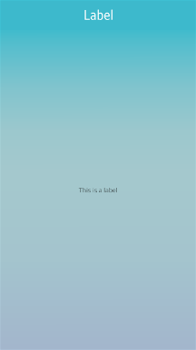

# Label

The label UI component displays texts with a simple HTML-like markup. For more information, see the [Label](../../../../api/mobile/latest/group__Elm__Label.html) API.

This feature is supported in mobile applications only.

## Basic Usage

To use a label component in your application:

1. Add a label with the `elm_label_add()` function:

   ```
   Evas_Object *label;

   label = elm_label_add(parent);
   ```

2. Set a text to the label with the `elm_object_text_set()` function. Label is based on [textblock](evas-objects.md#textblock-objects), which means you can use textblock markup in a label text.

   ```
   elm_object_text_set(label, "This is a label.");
   ```

3. Register the [callback](#callbacks) functions.

   The following example shows how to define and register a callback for the `slide,end` signal:

   ```
   evas_object_smart_callback_add(label, "slide,end", slide_end_cb, data);

   void
   slide_end_cb(void *data, Evas_Object *obj, void *event_info)
   {
       dlog_print(DLOG_INFO, LOG_TAG, "Slide has reach the end.\n");
   }
   ```

The following example shows a simple use case of the label component.

**Example: Label use case**



```
Evas_Object *win;
Evas_Object *conf;
Evas_Object *nf;
Evas_Object *box;
Evas_Object *label;

/* Starting right after the basic EFL UI layout code */
/* win - conformant - naviframe */

/* Add a box to pack a label */
box = elm_box_add(nf);
elm_object_content_set(nf, box);
evas_object_show(box);
elm_naviframe_item_push(nf, "Label", NULL, NULL, box, NULL);

label = elm_label_add(box);
elm_object_text_set(label, "This is a label");
evas_object_show(label);
elm_box_pack_end(box, label);
```

## Styles

If you use a slide-type style, you can adjust the slide mode and animation duration using the following functions:

```
elm_label_slide_mode_set(label, ELM_LABEL_SLIDE_MODE_ALWAYS);
elm_label_slide_duration_set(label, 3);
```

The following table lists the available component styles.

**Table: Label styles**

| Style          | Description                              |
|----------------|------------------------------------------|
| `default`      | No animation is used.                    |
| `marker`       | The text is centered and bolded.         |
| `slide_long`   | The text appears from the right of the screen and slides until it disappears in the left of the screen (reappearing on the right again). |
| `slide_short`  | The text appears in the left of the label and slides to the right to show the overflow. When all of the text has been shown, the position is reset. |
| `slide_bounce` | The text appears in the left of the label and slides to the right to show the overflow. When all of the text has been shown, the animation reverses, moving the text to the left. |

## Callbacks

You can register callback functions connected to the following signals for a label object.

**Table: Label callback signals**

| Signal              | Description                          | `event_info`                   |
|---------------------|--------------------------------------|--------------------------------|
| `language,changed`  | The program language changes.        | `NULL`                         |
| `slide,end`         | The slide reaches the end.           | `NULL`                         |
| `anchor,clicked`    | The anchor is clicked.               | `Elm_Label_Anchor_Info` object |
| `anchor,mouse,down` | The anchor is pressed by mouse down. | `Elm_Label_Anchor_Info` object |
| `anchor,mouse,up`   | The anchor is released by mouse up.  | `Elm_Label_Anchor_Info` object |

> **Note**
>
> The signal list in the API reference can be more extensive, but only the above signals are actually supported in Tizen.

> **Note**
>
> Except as noted, this content is licensed under [LGPLv2.1+](http://opensource.org/licenses/LGPL-2.1).

## Related Information
- Dependencies
  - Tizen 2.4 and Higher for Mobile
