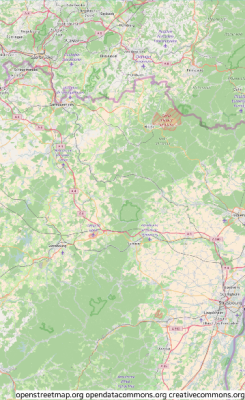

# Map

The map UI component displays a geographic map. The default map data is provided by the [OpenStreetMap project](http://www.openstreetmap.org/). For more information, see the [Map](../../../../api/mobile/latest/group__Elm__Map.html) API.

This feature is supported in mobile applications only.

## Basic Usage

To use a map component in your application:

1. Add a map with `elm_map_add()` function:

   ```
   Evas_Object *map;
   Evas_Object *parent;

   map = elm_map_add(parent);
   ```

2. Set the zoom mode with the `elm_map_zoom_mode_set()` function:

   ```
   elm_map_zoom_mode_set(map, ELM_MAP_ZOOM_MODE_MANUAL);
   ```

3. Set the zoom level with the `elm_map_zoom_set()` function:

   ```
   elm_map_zoom_set(map, 12);
   ```

4. Show a specific area on the map based on coordinates using the `elm_map_region_show()` function:

   ```
   elm_map_region_show(map, 2.2, 48.8);
   ```

   To show a specific area with a bring-in animation, use the `elm_map_region_bring_in()` function:

   ```
   elm_map_region_bring_in(map, 2.2, 48.8);
   ```

5. Register the [callback](#callbacks) functions.

   The following example shows how to define and register a callback for the `clicked` signal:

   ```
   evas_object_smart_callback_add(map, "clicked", clicked_cb, data);

   void
   clicked_cb(void *data, Evas_Object *obj, void *event_info)
   {
       dlog_print(DLOG_INFO, LOG_TAG, "Map clicked\n");
   }
   ```

The following example shows a simple use case of the map component.

**Example: Map use case**


```
Evas_Object *win;
Evas_Object *conf;
Evas_Object *nf;
Evas_Object *box;
Evas_Object *map;

/* Starting right after the basic EFL UI layout code */
/* win - conformant - naviframe */

/* Add a box to contain a map and push the box into the naviframe */
box = elm_box_add(nf);
evas_object_show(box);
elm_naviframe_item_push(nf, "Map", NULL, NULL, box, NULL);

/* Add a map */
map = elm_map_add(box);
evas_object_size_hint_align_set(map, EVAS_HINT_FILL, EVAS_HINT_FILL);
evas_object_size_hint_weight_set(map, EVAS_HINT_EXPAND, EVAS_HINT_EXPAND);

/* Set zoom mode to manual and zoom level to 12 */
elm_map_zoom_mode_set(map, ELM_MAP_ZOOM_MODE_MANUAL);
elm_map_zoom_set(map, 12);

/* Show a region (2.2 N, 48.8 E) */
elm_map_region_show(map, 2.2, 48.8);

evas_object_show(map);
elm_box_pack_end(box, map);
```

## Styles

The following table lists the available component styles.

**Table: Map styles**

| Style     | Sample                                   |
|-----------|------------------------------------------|
| `default` |  |

## Callbacks

You can register callback functions connected to the following signals for a map object.

**Table: Map callback signals**

| Signal              | Description                              | `event_info`            |
|---------------------|------------------------------------------|-------------------------|
| `clicked`           | The map is clicked without dragging.     | `Evas_Event_Mouse_Up`   |
| `clicked,double`    | The map is double-clicked.               | `Evas_Event_Mouse_Down` |
| `press`             | The map is pressed down on.              | `Evas_Event_Mouse_Down` |
| `longpressed`       | The map is pressed down for a long time without dragging. | `Evas_Event_Mouse_Down` |
| `scroll`            | The content is scrolled (moved).         | `NULL`                  |
| `scroll,drag,start` | Dragging the content starts.             | `NULL`                  |
| `scroll,drag,stop`  | Dragging the content stops.              | `NULL`                  |
| `scroll,anim,start` | The scrolling animation starts.          | `NULL`                  |
| `scroll,anim,stop`  | The scrolling animation stops.           | `NULL`                  |
| `zoom,start`        | The zoom animation starts.               | `NULL`                  |
| `zoom,stop`         | The zoom animation stops.                | `NULL`                  |
| `zoom,change`       | The zoom is changed when using an auto zoom mode. | `NULL`                  |
| `tile,load`         | The map tile image load begins.          | `NULL`                  |
| `tile,loaded`       | The map tile image load ends.            | `NULL`                  |
| `tile,loaded,fail`  | The map tile image load fails.           | `NULL`                  |
| `route,load`        | The route request begins.                | `Elm_Map_Route`         |
| `route,loaded`      | The route request ends.                  | `NULL`                  |
| `route,loaded,fail` | The route request fails.                 | `NULL`                  |
| `name,load`         | The name request begins.                 | `Elm_Map_Name`          |
| `name,loaded`       | The name request ends.                   | `NULL`                  |
| `name,loaded,fail`  | The name request fails.                  | `NULL`                  |
| `overlay,clicked`   | An overlay is clicked.                   | `Elm_Map_Overlay`       |
| `loaded`            | The map is loaded.                       | `NULL`                  |

> **Note**
>
> The signal list in the API reference can be more extensive, but only the above signals are actually supported in Tizen.

> **Note**
>
> Except as noted, this content is licensed under [LGPLv2.1+](http://opensource.org/licenses/LGPL-2.1).

## Related Information
- Dependencies
  - Tizen 2.4 and Higher for Mobile
