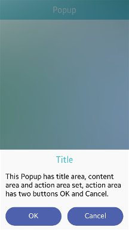
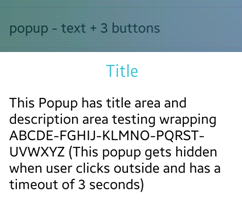

# Popup

The popup UI component is a small window for notifying the user or requesting user input. For more information, see the [Popup](../../../../api/mobile/latest/group__Elm__Popup.html) API.

This feature is supported in mobile applications only.

## Basic Usage

To use a popup component in your application:

1. Add a popup component with the `elm_popup_add()` function:

   ```
   Evas_Object *popup;
   Evas_Object *parent;

   /* Create a popup */
   popup = elm_popup_add(parent);
   ```

2. Set the title text using the `title,text` part name:

   ```
   elm_object_part_text_set(popup, "title,text", "Popup Title");
   ```

3. Set the content of the popup:

   - Simple text:

     ```
     elm_object_text_set(popup, "Popup text");
     ```

   - Evas object:

     ```
     Evas_Object *content;

     elm_object_content_set(popup, content);
     ```

4. Set the action area buttons.

   In the following example, the **OK** and **Cancel** buttons are created:

   ```
   Evas_Object *button1;
   Evas_Object *button2;

   /* Create the 2 buttons */
   button1 = elm_button_add(popup);
   elm_object_text_set(button1, "OK");

   button2 = elm_button_add(popup);
   elm_object_text_set(button2, "Cancel");

   /* Set the buttons to the action area */
   elm_object_part_content_set(popup, "button1", button1);
   elm_object_part_content_set(popup, "button2", button2);
   ```

5. Register the [callback](#callbacks) functions.

   The following example shows how to define and register a callback for the `dismissed` signal:

    ```
    evas_object_smart_callback_add(popup, "dismissed", dismissed_cb, data);

    void
    dismissed_cb(void *data, Evas_Object *obj, void *event_info)
    {
        evas_object_del(obj);
    }
    ```

The following example shows a simple use case of the popup component.

**Example: Popup use case**

 

```
Evas_Object *win;
Evas_Object *conf;
Evas_Object *nf;
Evas_Object *popup;
Evas_Object *button;

/* Starting right after the basic EFL UI layout code */
/* (win - conformant - naviframe) */

/* Add a popup and set a size hint to the popup */
popup = elm_popup_add(nf);
elm_popup_align_set(popup, ELM_NOTIFY_ALIGN_FILL, 1.0);
evas_object_size_hint_weight_set(popup, EVAS_HINT_EXPAND, EVAS_HINT_EXPAND);

/* Set a text to title and content part */
elm_object_part_text_set(popup, "title,text", "Title");
elm_object_text_set(popup, "This Popup has title area, content area and action area set,
                            action area has two buttons OK and Cancel.");

/* Add an "OK" button to popup */
button = elm_button_add(popup);
elm_object_style_set(button, "popup");
elm_object_text_set(button, "OK");
elm_object_part_content_set(popup, "button1", button);

/* Add a "Cancel" button to popup */
button = elm_button_add(popup);
elm_object_style_set(button, "popup");
elm_object_text_set(button, "Cancel");
elm_object_part_content_set(popup, "button2", button);

/* Add a callback function to popup */
eext_object_event_callback_add(popup, EEXT_CALLBACK_BACK, eext_popup_back_cb, NULL);
evas_object_smart_callback_add(popup, "block,clicked", popup_block_clicked_cb, NULL);

evas_object_show(popup);
```

## Features

To configure the popup features:

- Hide the popup after a set time with the `elm_popup_timeout_set()` function.

  In the following example, the timeout is set to 5 seconds, after which the popup is hidden:

  ```
  elm_popup_timeout_set(popup, 5.0);
  ```

- Dismiss the popup with a hide effect using the `elm_popup_dismiss()` function:

  ```
  elm_popup_dismiss(popup);
  ```

## Styles

The following table lists the available component styles.

**Table: Popup styles**

| Style      | Sample                                   | Text part                            | Swallow part                             |
|------------|------------------------------------------|--------------------------------------|------------------------------------------|
| `default`  |  | `default`<br>`title,text`<br>`subtitle,text` | `elm.swallow.content`<br>`button1`<br>`button2`<br>`button3` |
| `toast`    |  | `default`                            | `elm.swallow.content`                    |
| `theme_bg` |  | `default`<br>`title,text`<br>`subtitle,text` | `elm.swallow.content`<br>`button1`<br>`button2`<br>`button3` |

The `theme_bg` style is a unique style for supporting the genlist component's banded effect.

## Callbacks

You can register callback functions connected to the following signals for a popup object.

**Table: Popup callback signals**

| Signal          | Description                              | `event_info` |
|-----------------|------------------------------------------|--------------|
| `timeout`       | The popup is closed as a result of the timeout. | `NULL`       |
| `block,clicked` | The user clicks on the blocked event area. The blocked event area is the translucent region around the visible popup region. | `NULL`       |
| `dismissed`     | The popup is dismissed with a hide effect. | `NULL`       |

> **Note**
>
> The signal list in the API reference can be more extensive, but only the above signals are actually supported in Tizen.

> **Note**
>
> Except as noted, this content is licensed under [LGPLv2.1+](http://opensource.org/licenses/LGPL-2.1).

## Related Information
- Dependencies
  - Tizen 2.4 and Higher for Mobile
