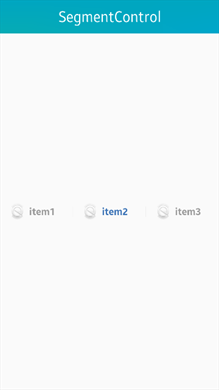

# Segmentcontrol

This feature is supported in mobile applications only.

The segmentcontrol component consists of several segment items. A segment item is similar to a discrete 2-state button. Any time, only one segment item can be selected. A segment item is composed of a label (text) and an icon.

The segmentcontrol component inherits from the layout component, which means that layout functions can be used on the segmentcontrol component.

For more information, see the [SegmentControl](../../../../api/mobile/latest/group__Elm__SegmentControl.html) API.

**Figure: Segmentcontrol component (with text on left and with icons on right)**

 

**Figure: Segmentcontrol hierarchy**


## Adding a Segmentcontrol Component

To add a segmentcontrol component, use the `elm_segment_control_add()` function:

```
Evas_Object *segcontrol;
Evas_Object *parent;

segcontrol = elm_segment_control_add(parent);
```

## Managing Segmentcontrol Items

To manage segmentcontrol items:

- Add items to the segmentcontrol component with the `elm_segment_control_item_add()` function.

  In the following example, 4 items containing only text labels (no icons) are added:

  ```
  Elm_Object_Item *it;
  int count;
  int idx;

  elm_segment_control_item_add(segcontrol, NULL, "item1");
  elm_segment_control_item_add(segcontrol, NULL, "item2");
  elm_segment_control_item_add(segcontrol, NULL, "item3");
  it = elm_segment_control_item_add(segcontrol, NULL, "item4");
  ```

  To insert an item at a specific position starting from 0:

  ```
  elm_segment_control_item_insert_at(segcontrol, NULL, "item7", 2);
  ```

- Set the state of the item to selected:

  ```
  elm_segment_control_item_selected_set(it, EINA_TRUE);
  ```

- Get items:

  ```
  /* Get the selected item */
  it = elm_segment_control_item_selected_get(segcontrol);

  /* Get the item placed at a specified index */
  it = elm_segment_control_item_get(segcontrol, 2);
  ```

- Get the item count from the segmentcontrol:

  ```
  count = elm_segment_control_item_count_get(segcontrol);
  ```

- Get the index of an item:

  ```
  idx = elm_segment_control_item_index_get(it);
  ```

- Delete an item and disable the entire segmentcontrol:

  ```
  elm_segment_control_item_del_at(segcontrol, 2);

  elm_object_disabled_set(segcontrol, EINA_TRUE);
  ```

## Using the Segmentcontrol Callbacks

To receive notifications about the segmentcontrol events, listen for the `changed` signal, which is called when the user clicks on a segment item that was not previously selected.

> **Note**
>
> The signal list in the API reference can be more extensive, but only the above signals are actually supported in Tizen.

The `event_info` callback parameter is the segment item pointer.

To register and define a callback for the `changed` signal:

```
{
    evas_object_smart_callback_add(segcontrol, "changed", changed_cb, data);
}

/* Callback for the "changed" signal */
/* Called when the selected segment item changes */
void
changed_cb(void *data, Evas_Object *obj, void *event_info)
{
    Elm_Object_Item *it = event_info;
    dlog_print(DLOG_INFO, LOG_TAG, "The selected segment item is %s\n",
               elm_object_item_text_get(it));
}
```

> **Note**
>
> Except as noted, this content is licensed under [LGPLv2.1+](http://opensource.org/licenses/LGPL-2.1).

## Related Information
- Dependencies
  - Tizen 2.4 and Higher for Mobile
