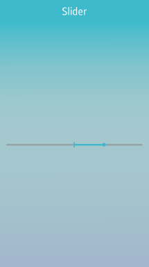
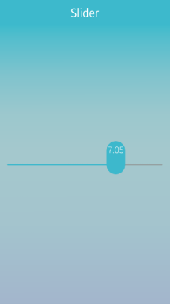
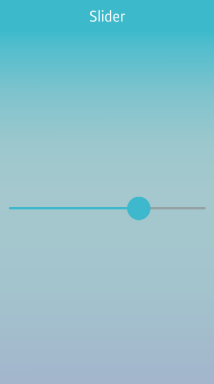
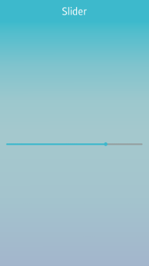
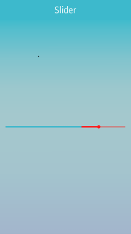

# Slider

The slider UI component is a draggable item used to select a value within a certain range. For more information, see the [Slider](../../../../api/mobile/latest/group__Elm__Slider.html) API.

This feature is supported in mobile applications only.

## Basic Usage

To use a slider component in your application:

1. Create a new slider with the `elm_slider_add()` function:

   ```
   Evas_Object *slider = NULL;

   slider = elm_slider_add(parent);
   ```

2. Configure the slider. The following configurations are optional. Unless you set other options, the slider uses the default styles.

   - Set the slider [style](#styles):

     ```
     /* Default: "default" */
     elm_object_style_set(slider, "default");
     ```

   - Set other [options](#options).

     ```
     elm_slider_inverted_set(slider, EINA_FALSE);
     elm_slider_indicator_show_set(slider, EINA_TRUE);
     elm_slider_indicator_format_set(slider, "%.1f");
     ```

3. Register the [callback](#callbacks) functions.

   The following example shows how to define and register a callback for the `changed` signal:

   ```
   evas_object_smart_callback_add(slider, "changed", slider_changed_cb, 0);

   static void
   slider_changed_cb(void *data, Evas_Object *obj, void *event_info)
   {
       double v = elm_slider_value_get(obj);
       dlog_print(DLOG_INFO, LOG_TAG, "The slider value has changed: %0.1f\n", v);
   }
   ```

The following example shows a simple use case of the slider component.

**Example: Slider use case**



```
Evas_Object *box;
Evas_Object *slider;
Evas_Object *nf;

/* Starting right after the basic EFL UI layout code */
/* (win - conformant - naviframe) */

box = elm_box_add(nf);
elm_naviframe_item_push(nf, "Slider", NULL, NULL, box, NULL);

/* Add a slider */
slider = elm_slider_add(box);
evas_object_size_hint_align_set(slider, EVAS_HINT_FILL, 0.5);

/* Set a style */
elm_object_style_set(slider, "center_point");

/* Set the slider range */
elm_slider_min_max_set(slider, 0.0, 10.0);
elm_slider_value_set(slider, 5.0);

evas_object_show(slider);
elm_box_pack_end(box, slider);
```

## Options

You can build various sliders by combining styles and options:

- Slider indicator

  **Table: Slider indicator**

  | `EINA_TRUE`                              | `EINA_FALSE`                             |
  |------------------------------------------|------------------------------------------|
  |  |  |

  ```
  Evas_Object *slider;
  Evas_Object *nf;
  Evas_Object *box;
  /* Add a box to contain a slider */
  box = elm_box_add(nf);
  elm_naviframe_item_push(nf, "Slider", NULL, NULL, box, NULL);

  /* Add a slider */
  slider = elm_slider_add(box);
  evas_object_size_hint_align_set(slider, EVAS_HINT_FILL, 0.5);

  /* Set styles in various ways */
  elm_object_style_set(slider, "default");
  elm_slider_indicator_show_set(slider, EINA_TRUE);
  elm_slider_indicator_format_set(slider, "%.2f");

  /* Set the slider range */
  elm_slider_min_max_set(slider, 0.0, 10.0);
  elm_slider_value_set(slider, 5.0);

  evas_object_show(slider);
  elm_box_pack_end(box, slider);
  ```

- Slider orientation

  **Table: Slider orientation**

  | `EINA_TRUE`                              | `EINA_FALSE`                             |
  |------------------------------------------|------------------------------------------|
  |  |  |

  ```
  Evas_Object *slider;
  Evas_Object *nf;
  Evas_Object *box;

  box = elm_box_add(nf);
  elm_naviframe_item_push(nf, "Slider", NULL, NULL, box, NULL);

  /* Add a slider */
  slider = elm_slider_add(box);
  evas_object_size_hint_align_set(slider, EVAS_HINT_FILL, EVAS_HINT_FILL);

  /* Set the slider orientation */
  elm_slider_horizontal_set(slider, EINA_TRUE);
  elm_slider_value_set(slider, 0.7);

  evas_object_show(slider);
  elm_box_pack_end(box, slider);
  ```

- Inverted slider

  **Table: Inverted slider**

  | `EINA_TRUE`                              | `EINA_FALSE`                             |
  |------------------------------------------|------------------------------------------|
  |  |  |

```
box = elm_box_add(nf);
elm_naviframe_item_push(nf, "Slider", NULL, NULL, box, NULL);

/* Add a slider */
slider = elm_slider_add(box);
evas_object_size_hint_align_set(slider, EVAS_HINT_FILL, 0.5);

elm_object_style_set(slider, "warning");
elm_slider_inverted_set(slider, EINA_TRUE);

evas_object_show(slider);
elm_box_pack_end(box, slider);
```

## Styles

The following table lists the available component styles.

**Table: Slider styles**

| Style          | Horizontal                               | Vertical                                 |
|----------------|------------------------------------------|------------------------------------------|
| `default`      |  |  |
| `center_point` |  |  |
| `warning`      |  |  |

## Callbacks

You can register callback functions connected to the following signals for a slider object.

**Table: Slider callback signals**

| Signal              | Description                              | `event_info` |
|-------------------|----------------------------------------|------------|
| `changed`           | The slider value is changed by the user. | `NULL`       |
| `delay,changed`     | A short time after the value is changed by the user. This is called only when the user stops dragging for a very short period or when they release their finger or mouse, so it avoids possibly expensive reactions to the value change. | `NULL`       |
| `slider,drag,start` | Dragging the slider indicator around has started. | `NULL`       |
| `slider,drag,stop`  | Dragging the slider indicator around has stopped. | `NULL`       |

> **Note**
>
> The signal list in the API reference can be more extensive, but only the above signals are actually supported in Tizen.

> **Note**
>
> Except as noted, this content is licensed under [LGPLv2.1+](http://opensource.org/licenses/LGPL-2.1).

## Related Information
- Dependencies
  - Tizen 2.4 and Higher for Mobile
