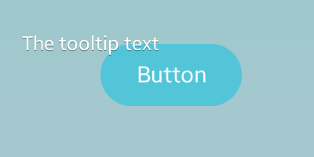

# Tooltip

The tooltip component is a smart object that shows content in a frame when the mouse hovers over the parent object. It provides tips or information about the parent object. A tooltip component is not a UI component as such, so it does not emit signals. For more information, see the [Tooltip](../../../../api/mobile/latest/group__Elm__Tooltips.html) API.

This feature is supported in mobile applications only.

## Basic Usage

> **Note**
>
> You cannot create a tooltip component with the `elm_tooltip_add()` function. This component is already contained in a parent component when it is created. You can only activate or disable the tooltip.

To activate a tooltip on a parent object in your application:

1. Set a tooltip text to a button component using the `elm_object_tooltip_text_set()` function:

   ```
   Evas_Object *button = elm_button_add(parent);

   evas_object_show(button);

   elm_object_tooltip_text_set(button, "The tooltip text");
   ```

2. You can set content to the tooltip using the `elm_object_tooltip_content_cb_set()` function.

   The second parameter defines a callback which is triggered each time the tooltip is shown. Use the callback to create the content to be shown in the tooltip. The callback returns a pointer to an `Evas_Object`.

   The fourth parameter defines a callback which is triggered when the tooltip disappears. Use the callback to delete the previously allocated `Evas_Object`.

   ```
   elm_object_tooltip_content_cb_set(obj, tooltip_content_cb, data, tooltip_content_del_cb);

   Evas_Object*
   tooltip_content_cb(void *data, Evas_Object *obj, Evas_Object *tooltip)
   {
       /* Create the tooltip content */
   }

   void
   tooltip_content_del_cb(void *data, Evas_Object *obj, void *event_info)
   {
       /* Destroy the tooltip content */
   }
   ```

3. You can also set a [style](#styles) and fill the layout with a text or an image according to the style:

   - Set a style to the tooltip with the `elm_object_tooltip_style_set()` function. If you use the default style, you can skip this step.

     ```
     elm_object_tooltip_style_set(obj, "transparent");
     ```

   - To get the current style, use the `elm_object_tooltip_style_get()` function:

     ```
     char *style = elm_object_tooltip_style_get(obj);
     ```

4. After you have set the tooltip text or content, you can manually hide or show the tooltip:

   ```
   /* Hide */
   elm_object_tooltip_hide(obj);
   /* Show */
   elm_object_tooltip_show(obj);
   ```

5. When no longer needed, remove the tooltip from the object:

   ```
   elm_object_tooltip_unset(obj);
   ```

   > **Note**
   >
   > If content was set into the tooltip object, unsetting the tooltip calls the callback provided as the fourth parameter of the `elm_object_tooltip_content_cb_set()` function. The callback is used to notify the application that the tooltip can no longer be used.

The following example shows a simple use case of the tooltip component on a button component.

**Example: Tooltip use case**


```
Evas_Object *win;
Evas_Object *conf;
Evas_Object *nf;
Evas_Object *box;
Evas_Object *button;
Evas_Object *icon;

/* Starting right after the basic EFL UI layout code */
/* (win - conformant - naviframe) */

box = elm_box_add(nf);

/* Add a button and set a style */
button = elm_button_add(box);
elm_object_style_set(button, "circle");

/* Add an icon and set it as a content */
icon = elm_icon_add(button);
elm_icon_standard_set(icon, "home");
elm_object_part_content_set(button, "icon", icon);

/* Set a tooltip on a button */
elm_object_tooltip_text_set(button, "The tooltip text");

elm_box_pack_end(box, button);
evas_object_show(button);

evas_object_show(box);
```

## Features

You can activate the window mode for the tooltip with the `elm_object_tooltip_window_mode_set()` function.

The window mode allows the tooltip to expand beyond its parent window canvas. It is limited only by the size of the display.

```
elm_object_tooltip_window_mode_set(parent, EINA_TRUE);
elm_object_tooltip_window_mode_get(parent);
```

## Styles

The following table lists the available component styles.

**Table: Tooltip styles**

| Style         | Sample                                   | Text part | Swallow part          |
|-------------|----------------------------------------|---------|---------------------|
| `default`     |  | `default` | `elm.swallow.content` |
| `transparent` |  | `default` | `elm.swallow.content` |

> **Note**
>
> Except as noted, this content is licensed under [LGPLv2.1+](http://opensource.org/licenses/LGPL-2.1).

## Related Information
- Dependencies
  - Tizen 2.4 and Higher for Mobile
