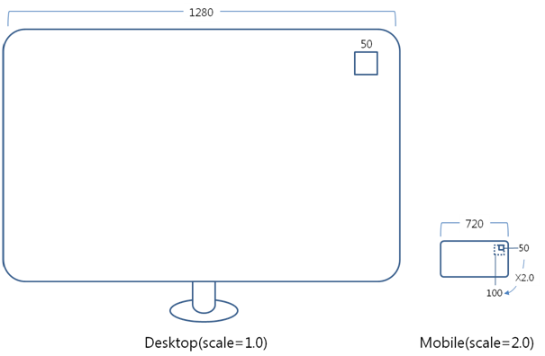
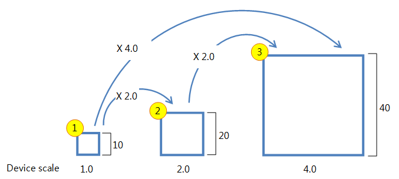

# Multiple Screen Support

Tizen is available on various devices, which support different screen sizes and resolutions. When developing Tizen applications, you must take this into account if you want your application to function well on various device models.

Before [implementing multiple screen support](#applying-the-base-scale), make sure you are familiar with the [key concepts of multiple screen support](#key-concepts).

## Key Concepts

Before building a native application for multiple resolutions using Tizen native UI framework, make sure you are familiar with the following concepts:

- [Multi-scale](#multi-scale-in-the-tizen-native-ui-framework)
- [Base scale](#base-scale)

### Multi-scale in the Tizen Native UI Framework

Tizen native UI framework supports multiple scaling. If the application is implemented to be scalable, it can be scaled to different device environments by simply changing the `elm_scale` value in the target environment without modifying the application code.

Scale 1.0 in the Tizen native UI framework means that the application is displayed in a set size and is not scaled. Scale 1.0 is used in a display environment, such as a desktop. In the desktop environment, the monitor has a resolution between 1280 x 800 and 1920 x 1080, with a size between 20 and 27 inch, and the DPI between 80 and 100.

If an application is scaled up or down after implementing it in a desktop environment, it can be used on another device without modifying the code. Each device has a proper scale value for adjusting the application size. Edje, which handles layout and themes in the Tizen native UI framework, gets the size of an object by multiplying the application-specified size with the device-specific scale value.

The following figure illustrates a 50 px wide object in a 1280 px wide monitor. If the same object is displayed without scaling in a mobile environment, it looks very small. To show the object in the mobile environment with a similar size as in the monitor, a device-specific scale value of 2.0 is used, resulting in the object size of 100 px instead of 50 px.

**Figure: Scaling from desktop to mobile**



### Base Scale

The object is multiplied by the scale specified in the system to show the application in a proper size on other devices. The scaling must be based on the scale 1.0, or the scale that the application is based on, which must then be defined in the [EDC](#setting-the-base-scale-in-the-edc-file) and [C](#setting-the-base-scale-in-the-c-code) files. This predefined scale is called the **base scale**.

The size of the scalable object is multiplied with the device scale value, as illustrated in the following figure. If the scalable object has a size of 10 in the base scale 1.0, it is created with that same size 10 on a device with scale 1.0. On a device with scale 2.0, the object size is 20, and on a device with scale 4.0, the object size is 40.

**Figure: Base scale**



The middle object in the above figure has a base scale 2.0. To calculate the size of the scalable object on a device when the base scale is something other than 1.0, use the following formula:

```
scale = device_scale (information on the target device) / base_scale (information in the application)
```

For example, to calculate the size of a scalable object on a device with scale 4.0 when the base scale in the application is 2.0:

4.0 / 2.0 = 2.0

Basically, if the object size is 20 with base scale 2.0, the object size on a device with scale 4.0 must be 20 * 2.0 = 40.

## Applying the Base Scale

To create an application that supports multiple screen sizes, you must learn how to set the base scale in:

- [EDC file](#setting-the-base-scale-in-the-edc-file)
- [C code](#setting-the-base-scale-in-the-c-code)

### Calculating the Base Scale

To get the base scale value of your own display, you must know the DPI of the display. Based on the display DPI, you can calculate the base scale, since it is proportional to the display DPI with the following formula:

```
base_scale = (DPI / 90) * profile_factor
```

The profile factor defines the object size based on the device profile. The distance between the user eye and the display differs for each profile. This means that the object size must change along the device display.

The following table lists the profile factors for various profiles.

**Table: Profile factors**

| Profile                                  | Profile factor |
|----------------------------------------|--------------|
| Wearable                                 | 0.4            |
| Mobile - small screen (until 4.4 inch)   | 0.7            |
| Mobile - normal screen (4.5 inch and upwards) | 0.8            |
| Desktop                                  | 1.0            |

For example, if your display DPI is 233 and the platform uses the mobile profile (small screen), the base scale is calculated like this:

```
(233 / 90) * 0.7 = 1.8
```

If the application is made in the environment using DPI of 233 and mobile profile, its base scale must be set to 1.8. For a desktop, the DPI is 90, resulting in a base scale of 1.0.

### Setting the Base Scale in the EDC File

The application must specify its base scale.

The EDJE objects are scaled properly, if the base scale is set in the collections block of the EDC file and the object is set as scalable with the `scale` property:

```
collections {
   base_scale: 1.8; /* For WVGA applications */
   parts {
      part {
         name: "box";
         type: RECT;
         min: 100 100;
         scale: 1;
      }
   }
}
```

> **Note**  
> The base scale for the WVGA resolution is 1.8 and for the HD resolution 2.4.

### Setting the Base Scale in the C Code

The object size must be specified in the EDC file. However, sometimes it is better to set the object size in a C file.

If the size is defined in the C file with no scaling, the object is displayed in the same size even if the scale changes. To avoid this, use the `ELM_SCALE_SIZE` macro:

```
#define ELM_SCALE_SIZE(x) x / elm_app_base_scale_get() * elm_config_scale_get()
```

In the above definition, the size (`x`) is first changed to a size based on 1.0 (`x/elm_app_base_scale_get()`) and then multiplied with the scale of the current target (`elm_config_scale_get()`).

To use the `ELM_SCALE_SIZE` macro in your application:

1. Set the application base scale using the `elm_app_base_scale_set()` function:

   ```
   int
   app_create(void *data)
   {
       elm_app_base_scale_set(1.8); /* This value is for WVGA application */
   }
   ```

2. Define the object size in the application using the `ELM_SCALE_SIZE` macro:

   ```
   evas_object_size_hint_min_set(object, ELM_SCALE_SIZE(100), ELM_SCALE_SIZE(100));
   evas_object_resize(object, ELM_SCALE_SIZE(50), ELM_SCALE_SIZE(50));
   ```

     You can use the `ELM_SCALE_SIZE` macro in all functions related to setting objects sizes in Tizen native applications.

## Scaling without the Base Scale

In Tizen, each device has a scale value in proportion to the display. If scaling is enabled, the objects are drawn on the display by multiplying the user-defined object size with the device scale. If the base scale is set, the objects are drawn by dividing the user-defined object size by the base scale and multiplying it with the device scale.

If you use the scale feature without setting the base scale, the result is the same as if you set the base scale to 1.0. Then you do not need to care about the base scale variables, because the pixels roll like a virtual pixel. For example, if you set 1 pixel in 129 DPI without setting the base scale value, the 1 pixel before scaling is equivalent to 1 real physical pixel after scaling. For 233 DPI, it is the same as 1.8 pixels after scaling.

Always consider the pixel before scaling when defining the application UI, in order to ensure a proper UI display on screens with different densities.

```
/* Conversion formula */
real_physical_pixel = (a_pixel_before_scaling) x (DPI / 90) x 0.7
```

Where 90 is the default DPI on a desktop and 0.7 is the mobile profile factor.

The following table shows some examples of pixel conversions.

**Table: Pixel conversions**

|                        | Base | Low-density device (such as WVGA, 4 inch) | High-density device (such as HD, 5 inch) |
|----------------------|----|----------------------------------------|----------------------------------------|
| DPI                    | 129  | 233                                      | 294                                      |
| A pixel before scaling | 100  | 100                                      | 100                                      |
| Real physical pixel    | 100  | 180                                      | 260                                      |
| Actual base scale      | 1.0  | 1.8                                      | 2.6                                      |

## Related Information
- Dependencies
  - Tizen 2.4 and Higher for Mobile
  - Tizen 2.3.1 and Higher for Wearable
