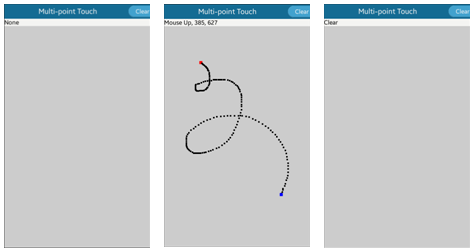

# Tracking Multi-point Touch Events

This topic demonstrates how you can use Evas objects to paint on a canvas and track touch events.

In the following example, you create a fully functional application that is able to track multiple simultaneous clicks. For every click, a black rectangle is drawn on the screen. This way it is easy to test the multi-point touch operation with the application.

## Initializing Multi-point Touch

To initialize multi-point touch for use:

1. In the `multitouch.c` file, define the `appdata` structure that includes the `Evas_Object` pointers for various UI components, a list, and a Boolean flag:

   ```
   struct appdata {
       Evas_Object *win;
       Evas_Object *conform;
       Evas_Object *nf;
       Evas_Object *button;
       Evas_Object *box;
       Evas_Object *rect;
       Evas_Object *label;

       /* List of mouse spots */
       Eina_List *spots;

       /* Flag for checking the mouse down event */
       Eina_Bool down;
   };
   typedef struct appdata appdata_s;
   ```

2. In the `main()` function, initialize the event callbacks and call the `ui_app_main()` function to start the EFL application main loop:

   ```
   int
   main(int argc, char *argv[])
   {
       appdata_s *ad = {0,};
       int ret = 0;

       ui_app_lifecycle_callback_s event_callback = {0,};
       app_event_handler_h handlers[5] = {NULL,};

       event_callback.create = app_create;
       event_callback.terminate = app_terminate;
       event_callback.pause = app_pause;
       event_callback.resume = app_resume;
       event_callback.app_control = app_control;

       ui_app_add_event_handler(&handlers[APP_EVENT_LOW_BATTERY], APP_EVENT_LOW_BATTERY,
                                ui_app_low_battery, &ad);
       ui_app_add_event_handler(&handlers[APP_EVENT_LOW_MEMORY], APP_EVENT_LOW_MEMORY,
                                ui_app_low_memory, &ad);
       ui_app_add_event_handler(&handlers[APP_EVENT_DEVICE_ORIENTATION_CHANGED], APP_EVENT_DEVICE_ORIENTATION_CHANGED,
                                ui_app_orient_changed, &ad);
       ui_app_add_event_handler(&handlers[APP_EVENT_LANGUAGE_CHANGED], APP_EVENT_LANGUAGE_CHANGED,
                                ui_app_lang_changed, &ad);
       ui_app_add_event_handler(&handlers[APP_EVENT_REGION_FORMAT_CHANGED], APP_EVENT_REGION_FORMAT_CHANGED,
                                ui_app_region_changed, &ad);
       ui_app_remove_event_handler(handlers[APP_EVENT_LOW_MEMORY]);

       ret = ui_app_main(argc, argv, &event_callback, &ad);

       return ret;
   }
   ```

   The following figure illustrates the example application screen.

   **Figure: Multi-point touch screen**

   

## Handling the Canvas

To handle the canvas:

1. In the `create_base_gui()` function, create the base UI elements, including the naviframe and button. The naviframe includes each view screen as an item, and the item in turn includes a title, a button which clears the spots when clicked, and the actual content (in this case, a box component).

   ```
   static void
   create_base_gui(appdata_s *ad)
   {
       Elm_Object_Item *nf_it;

       /* Naviframe */
       ad->nf = elm_naviframe_add(ad->conform);
       elm_object_content_set(ad->conform, ad->nf);
       evas_object_show(ad->nf);

       /* Button */
       ad->button = elm_button_add(ad->nf);
       elm_object_text_set(ad->button, "Clear");
       evas_object_smart_callback_add(ad->button, "clicked", button_clicked_cb, ad);

       /* Create main view */
       ad->box = create_main_view(ad);
       nf_it = elm_naviframe_item_push(ad->nf, "Multi-point Touch",
                                       NULL, NULL, ad->box, NULL);
       elm_object_item_part_content_set(nf_it, "title_right_btn", ad->button);
   }
   ```

2. In the `create_main_view()` function, create the view screen content: the box with a label and an event rectangle.

   The label displays information on the mouse event status and coordinates (X and Y positions). The event rectangle is received completely through the mouse (touch) events.

   A box is used as a container for the label and rectangle, because to show multiple elements in a naviframe content area, a container combining those elements is necessary. The label and rectangle are packed at the end of the box, and the box is embedded into the naviframe content area.

   ```
   static Evas_Object*
   create_main_view(appdata_s *ad)
   {
       Evas_Object *box;

       /* Box */
       box = elm_box_add(ad->nf);
       evas_object_size_hint_weight_set(box, EVAS_HINT_EXPAND, EVAS_HINT_EXPAND);
       evas_object_show(box);

       /* Label */
       ad->label = elm_label_add(box);
       elm_object_text_set(ad->label, "None");
       evas_object_size_hint_weight_set(ad->label, EVAS_HINT_EXPAND, 0);
       evas_object_size_hint_align_set(ad->label, EVAS_HINT_FILL, EVAS_HINT_FILL);
       evas_object_repeat_events_set(ad->label, EINA_TRUE);
       elm_box_pack_end(box, ad->label);
       evas_object_show(ad->label);

       /* Event Rect */
       ad->rect = evas_object_rectangle_add(evas_object_evas_get(box));
       evas_object_size_hint_weight_set(ad->rect, EVAS_HINT_EXPAND, EVAS_HINT_EXPAND);
       evas_object_size_hint_align_set(ad->rect, EVAS_HINT_FILL, EVAS_HINT_FILL);
       evas_object_color_set(ad->rect, 204, 204, 204, 255);
       evas_object_repeat_events_set(ad->rect, EINA_TRUE);
       elm_box_pack_end(box, ad->rect);
       evas_object_show(ad->rect);

       return box;
   }
   ```

3. In the `create_spot()` function, create a rectangle, resize it according to the received size input, and move it according to the received coordinate input (X and Y positions):

   ```
   Evas_Object*
   create_spot(Evas_Object *parent, Evas_Coord x, Evas_Coord y, int size)
   {
       Evas_Object *spot;
       spot = evas_object_rectangle_add(evas_object_evas_get(parent));
       evas_object_resize(spot, size, size);
       /* Adjust X and Y positions to be the object center */
       evas_object_move(spot, x - (size/2), y - (size/2));
       evas_object_show(spot);

       return spot;
   }
   ```

4. The created rectangle is stored in the `Eina_List(ad->spots)` list to allow it to be removed when the user clicks **Clear**.

   In the `button_clicked_cb()` button click callback, remove all `evas_objects` from the `ad->spots` list, to clear all spot rectangles from the screen.

   ```
   static void
   button_clicked_cb(void *data, Evas *evas, Evas_Object *object, void *event_info)
   {
       appdata_s *ad = data;
       Evas_Object *spot;

       /* Remove the objects from the list */
       EINA_LIST_FREE(ad->spots, spot) {
           evas_object_del(spot);
           spot = NULL;
       }
       /* Update the label text */
       elm_object_text_set(ad->label, "Clear");
   }
   ```

## Managing Touch Events

Within the `create_main_view()` function, where the box component is created, event callbacks are added for the box to draw event rectangles according to touch events. The event callback is added using the `evas_object_event_callback_add()` function.

The following example shows how to add and define an event callback for a move event by drawing a black rectangle after each movement. To distinguish the places where the user touches down and releases the touch, you can add and define additional event callbacks for down and up events, by setting a different color for the down and up rectangles.

If the given object receives a touch event, a callback function is called, and event information, such as coordinates (X and Y positions) is passed. In this example, the `mousemove_cb()` function updates the label text with the touch coordinates, and draws a spot rectangle in those coordinates.

```
static void
mousemove_cb(void *data, Evas *evas, Evas_Object *obj, void *event_info)
{
    appdata_s *ad = data;
    Evas_Object *spot;
    char buf[1024];
    Evas_Event_Mouse_Move *ev = event_info;
    /* Retrieve the coordinates */
    Evas_Coord x = ev->cur.canvas.x;
    Evas_Coord y = ev->cur.canvas.y;
    int size = (int) 5 * elm_config_scale_get();

    if (!ad->down)
        return;

    /* Update the label text */
    snprintf(buf, sizeof(buf), "Mouse Move, %d, %d", x, y);
    elm_object_text_set(ad->label, buf);

    /* Draw the spot rectangle */
    spot = create_spot(ad->rect, x, y, size);
    evas_object_color_set(spot, 0, 0, 0, 255);
    /* Store the rectangle to the list */
    ad->spots= eina_list_append(ad->spots, spot);
}

static void
create_main_view(appdata_s *ad)
{
    Evas_Object *box;

    /* Create the box */
    box = elm_box_add(ad->nf);
    evas_object_size_hint_weight_set(box, EVAS_HINT_EXPAND, EVAS_HINT_EXPAND);
    evas_object_show(box);

    /* Add the callback */
    evas_object_event_callback_add(box, EVAS_CALLBACK_MOUSE_MOVE, mousemove_cb, ad);
}
```

> **Note**  
> The event types for a touch event contain the "MOUSE" keyword due to backward compatibility with Tizen 2.3. Before the multi-point touch concept was introduced, there was no difference between a single touch event and a mouse event. As a result, the single touch event used the `EVAS_CALLBACK_MOUSE_DOWN/UP/MOVE` event types.

The following touch event types are supported:

- `EVAS_CALLBACK_MOUSE_DOWN`: Object receives the mouse/touch down event.
- `EVAS_CALLBACK_MOUSE_UP`: Object receives the mouse/touch up event.
- `EVAS_CALLBACK_MOUSE_MOVE`: Object receives the mouse/touch move event.
- `EVAS_CALLBACK_MULTI_DOWN`: Object has already received the mouse/touch down event and receives the multi-mouse/touch down event.
- `EVAS_CALLBACK_MULTI_UP`: Object receives the multi-mouse/touch up event.
- `EVAS_CALLBACK_MULTI_MOVE`: Object receives the multi-mouse/touch move event.

The following example shows a scenario with an image and an `EVAS_CALLBACK_MOUSE_UP` event callback, where the callback is used to print out the location where a touch up event occurs over the image. The callback uses the `EVAS_EVENT_FLAG_ON_HOLD` event flag to check whether the event is usable: if the `EVAS_EVENT_FLAG_ON_HOLD` event flag is set, the event is on hold and must not be used to perform any actions.

```
static void
_mouse_up(void *data EINA_UNUSED, Evas *e EINA_UNUSED, Evas_Object *o EINA_UNUSED,
          void *event_info)
{
    Evas_Event_Mouse_Up *ev = event_info;

    if (ev->button != 1) return;
    if (ev->event_flags & EVAS_EVENT_FLAG_ON_HOLD) return;

    printf("MOUSE: up @ %4i %4i\n", ev->canvas.x, ev->canvas.y);
}

static void
_add_mouse_up(Evas_Object *window)
{
    Evas_Object *image;

    image = elm_image_add(win);
    evas_object_event_callback_add(image, EVAS_CALLBACK_MOUSE_UP, _mouse_up, NULL);
    evas_object_show(image);
}
```

## Related Information
- Dependencies
  - Tizen 2.4 and Higher for Mobile
  - Tizen 2.3.1 and Higher for Wearable
