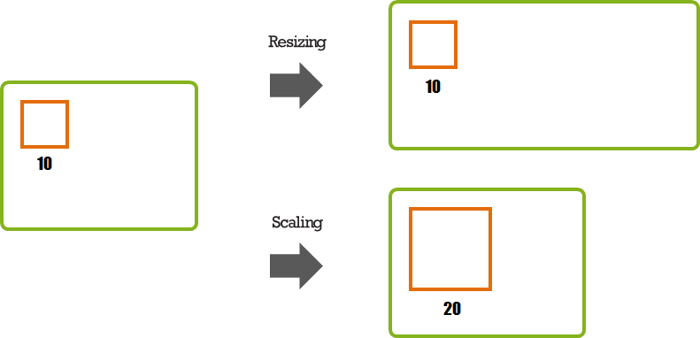
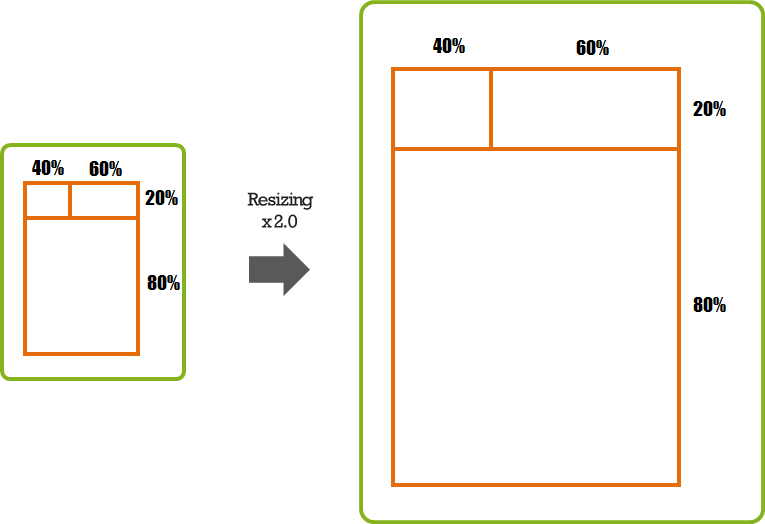
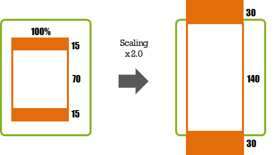
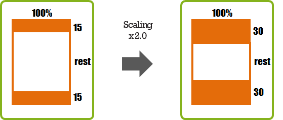
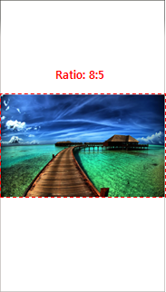
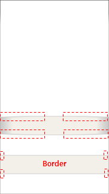
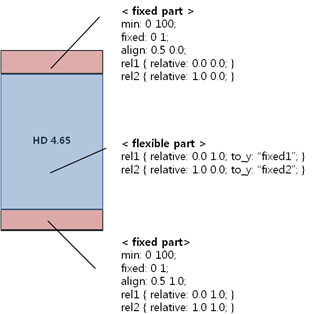
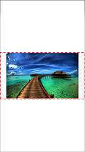
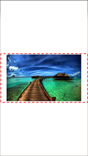
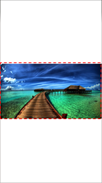

# Scalability Support

To ensure that your application works well on diverse devices, you must consider scalability when designing the application layout:

- [Key concepts](#key-concepts)
- [Scalability using Elementary UI components](#scalability-using-elementary-ui-components)
- [Scalability using the EDC file](#scalability-using-the-edc-file)
- [Aspect ratio](#aspect-ratio)

## Key Concepts

When designing the application layout to be scalable, you must pay attention to the following key concepts:

- Understand the character of the relative position and the fixed position

  In the **relative position**, the size is determined in proportion to the size of the referred object. For example, if an orange rectangle occupies 30% of the green rectangle, and the green rectangle is expanded, the orange rectangle is expanded accordingly. However, if the scaling value is changed and the green rectangle is not scaled, the orange rectangle remains unchanged too.

  **Figure: Relative position**

  

  In the **fixed position**, the size is determined by a value set for the object. For example, the orange rectangle set to the size of 10. If the green rectangle is expanded, the orange rectangle does not change. However, if the scaling value is, for example, doubled, the size of the orange rectangle grows to 20.

  **Figure: Fixed position**

  

- Use the relative position

  If you set the object size as a percentage, the ratio remains fixed regardless of the changes in the screen size or resolution. If you want the object size changed in proportion of the window size, use the relative position.

  **Figure: Scaling relative position**

  

- If you use the fixed size, make the object scalable

  If you use the EDC file to set up the layout, you can set the object scalable in the `part` block:

  ```
  parts {
     part {
        name: "box";
        type: RECT;
        scale: 1;
     }
  }
  ```

  If you set the fixed size in the C code, you can use the `ELM_SCALE_SIZE` macro to ensure that the object size reacts to scale changes:

  ```
  evas_object_size_hint_min_set(object, ELM_SCALE_SIZE(100), ELM_SCALE_SIZE(100));
  ```

  For more information, see [Applying the Base Scale](./multiple-screens.md#applying-the-base-scale).

- Do not fill the width or height out with a fixed size only

  If you fill the entire height out with a fixed size only and it is scaled, the end result can be larger than the screen size.

  **Figure: Height filled with a fixed size**

  

  If you set a partial width or height with a fixed size and leave the remaining area flexible, the layout does not expand outside the screen.

  **Figure: Height with a flexible area**

  

## Scalability Using Elementary UI Components

The Tizen platform provides a UI component toolkit library, called Elementary, that includes an extensive set of UI components. You can use the Elementary UI components to compose your application user interface (UI). While creating the UI, you can set specific properties for the UI components to control the scalable behavior of the UI. Before you try to create a scalable UI using Elementary UI components, make sure you understand some core concepts, such as how to create effective layouts with containers, and how to use the weight and align properties.

> **Note**
>
> The Elementary library provides 3 groups of APIs:
> - Infrastructure: Control of the behavior of Elementary objects.
> - Container: UI component that can contain other UI components.
> - UI component: Elementary UI component, such as button, list, or check or radio box.

### Using Containers for Effective Layouts

The Elementary library provides several containers to display UI components in an effective layout. The containers have no visual identity of their own.

- Box

  The box container makes a layout where child UI components are stacked in either horizontal or vertical direction. The box size is the sum of its child UI components' size:

  - A vertical box calculates its height as the sum of its children's height and its width as the width of the widest child.
  - A horizontal box calculates its width as the sum of its children's width and its height as the height of the tallest child.

  **Figure: Box layout**

  

  The box-based linear layout is the best solution to ensure a minimum size for the child UI components on any device or any orientation.

- Grid

  The grid container makes a layout where child UI components set their position and size relative to the container position and size. You can define the virtual width and height of the grid (by default: 100 x 100). You then pack the child UI components into the grid while setting their position and size based on the virtual size of the grid.

  **Figure: Grid layout**

  

  The grid-based relative layout can always fill the full screen on any device or any orientation. However, the size of the child UI components is changed based on the screen size.

### Using Weight and Align Properties

To make a layout scalable with UI components, the UI components must be packed into a container using only the weight and align properties based on their minimum size. Do not resize the UI components directly using pixels.

The weight and align properties are associated with every Elementary UI component, and they serve as hints for the container they are in. They tell the container how the UI component wants to occupy the space and pack itself with other UI components in the container.

#### Weight

You can set the horizontal and vertical weight property with the `evas_object_size_hint_weight_set()` function:

- Containers use the weights of the child UI components by normalizing them across all child UI components along both X and Y directions.

- The parameter values can be 0 or positive values (default: 0.0).

  0.0 means that the container allocates a minimum size of the UI component area.

  1.0 (`EVAS_HINT_EXPAND`) means that the container allocates all of the remaining area to the UI component.

- If the container has several UI components, it allocates the UI component area relative to the weights of other UI components.

The following figures shows how the different weight hints (horizontal, vertical) of a UI component affect the size allocated to it in a container.

**Figure: Weight hint with 1 child UI component**

 

**Figure: Weight hint across multiple child UI components**

 

#### Align

You can set the horizontal and vertical align property with the `evas_object_size_hint_align_set()` function:

- UI components use the alignment for their position or size along both X and Y directions.

- The parameter values can be from 0.0 to 1.0 or -1.0 (default: 0.5).

- The values define positions as follows:

  - Left: (x=0.0)
  - Right: (x=1.0)
  - Top: (y=0.0)
  - Bottom: (y=1.0)
  - Center: (x=0.5, y=0.5)

  -1.0 (`EVAS_HINT_FILL`) means that the UI component fills all of the allocated area.

**Figure: Alignment hint**


<a name="edje"></a>
## Scalability Using the EDC File

The Tizen platform provides a complex graphical design and layout library called Edje, which provides an abstraction layer between the application code and the interface. You can use Edje in your Tizen applications to create visual elements and control the application layout, look, and feel.

Internally, Edje holds a geometry state machine and a state graph that defines, for example, what is visible, where, at what size, and with what colors. These details are described to Edje using an EDC file. The file can be manually produced with the `Edje_cc` tool by taking a text file (`.edc` file) and "compiling" an output `.edj` file that contains the state graph information, images, and any other needed data. The Tizen Studio complies the EDJ file from the EDC file automatically when you build the application.

While creating the EDC file, you set specific element properties to control the scalable behavior of the UI. Before creating a scalable UI using Edje, you must be familiar with various scalability properties and part types described in the following sections.

### Part

Parts are used to represent the most basic layout elements, such as a line in a border or a text on an image.

The part blocks in the EDC file can have the following property related to scalability:

- `scale`: 0-1

  Specifies whether the part scales its size according to the scaling factor (Tizen has a scaling factor to resize the application layout and object). This property is used to scale object properties, such as font size or min/max size of the part.

  The default value is 0 (off) and the default scaling factor is 1.0. To make a part scalable, set the property to 1 (on).

### Description

Every part can have 1 or more description blocks to define the layout properties of the part.

The description blocks in the EDC file can have the following properties related to scalability:

- `min`/`max`: width height

  Specifies the minimum or maximum size of the part in pixels. It has no effect on the container size.

  When the `scale` property of the part is set to 1 (on), the size is multiplied by the scaling factor.

- `fixed`: 0-1 0-1

  When the `min` or `max` property is set, this property sets a boolean value for each dimension (horizontal and vertical, respectively) that tells the application whether it must be scaled when resized.

  The default value is `0 0`. To fix a part size to its min or max, set the value to 1.

- `align`: X-axis Y-axis

  When the displayed object size is smaller than its container, this property moves it along both axes using the relative position.

  To move the property, use x = 0.0 to move to left, x = 1.0 to move to right, y = 0.0 to move to the top, and y = 1.0 to move to the bottom. The x = 0.5, y = 0.5 value sets the object at the center of its container.

  The default value is `0.5 0.5`.

- `rel1`/`rel2`

  Specifies the position of the top-left and bottom-right corners of the part's container.

  - `relative`: X-axis Y-axis

    Specifies the relative position of the part's container.

    The default value is `0.0 0.0` for `rel1.relative` and `1.0 1.0` for `rel2.relative`.

  - `to`/`to_x`/`to_y`

    Specifies that a corner must be positioned relatively to another part's container.

    By default, the corners of a part are placed to cover whole interface.

  **Example: EDC file part block and its properties**

  

  ```
  collections {
     group {
        name: "property_test";
        images {
           image: "panorama.png" COMP;
        }
        parts {
           /* Blue rectangle in the middle of the screen */
           part {
              name: "rect1";
              type: RECT;
              description {
                 state: "default" 0.0;
                 rel1 {relative: 0.3 0.4;}
                 rel2 {relative: 0.7 0.6;}
                 color: 0 127 255 255;
              }
           }
           /* Orange rectangle at the bottom of the screen */
           part {
              name: "rect2";
              type: RECT;
              /* Affected by scaling factor */
              scale: 1;
              description {
                 state: "default" 0.0;
                 fixed: 0 1;
                 /* Height: 100 pixels (when the scaling factor is 1.0) */
                 min: 0 100;
                 rel1 {relative: 0.0 1.0;}
                 rel2 {relative: 1.0 1.0;}
                 /* Bottom-aligned */
                 align: 0.5 1.0;
                 color: 255 127 0 255;
              }
           }
           /* Image above the orange rectangle */
           part {
              name: "image";
              /* Affected by scaling factor */
              scale: 1;
              description {
                 state: "default" 0.0;
                 fixed: 1 1;
                 /* Image size: 720 x 180 pixels (when the scaling factor is 1.0) */
                 min: 720 180;
                 /* Y axis is positioned relative to "rect2" part */
                 rel1 {relative: 0.5 0.0; to_y: "rect2";}
                 rel2 {relative: 0.5 0.0; to_y: "rect2";}
                 /* Bottom-aligned */
                 align: 0.5 1.0;
                 image.normal: "panorama.png";
              }
           }
        }
     }
  }
  ```


- `aspect`: min max

  Specifies the width to height ratio to keep when the part is resized. When both values are the same, the ratio is fixed. When they differ, the part is forced to keep the ratio between the `min` and `max` properties when resized.

  The default value is `0.0 0.0`.

- `aspect_preference`: dimension

  Specifies the scope of the `aspect` property to a given dimension.

  The possible values are `BOTH`, `VERTICAL`, `HORIZONTAL`, and `NONE`. The default is `NONE`.

  **Example: EDC file aspect property**

  

```
collections {
   group {
      name: "property_test";
      images {
         image: "island.png" COMP;
      }
      parts {
         part {
            name: "image";
            description {
               state: "default" 0.0;
               rel1 {relative: 0.0 0.0;}
               rel2 {relative: 1.0 1.0;}
               image.normal: "island.png";
               aspect: 8/5 8/5;
               /* Keep the aspect ratio based on the part width */
               aspect_preference: HORIZONTAL;
            }
         }
      }
   }
}
```

### Text

The text elements are used to display text on the screen.

The text blocks in the EDC file can have the following properties related to scalability:

- `size`: font-size

  Specifies the font size for the text. When the `scale` property of the part is set to 1 (on), the size is multiplied by the scaling factor.

- `min`: horizontal vertical

  Specifies a pair of boolean values that define whether the container can be reduced further than the text size. The property is used to prevent the container from chopping the text.

  When `min` is set horizontally or vertically, the minimum height or width of the part is decided by the text size.

  The default value is `0 0`.

- `max`: horizontal vertical

   Specifies a pair of boolean values that define whether the container can be expanded further than the text size.

   When `max` is set horizontally or vertically, the maximum height or width of the part is decided by the text size.

   The default value is `0 0`.

   **Example: EDC file text block and its properties**

   

  ```
  collections {
     group {
        name: "property_test";
        parts {
           part {
              name: "text";
              type: TEXT;
              scale: 1;
              description {
                 state: "default" 0.0;
                 rel1 {relative: 0.0 0.0;}
                 rel2 {relative: 1.0 0.0;}
                 align: 0.5 0.0;
                 color: 108 108 108 255;
                 text {
                    font: "TIZEN";
                    /* Affected by scaling factor */
                    size: 80;
                    /*
                       Minimum height of the part container
                       is decided by the text size
                    */
                    min: 0 1;
                    text: "Test properties!!";
                 }
              }
           }
        }
     }
  }
  ```

- `fit`: horizontal vertical

  Specifies a pair of values that define whether the text is scaled to fill its container horizontally or vertically.

  The default value is `0 0`.

  **Example: EDC file fit property**

  

    ```
    collections {
       group {
          name: "property_test";
          parts {
             part {
                name: "text";
                type: TEXT;
                description {
                   state: "default" 0.0;
                   rel1 {relative: 0.0 0.0;}
                   rel2 {relative: 1.0 0.1;}
                   color: 108 108 108 255;
                   text {
                      font: "TIZEN";
                      /* Resize text to fill the container height */
                      fit: 0 1;
                      text: "Test properties!!";
                   }
                }
             }
          }
       }
    }
    ```

### Image

The image elements are used to display images on the screen.

The image blocks in the EDC file can have the following properties related to scalability:

- `border`: left right top bottom

  Specifies the border size of the image in pixels. This property sets the area of each side of the image to be displayed as a fixed size border, preventing the corners from being changed on a resize.

- `border_scale`

  Specifies whether the border scales its size according to the scaling factor.

  The default value is 0 (off). To make the border scalable, the value must be set to 1 (on).

  **Example: EDC file image block and its properties**

  

   ```
   collections {
      group {
         name: "property_test";
         images {
            image: "00_button_01_normal.png" COMP;
         }
         parts {
            part {
               name: "image";
               description {
                  state: "default" 0.0;
                  rel1 {relative: 0.0 0.6;}
                  rel2 {relative: 1.0 0.7;}
                  image.normal: "00_button_01_normal.png";
               }
            }
            part {
               name: "ninepatch_image";
               description {
                  state: "default" 0.0;
                  rel1 {relative: 0.0 0.8;}
                  rel2 {relative: 1.0 0.9;}
                  image {
                     normal: "00_button_01_normal.png";
                     border: 4 4 0 0;
                     /* Affected by scaling factor */
                     border_scale: 1;
                  }
               }
            }
         }
      }
   }
   ```

### Image Set

The image set elements are used to display a specific image on the screen based on the container size. The image set is used to control resource quality when the image part is scaled to multiple devices. According to the size of the part's container, an appropriate image is loaded.

The images.set blocks in the EDC file can have the following properties related to scalability:

- `image`: image-name

  Specifies the name of the image file.

- `size`: minw minh maxw maxh

  Specifies the minimum and maximum size that causes a specified image to be selected and shown.

  **Example: EDC file images.set block and its properties**

  

   ```
   collections {
      group {
         name: "property_test";
         images {
            set {
               name: "alternative_animal";
               image {
                  image: "pig.png" COMP;
                  size: 640 800 1200 1500;
               }
               image {
                  image: "monkey.png" COMP;
                  size: 400 500 639 799;
               }
               image {
                  image: "cat.png" COMP;
                  size: 240 300 399 499;
               }
               image {
                  image: "mouse.png" COMP;
                  size: 80 100 239 299;
               }
               image {
                  image: "snail.png" COMP;
                  size: 0 0 79 99;
               }
            }
         }
         parts {
            part {
               name: "image1";
               description {
                  state: "default" 0.0;
                  rel1 {relative: 0.0 0.0;}
                  rel2 {relative: 1.0 0.45;}
                  image.normal: "alternative_animal";
                  aspect: 4/5 4/5;
                  aspect_preference: BOTH;
               }
            }
            part {
               name: "image2";
               description {
                  state: "default" 0.0;
                  rel1 {relative: 0.0 0.5;}
                  rel2 {relative: 1.0 0.75;}
                  image.normal: "alternative_animal";
                  aspect: 4/5 4/5;
                  aspect_preference: BOTH;
               }
            }
            part {
               name: "image3";
               description {
                  state: "default" 0.0;
                  rel1 {relative: 0.0 0.8;}
                  rel2 {relative: 1.0 1.0;}
                  image.normal: "alternative_animal";
                  aspect: 4/5 4/5;
                  aspect_preference: BOTH;
               }
            }
         }
      }
   }
   ```

### Part Types

You can use fixed and flexible parts:

- Fixed parts
  - Fixed parts have a minimum size (at least width or height).
  - When the part `scale` property is set to 1 (on), the scaling factor has an effect on the minimum size.
  - Fixed parts are used when the parts must keep a fixed size on any device or any orientation.
- Flexible parts
  - Flexible parts resize according to the container size and other fixed parts' size.
  - Flexible parts are used when the parts can be resized on any device or any orientation.

**Figure: Fixed and flexible parts**



## Aspect Ratio

In Tizen, the application generally fills out the screen. However, sometimes you want the application to be shown in a specific aspect ratio, regardless of the screen size.

As images are scaled on different devices, they are resized based on the container size. The images have specific properties that define the area to be shown when resized.

For example, the following table illustrates what happens to the parts marked with yellow rectangles in the following figure when scaling properties are applied. In the table, the red dashed rectangle illustrates the container size.

**Figure: Original image [1920x1280 (8:5)]**

![Original image [1920x1280 (8:5)]](./media/scale_original_image.png)

> **Note**
>
> To set the required aspect ratio, use the `evas_object_size_hint_aspect_set()` function or the `aspect_preference` property in the EDC file.

**Table: Image resizing effects with a specific aspect ratio**
<table>
<thead>
<tr><th rowspan="2">Aspect</th><th colspan="2">Container area</th></tr>
<tr><th>720x384 (15:8)</th><th>720x640 (9:8)</th></tr>
</thead>
<tbody>
<tr>
  <td> HORIZONTAL<br>Resizing based on the container width while keeping the image aspect ratio.<br> Extra height goes outside the image area and is clipped. </td>
  <td>  </td>
  <td>  </td></tr>
<tr>
  <td>  VERTICAL<br>Resizing based on the container height while keeping the image aspect ratio.<br> Extra width goes outside the image area and is clipped. </td>
  <td>  </td>
  <td>  </td></tr>
<tr>
  <td> BOTH<br>Resizing based on the container area while keeping the image aspect ratio.<br> No extra width or height goes outside the image area, so the entire image is always shown.</td>
  <td>  </td>
  <td>  </td></tr>
<tr>
  <td> NONE<br>Resizing to fill the available area while keeping the image aspect ratio.<br> Extra width or height goes outside the image area and is clipped. </td>
  <td>  </td>
  <td>  </td></tr>
</tbody>
</table>

### Setting the Image Aspect Ratio

You can set the aspect ratio of an image object with additional functions:

- `elm_image_fill_outside_set()`

  If the second function parameter is set to `TRUE`, the image resizes to fill the entire area while keeping its aspect ratio. It lets the extra width or height go outside of the area (same result as with the aspect NONE in the above table).

- `elm_image_aspect_fixed_set()`

  If the second function parameter is set to `FALSE`, the image resizes to fill the entire area without keeping its original aspect ratio. The image can be distorted to fit the area.

  The following table shows how, to fit in, the image in the 720x384 container area is flattened vertically while the image in the 720x640 container area is flattened horizontally.

  **Table: Image resizing without keeping the aspect ratio**
  <table>
  <thead>
  <tr><th colspan="2">Container area</th></tr>
  <tr><th>720x384 (15:8)</th><th> 720x640 (9:8)</th></tr>
  </thead>
  <tbody>
  <tr>
    <td> </td>
    <td> </td></tr>
  </tbody>
  </table>

## Related Information
- Dependencies
    - Tizen 2.4 and Higher for Mobile
    - Tizen 2.3.1 and Higher for Wearable
