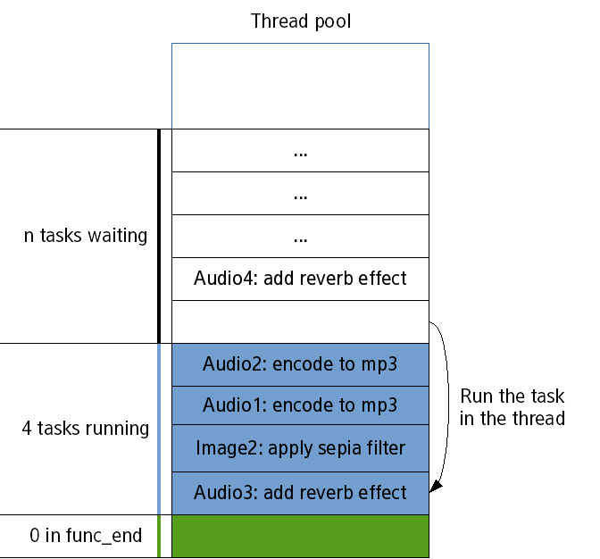

# Using Threads

Threads are concurrent execution environments that are lighter than full-blown processes because they share some operating system resources. Threads make it possible to do several things at the same time while using less resources and offering simpler synchronization and data exchange compared to processes.

If you move a blocking operation to a separate thread, it cannot block the event loop and keeps the user interface reactive. Blocking the event loop and using long-running callbacks means the application cannot update its graphical user interface.

While threads can be useful, they are not always the best choice:

- The first rule to using threads is to avoid them as much as possible, as there are often better tools and approaches. For example, to do network transfers, use `Ecore_Con` that integrates with the event loop to use a function based on callbacks. Being able to use such a function means that specific support work has been done in libraries. In some cases, using a function and libraries is impossible, and in those situations threads are required.
- Use threads in CPU-intensive tasks and disk IOs. For example, a thread is the appropriate way to apply filters to an image or to a video without blocking the interface.
- Use threads to take advantage of multiple available CPU cores, if the workload can be split into several units of work and spread across the cores. A typical example for an image processing application on a quad-core CPU is to process 4 images at once, each on 1 thread. For such tasks, the thread pool helps with the creation and scheduling of the threads, handling all the grunt work.

## Thread Safety

If several strings have to work on the same resources, conflicts can happen as the threads are run in parallel. For example, if thread A modifies several values while thread B is reading them, it is likely that some of the values read by B are outdated. Similar issues can happen if both threads are modifying data concurrently.

These kinds of conflicts are called race-conditions: depending on which thread is faster, the output changes and can be incorrect. Avoiding such issues is called thread safety. Thread safety involves critical sections, which are blocks of code that operate on shared resources and must not be accessed concurrently by another thread.

The usual solution for ensuring exclusive access to shared resources is mutual exclusion: only 1 thread can operate on the data at any given time. Mutual exclusion is often implemented through locks. Before attempting to operate on a shared resource, the thread waits until it can lock something called a mutex (stands for mutual exclusion), then operates on the resource, and unlocks the mutex. Operating systems guarantee that only 1 thread can lock a mutex at a given time: this ensures that only 1 thread operates on the shared resource at one time.

For more information on thread safety, see [Low-level Functions](#low-level-functions).

## Thread Pools

Threads are operating system resources: while much lighter than processes, they still have a cost. Moreover, spawning a thousand threads means that each of them only gets 1/1000th of the total CPU time: each thread is progressed slowly and, in the worst case, the system wastes all of its time switching between threads without doing any actual work.

Thread pools solve this problem. In thread pools, up to a maximum number of threads are created on-demand and used to execute tasks. When the tasks are finished, they are kept alive but sleeping. This avoids the cost of creating and destroying them.

In EFL, the thread pool is controlled by a `thread_max` parameter, which defines the maximum number of threads running at the same time. Another control feature is the `func_end()` callback that runs from the main loop thread after a task has completed and is typically used to extract the data from the finished task and make it available to the main loop.

To manage the maximum number of threads:

- To retrieve the current value, use the `ecore_thread_max_get()` function.
- To set the value, use the `ecore_thread_max_set()` function. The value has a maximum of 16 times the CPU count.
- To reset the maximum number of threads, use the `ecore_thread_max_reset()` function.
- To get the number of available threads in the pool, use the `ecore_thread_available_get()` function. The function returns the current maximum number of threads minus the number of running threads. The number can be a negative value, if the maximum number of threads has been lowered.

The following figures illustrate the thread pool. The first figure shows the occupancy of a hypothetical thread pool. There are several tasks, of which 4 are running. The  `thread_max` parameter of the pool is 4, and the other tasks are waiting. There is no thread with its `func_end()` callback currently called.

**Figure: Thread pool, step 1**


When a task, applying the sepia filter on image1, finishes, the corresponding `func_end()` function is invoked from the main loop.

**Figure: Thread pool, step 2**


With the task done, one of the threads from the pool becomes available, and another thread, adding the reverberation effect on audio3, can run in it.

**Figure: Thread pool, step 3**



As long as there are tasks to be done, the thread pool continues the same way, running tasks in its threads whenever a thread is available.

## Thread Management with Ecore

Ecore offers a simplified API for managing threads in EFL applications. The Ecore API applies to a typical scenario where the main thread creates another thread, which in turn sends data back to the main thread or calls GUI-related functions. GUI-related functions are not thread-safe.

### Creating Threads with Ecore

The threads created with Ecore are by default integrated with the thread pool and offer simple callback-based ways to interact with the main loop. New threads are created as needed until the maximum capacity of the thread pool is reached.

- To return values to the main thread:

  Use the `ecore_thread_feedback_run()` function to send intermediate feedback from the thread to the main loop.

- To return only the final value to the main thread:

  To create and run a thread, use the `ecore_thread_run()` function. It runs a function inside a thread from the thread pool and takes care of all the low-level work. It returns the corresponding thread handler or `NULL` on failure.

  The most common way to return data from one thread to the main thread is to put a pointer to it in the data. When the thread is aborted or finishes, either `func_cancel()` or `func_end()` is called from the main loop. The functions are running in the simpler context of a single thread running at once and therefore avoid race-conditions.

  The data pointer approach can only be used when the data is shared between the one thread and the main thread only. However, this does not prevent you from using the `func_end()` callback to merge the results into a single data structure. For example, you can add all the values computed by the threads to an `Eina_List`, as all the operations on the list happen from a single thread and therefore one after the other and not concurrently.

### Running Callbacks from the Main Loop

If you are performing operations in another thread and want to update a progress bar, the update operation must be done from the main thread. The simplest way is to use the `ecore_main_loop_thread_safe_call_async()` function, which takes a function and some data as parameters and instructs the main loop to execute the given function with the given data.

Depending on the kind of thread the function is called from, the process differs:

- If the function is called from a thread that is not the main one, the function sends a message to the main loop and returns quickly. The message is processed in order, similarly to others.
- If the function is called from the main thread, the function is called immediately as if it were a direct call.

If you want to wait until the callback is called and returns, use the `ecore_main_loop_thread_safe_call_sync()` function, which is similar but synchronous. Since it is synchronous, it can also return the value returned by the callback.

## Low-level Functions

Eina offers low-level functions that are portable across the operating system, such as locks, conditions, semaphores, barriers, and spinlocks. The functions follow closely the logic of pthreads.

While these functions are useful, they are building blocks and not usually useful in EFL applications considering the higher-level functions that are available in Ecore.

For an introduction to threads and pthreads in particular, see:

- [Basic use of pthreads](http://www.ibm.com/developerworks/library/l-pthred/index.html) (IBM developerWorks)
- [POSIX Threads Programming](https://computing.llnl.gov/tutorials/pthreads/) (Lawrence Livermore National Laboratory)
- [POSIX 2003 specification](http://pubs.opengroup.org/onlinepubs/9699919799/basedefs/pthread.h.html) (opengroup)

If you are already familiar with threads, see the standard pthreads documentation and the Eina reference documentation, or the following function lists. Remember that the Eina functions map very closely to the pthreads functions.

**Table: Locks (mutual exclusions)**

| pthreads function                        | Eina equivalent        |
|----------------------------------------|----------------------|
| `pthread_mutex_new()`                    | `eina_lock_new()`      |
| `pthread_mutex_destroy()`                | `eina_lock_free()`     |
| `pthread_mutex_lock()`                   | `eina_lock_take()`     |
| `pthread_mutex_trylock()`                | `eina_lock_take_try()` |
| `pthread_mutex_unlock()`                 | `eina_lock_release()`  |
| none (prints debug information on the lock) | `eina_lock_debug()`    |

**Table: Conditions (notifications when condition objects change)**

| pthreads function          | Eina equivalent              |
|--------------------------|----------------------------|
| `pthread_cond_init()`      | `eina_condition_new()`       |
| `pthread_cond_destroy()`   | `eina_condition_free()`      |
| `pthread_cond_wait()`      | `eina_condition_wait()`      |
| `pthread_cond_timedwait()` | `eina_condition_timedwait()` |
| `pthread_cond_broadcast()` | `eina_condition_broadcast()` |
| `pthread_cond_signal()`    | `eina_condition_signal()`    |

**Table: RWLocks (Read-write locks, for multiple-readers/single-writer scenarios)**

| pthreads function                | Eina equivalent            |
|--------------------------------|--------------------------|
| `pthread_rwlock_init()`          | `eina_rwlock_new()`        |
| `pthread_rwlock_destroy()`       | `eina_rwlock_free()`       |
| `pthread_rwlock_rwlock_rdlock()` | `eina_rwlock_take_read()`  |
| `pthread_rwlock_rwlock_wrlock()` | `eina_rwlock_take_write()` |
| `pthread_rwlock_unlock()`        | `eina_rwlock_release()`    |

**Table: TLS (Thread-Local Storage)**

| pthreads function       | Eina equivalent   |
|-----------------------|-----------------|
| `pthread_key_create()`  | `eina_tls_new()`  |
| `pthread_key_delete()`  | `eina_tls_free()` |
| `pthread_getspecific()` | `eina_tls_get()`  |
| `pthread_setspecific`   | `eina_tls_set()`  |

**Table: Semaphores (access restrictions for a set of resources)**

| pthreads function | Eina equivalent            |
|-----------------|--------------------------|
| `sem_init()`      | `eina_semaphore_new()`     |
| `sem_destroy()`   | `eina_semaphore_free()`    |
| `sem_wait()`      | `eina_semaphore_lock()`    |
| `sem_post()`      | `eina_semaphore_release()` |

**Table: Barriers**

| pthreads function           | Eina equivalent       |
|---------------------------|---------------------|
| `pthread_barrier_init()`    | `eina_barrier_new()`  |
| `pthread_barrier_destroy()` | `eina_barrier_free()` |
| `pthread_barrier_wait()`    | `eina_barrier_wait()` |

## Thread Use Examples

The following examples display a window with a label. An auxiliary thread semi-regularly changes the text of the label. If you want to display a regular animation, use the Ecore animators described in the [Main Loop](./main-loop.md) guide.

To use the `ecore_thread_feedback()` function:

1. Implement the GUI function that sets the text of a label and can be called from the main thread.

   ```
   static void
   _set_label_text(void *data, Ecore_Thread *thread __UNUSED__, void *msgdata)
   {
       char buf[64];
       appdata_s *ad = data;
       snprintf(buf, sizeof(buf), "Tick %d", (int)(uintptr_t)msgdata);
       elm_object_text_set(ad->label, buf);
   }
   ```

2. Send the feedback from the other thread using the `ecore_thread_feedback()` function. The following function does nothing besides sending the feedback and sleeping.

   ```
   static void
   _long_function(void *data __UNUSED__, Ecore_Thread *thread)
   {
       int iteration;
       /*
          Change the text roughly every 1 second. This is only an example; if you
          want regular animations, use Ecore animators!
       */
       for (iteration = 0; ; iteration++) {
           /*
              Since you are running from another thread, you need to take special
              care and instead send data to the main thread and have it run the
              feedback function given when creating the thread
           */
           ecore_thread_feedback(thread, (void*)(uintptr_t)iteration);
           /* Sleep for roughly one second */
           sleep(1);
       }
   }
   ```

3. Create an end function that is called when the thread exits. In this example, the end function is called only right before the application exits. However, if the blocking function is more complex, it can trigger the end function.

   ```
   static void
   _end_func(void *data, Ecore_Thread *thread __UNUSED__)
   {
       appdata_s *ad = data;
       elm_object_text_set(ad->label, "Ticks over");
   }
   ```

4. Call the `ecore_thread_feedback_run()` function to start the thread:

   ```
   ecore_thread_feedback_run(_long_function, _set_label_text, _end_func, NULL, ad, EINA_FALSE);
   ```

To use the `ecore_main_loop_thread_safe_call_sync()` function:

1. Implement the GUI function that sets the text of a label and can be called from the main thread. The function receives data as a structure and alternatively displays "Tick d" or "Tock d".

   ```
   struct thd {
       appdata_s *ad;
       Eina_Bool tick_not_tock;
       int iteration;
   };
   static void*
   _set_label_text_tick_tock(void *data)
   {
       char buf[64];
       struct thd *thd = data;
       snprintf(buf, sizeof(buf), "%s %d", (thd->tick_not_tock ? "Tick" : "Tock"), thd->iteration);
       elm_object_text_set(thd->ad->label, buf);

       return NULL;
   }
   ```

2. Use the `ecore_main_loop_thread_safe_call_sync()` function call the GUI function. Differentiate between the ticks and the tocks:

   ```
   static void
   _long_function_tick_tock(void *data, Ecore_Thread *thread __UNUSED__)
   {
       struct thd *thd = malloc(sizeof(struct thd));
       thd->ad = data;
       for (thd->iteration = 0; ; (thd->iteration)++) {
           thd->tick_not_tock = EINA_TRUE;
           ecore_main_loop_thread_safe_call_sync(_set_label_text_tick_tock, thd);
           sleep(1);
           thd->tick_not_tock = EINA_FALSE;
           ecore_main_loop_thread_safe_call_sync(_set_label_text_tick_tock, thd);
           sleep(1);
       }
       free(thd);
   }
   ```

3. Start the thread through the `ecore_thread_run()` function:

   ```
   ecore_thread_run(_long_function_tick_tock, _end_func, NULL, ad);
   ```

> **Note**  
> Except as noted, this content is licensed under [LGPLv2.1+](http://opensource.org/licenses/LGPL-2.1).

## Related Information
- Dependencies
  - Tizen 2.4 and Higher for Mobile
  - Tizen 2.3.1 and Higher for Wearable
