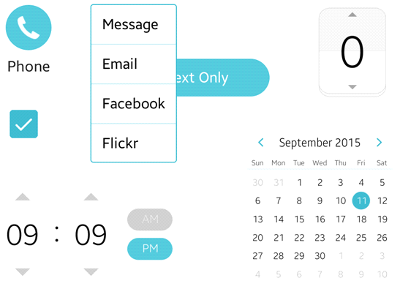
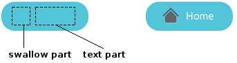

# UI Components

Elementary library provides a set of pre-built UI components that allow you to build a rich graphical user interface for your applications. Each profile provides a different set of UI components, as you can see in [Mobile UI Components](mobile/ui-components.md) and [Wearable UI Components](wearable/ui-components.md).

The preconditions of using Elementary UI components are covered in [Getting Started with EFL UI Programming](./getting-started.md). Elementary UI components share the same APIs for general features. For more information, see the General API (in [mobile](../../../api/mobile/latest/group__Elm__General.html) and [wearable](../../../api/wearable/latest/group__Elm__General.html) applications).

**Figure: Mobile UI components**



## Basic Usage

You can use all UI components as follows:

1. Add an object with the `elm_<UI_component>_add()` function.

2. Set a style to the object with the `elm_object_style_set()` function and fill the layout of the style with a text or an image, if necessary.

   You can skip this step and use the default style.

3. Arrange the object in the [UI layout](./ui-layouts.md) you have built.

4. Register callback functions with the `evas_object_smart_callback_call()` function.

## Styles

The style of a UI component refers to its graphical appearance determined by the layout, shapes, fonts, and colors. Every UI component has a distinguished layout according to its function and feature, and the layout of a UI component varies somewhat according to the styles.

In the layout, there are spaces for texts or images which sometimes remain empty for you to fill. In EFL, that space is a "part" (the term comes from [part](./learn-edc-part.md) in [EDC](./learn-edc-intro.md)). A layout of a UI component has 2 types of parts: a text part and a swallow part. A swallow part is a blank you can fill with any kind of object.

The following figure shows a default style button. The default style of a button has 1 swallow part and 1 text part. If you create a button and do not set a text or an image, the button looks like the left side. If you set a text and an image to the button, it looks like the right side.

**Figure: Empty button and button filled with an icon and a text**



The following code snippet shows how to implement the button on the right:

```
Evas_Object *btn;
Evas_Object *icon;

btn = elm_button_add(parent);
icon = elm_icon_add(btn);
elm_icon_standard_set(icon, "home");
/* Set a text to the button */
elm_object_text_set(btn, "Home");
/* Set an icon to the button */
elm_object_part_content_set(btn, "icon", icon);
```

Use the following functions to fill a part with a text or an icon:

- `elm_object_part_text_set()`
- `elm_object_part_content_set()`

If the part name is `default`, you can use the following functions without specifying the part name:

- `elm_object_text_set()`
- `elm_object_content_set()`

## Callbacks

UI components emit signals on specific situations so that you can perform some action by registering a callback function connected to the signal. The callback is called a "smart callback", distinguished from an event callback.

For example, a button object emits a `clicked` signal when it is clicked, and you can define a specific action every time the button is clicked. Each UI component provides different kinds of signals. For the available signals, see the topic for each individual UI component.

Use the `evas_object_smart_callback_add()` function to register a callback. The following code snippet shows how to register a callback function to the `clicked` signal:

```
/* Add a callback function connected to the clicked signal */
evas_object_smart_callback_add(btn, "clicked", _clicked_cb, NULL);

/* Print a log every time the button is clicked */
void
_clicked_cb(void *data, Evas_Object *obj, void *event_info)
{
    dlog_print(DLOG_INFO, LOG_TAG, "Button clicked\n");
}
```

Besides smart signals, which are defined on the Elementary level, Evas event signals are also available on UI components. You can register callback functions connected to input events (key up, key down, mouse wheel) using the `evas_object_event_callback_add()` function.

The following code snippet shows how to register a callback function to the mouse down event:

```
/* Add a callback function to the mouse down event */
evas_object_event_callback_add(btn, EVAS_CALLBACK_MOUSE_DOWN, _down_cb, NULL);

/* Print a log every time the mouse down event occurs */
void
_down_cb(void *data, Evas *e, Evas_Object *obj, void *event_info)
{
    dlog_print(DLOG_INFO, LOG_TAG, "Mouse down on button\n");
}
```

For more information on event handling, see [Event Handling](./event-handling.md).

## Topics on UI Components

For more information on UI components in general, see the following topics:

- [Configuring UI Components](./configuring.md)

  UI components are under the influence of the Elementary configuration. The Elementary configuration consists of a set of preconfigured options, which are linked to form an Elementary profile. The configuration affects the entire look and feel of an application.

- [Customizing UI Components](./component-custom.md)

  Besides the predefined styles of each UI component, EFL provides a way to customize the graphical user interface with the Edje library.

- [Managing UI Component Focus](./component-focus.md)

  The Elementary user interface has the concept of "focus". A UI component receives input from the user when it is focused.

- [Scaling](./ui-scalability.md)

  To ensure that your application works well on diverse devices, you must consider scalability when designing the application layout.

> **Note**
>
> Except as noted, this content is licensed under [LGPLv2.1+](http://opensource.org/licenses/LGPL-2.1).

## Related Information
- Dependencies
  - Tizen 2.4 and Higher for Mobile
  - Tizen 2.3.1 and Higher for Wearable
