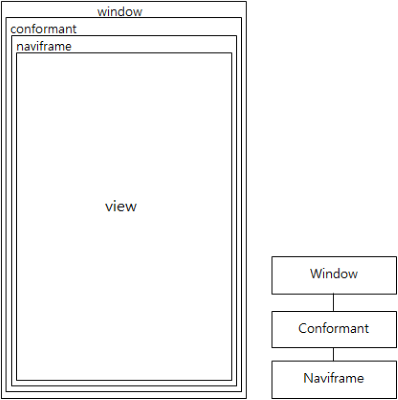

# Building UI Layouts

A layout lays out the arrangement of different graphical elements of a user interface. Designing a layout is a fundamental part of building a user interface, unless you want to display only one UI component in your application throughout the running time. In most cases, applications have more than one view changing over time, and a view consists of many graphical elements.

## UI Containers

EFL supports building layouts in the form of special Elementary UI components, classified as **containers**. Elementary provides a set of UI containers which enable displaying UI components in an organized layout. Each UI container has a different purpose and distinct behaviors, so it is important to select the most suitable one for your layout.

Container UI components do not have their own visual identity. They only have logical structures for assignment or placement of other UI components. The use of container UI components only differs from the use of the UI components due to the absence of a visual identity.

**Table: UI containers**

| Name                                     | Description                              |
|----------------------------------------|----------------------------------------|
| [Box](./container-box.md) | Arrange more than 2 objects linearly.    |
| [Conformant](./container-conformant.md) | Resize and position the content area based on the space taken by, for example, an indicator, a virtual keyboard and a softkey window. |
| [Grid](./container-grid.md) | Place objects at specific positions along a fixed grid. |
| [Layout](./container-layout.md) | Take a standard Edje design file and wrap it very thinly in a UI component. |
| [Mapbuf](./container-mapbuf.md) | Improve the moving and resizing performance of a complex UI component by treating it as a single Evas map image. |
| [Naviframe](./container-naviframe.md) | Manage many views by stacking them and displaying the topmost one. |
| [Panes](./container-panes.md) **in mobile applications only** | Resize 2 sections of content by adding a draggable bar between them. |
| [Scroller](./container-scroller.md) | Hold and clip a single object and allow users to scroll across it. |
| [Table](./container-table.md) | Arrange multiple objects like for a box, but with 2 dimensions. |

## Basic EFL UI Layout

The basic UI layout structure of an EFL application is as follows: a window is filled with a conformant, and the conformant is filled with a naviframe.

Each component has a specific role:

- A conformant accounts for the space taken up by a factor outside the application layout, such as rotation, an indicator, a virtual keyboard, and a softkey window. A conformant has to be present in every application.   

  The content is resized and positioned based on the space available.

- A naviframe acts as a view manager and optionally provides the application title. Most of the time, your application has to manage multiple views, and the easiest way to handle them is to create a naviframe object. Every Tizen application can use this top-layer object to facilitate navigation.   

  The main layout of the application is added to the naviframe view area.

The above structure is highly recommended and very usual, but it is not essential for every application. For example, if your application displays only one view statically throughout the running time, it does not need a naviframe.

**Figure: Basic EFL UI Layout**



```
static void
create_base_gui(appdata_s *ad)
{
    /* Window */
    /* Create and initialize elm_win,
       which is mandatory to manipulate a window
    */
    ad->win = elm_win_util_standard_add(PACKAGE, PACKAGE);
    elm_win_autodel_set(ad->win, EINA_TRUE);

    if (elm_win_wm_rotation_supported_get(ad->win)) {
        int rots[4] = {0, 90, 180, 270};
        elm_win_wm_rotation_available_rotations_set(ad->win, (const int *)(&rots), 4);
    }

    evas_object_smart_callback_add(ad->win, "delete,request", win_delete_request_cb, NULL);
    eext_object_event_callback_add(ad->win, EEXT_CALLBACK_BACK, win_back_cb, ad);

    /* Conformant */
    /* Create and initialize elm_conformant,
       which is mandatory for the base UI to have a proper size
       when an indicator or virtual keypad is visible
    */
    ad->conform = elm_conformant_add(ad->win);
    elm_win_indicator_mode_set(ad->win, ELM_WIN_INDICATOR_HIDE);
    evas_object_size_hint_weight_set(ad->conform, EVAS_HINT_EXPAND, EVAS_HINT_EXPAND);
    elm_win_resize_object_add(ad->win, ad->conform);
    evas_object_show(ad->conform);

    /* Naviframe */
    ad->nf = elm_naviframe_add(ad->conform);
    evas_object_show(ad->nf);
    elm_naviframe_prev_btn_auto_pushed_set(ad->nf, EINA_TRUE);
    elm_object_content_set(ad->conform, ad->nf);

    evas_object_show(ad->win);
}
```

## Size Hints

When you use a container component, such as a naviframe, a conformant, or a box, you need to understand certain APIs related to size hints.

Size hints are a set of functions that can be used on any Evas object. You request Evas to take care of various properties, and Evas honors these requests if it can. This is why they are called "hints". You can also use the respective get functions to get the current hint values. You can use more than 2 size hint functions together to make the layout you want.

- Alignment

  To change the alignment of an object relative to its container, use the `evas_object_size_hint_align_set()` function. It takes 2 double values, a horizontal and vertical value, representing the percentage between 0.0 and 1.0 of the alignment in the horizontal and vertical axes. By default, the object is centered with a value of 0.5.

  `EVAS_HINT_FILL` or -1.0 can be given as a horizontal and vertical value, meaning that you request Evas to fill the Evas object in the parent area.

- Weight

  To set a weight size hint, use the `evas_object_size_hint_weight_set()` function. The weight size hint represents the Evas objects weight comparing to that of other Evas objects in the container.

  By default, the weight is not set, and the size of the object is its minimum size. But if you set this value to 1.0, the object expands as much as it can inside the container.

- Minimum and maximum size

  To set the minimum size of an object, use the `evas_object_size_hint_min_set()` function. Evas respects the minimum size you define for the object. You can also set a maximum size of an object using the `evas_object_size_hint_max_set()` function.

  When you resize the parent of an object, the minimum size of the parent is the minimum hint size of the object, if there are no constraints to the parent. If you increase the parent size, the object grows larger until its maximum hint size is reached. After this point, the object does not grow any larger and there is empty space around it within the parent.

- Aspect

  To fix the dimensional proportions of the object, use the `evas_object_size_hint_aspect_set()` function. When the aspect size hint is set, Evas tries to fix the dimensional proportions of the object.

For examples on the use of the alignment, weight, and minimum and maximum size properties, see [Box](container-box.md).

## Related Information
- Dependencies
  - Tizen 2.4 and Higher for Mobile
  - Tizen 2.3.1 and Higher for Wearable
