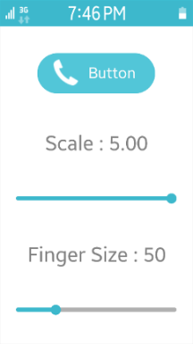
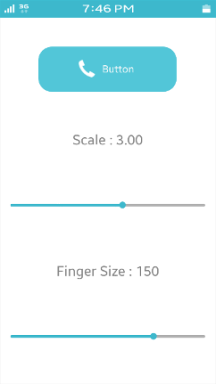

# Scaling

Supporting UI scalability in a user interface toolkit means that container components and UI components are scaled properly when the resolution or screen size changes. The Elementary library allows you to manipulate scaling on a per-UI-component basis using a scale factor based on the screen resolution, size, and profile configurations.

Tizen native applications can run on different types of devices, such as wearable, phone, tablet, and TV. Tizen also supports various resolutions (WVGA - XQXGA) with the same layouts and resources. However, remember that you must always polish your work to create an optimal application for each device.

The main scalability features are:

- [Multiple Screen Support](./multiple-screens.md)

  Enables you to design applications for different kinds of screens.

- [Scalability Support](./scalability.md)

  Enables you to design applications so that their UI can be scaled for diverse devices without problems.

- [Resource Fallback Support](./resource-fallback.md)

  Enables you to design applications which can use alternative resources for the device display state.

## Scaling UI Components

Through its configuration (Elementary Config API in [mobile](../../../api/mobile/latest/group__Elm__Config.html) and [wearable](../../../api/wearable/latest/group__Elm__Config.html) applications), Elementary provides a way to scale UI components with 2 different parameters:

- The `finger_size` parameter is used when the interactive (clickable or editable) zones of the UI components need to be scaled in order to be comfortably used with a finger.

  The `finger_size` parameter scales UI components based on the user's finger size. This is useful when using a touch screen with a finger rather than with a stylus. The finger size parameter is in pixels, and determines the minimum size of a square on the screen that is reliably hittable with a finger.

  The global finger size is set with the `elm_config_finger_size_set()` function. This adjusts the size and hit area of the UI components so that they are easy to hit with a finger. The current value is retrieved with the `elm_config_finger_size_get()` function. The finger size is always in pixels.

  To increase the current global finger size by 20 px:

  ```
  Evas_Coord finger_size;

  /* Get the current finger size */
  finger_size = elm_config_finger_size_get();

  /*
     Add 20px to finger size parameter and set it
     to the global Elementary configuration
  */
  elm_config_finger_size_set(finger_size + 20);
  ```

- The `scale` parameter is responsible for scaling readable parts of a UI component (such as text or icons), so that it is more visible in the user interface.

  The `scale` parameter only scales the readable areas of the UI component. Parts that must stay pixel-perfect, such as the highlights, shading, textures, and decorations, stay as they are.

    The `elm_config_scale_set()` function is used to set the global scaling factor that affects all UI components. It is also possible to use the `elm_object_scale_set()` function to set the scaling factor on a given Elementary UI component and all its children.

	> **Note**  
	> The scaling factor is multiplicative: if a child already has a scale size set, it is multiplied by its parent's scale size.

    The following example sets the global scaling factor to 2.0 and the scaling factor of an existing Elementary button object to 2.0. As a result, the button appears as if it had a 4.0 scaling factor, while the rest of the application is displayed with a 2.0 scaling factor.

    ```
    Evas_Object *button;

    /* Button object is created and configured */

    /* Set the global scaling factor to 2.0 */
    elm_config_scale_set(2.0);

    /*
       Set the scaling factor of the button component to 2.0, this component
       appears 4 times bigger than its initial size
    */
    elm_object_scale_set(button, 2.0);
    ```

The following figure shows the visual result of the finger size and scaling factor modification:

- The screenshot on the left shows an example application that enables the user to set the global scale factor and finger size parameter. As the user drags the sliders, the UI is updated, directly showing the result of the new parameter value.
- The screenshot in the middle shows what happens when the scale factor is increased from 3.00 to 5.00. Everything gets bigger: all the texts, and also the actual elements, like the sliders.
- The screenshot on the right shows what happens when the finger size is increased from 50 px to 150 px. Only the button on the top gets bigger, enabling the user more reliably to hit it with a bigger finger.

**Figure: Scalability example**



> **Note**  
> It is up to the theme (Edje file) to use the `scale` parameter to define which parts are scalable. This is something that needs to be taken into account when developing a new Edje theme. For more information on how to set the scalability in EDC, see [Layouting with EDC](./learn-edc-intro.md).

### Creating Scalable EDC Objects

To make an Edje object scalable, you must set the `scale` parameter to 1 on the parts you want to be scalable.

The following example shows a basic button that is composed of a background image part and a swallow part that can receive some content. Both the background and swallow parts are set to be scalable.

```
group {
   name: "button";
   images {
      image: "bg.png" COMP;
   }
   parts {
      part {
         name: "bg";
         type: IMAGE;
         scale: 1;
         description {
            state: "default" 0.0;
            image.normal: "bg.png";
         }
      }
      part {
         name: "elm.swallow.content";
         type: SWALLOW;
         scale: 1;
         description {
            state: "default" 0.0;
            visible: 0;
         }
         description {
            state: "visible" 0.0;
            visible: 1;
         }
      }
   }
}
```

When you make an object scalable, you must also consider how any images within the object are handled. You can take advantage of:

- Image sets

  If the application is potentially used at different resolutions, use image sets to provide separate image files for different resolutions. For the button defined above, consider having 2 different image files for the `bg.png` background image. Change the `images` block in the above code to contain an image set named `bg.png` instead of a single image file:

  - Use the `bg_low.png` image file when the size of the image is under 200 px.
  - Use the `bg_high.png` image file for higher resolutions.

  ```
  images {
     set {
        name: "bg.png";
        image {
           image: "bg_low.png" COMP;
           size: 0 0 200 100;
        }
        image {
           image: "bg_high.png" COMP;
           size: 201 101 5000 5000;
        }
     }
  }
  ```

  The following figure shows the effects of the image set. The screen shows 3 buttons:

  - The top button size is 100 x 50 pixels, so the background image uses the `bg_low.png` image file with the same size.
  - The middle button size is twice the first one (200 x 100 pixels). The image is scaled and it does not render well, the borders are quite blurry.
  - The bottom image uses the `bg_high.png` image file, which is defined to be used when the size is bigger than 200 x 100 pixels. The bottom image size is 201 x 101 pixels, and with the `bg_high.png` image file, it has much better quality than the scaled middle image.

  **Figure: Image set example**

  

- Image borders

  When the button defined above is resized, its image part is also resized because it is marked as scalable. To resize only the image itself, but not its borders, use the `border` parameter to specify a static unscalable border size.

  To add a 40-pixel border on the left and right side of the `bg` image, and a 20-pixel border at its top and bottom, modify the `description` block of the image part:

  ```
  parts {
     part {
        name: "bg";
        type: IMAGE;
        scale: 1;
        description {
           state: "default" 0.0;
           image.normal: "bg.png";
           image.border: 40 40 20 20;
        }
     }
     /* Other parts */
  }
  ```

  The following figure shows the original button at the top, and the resized button at the bottom. When the button is resized, the borders (and consequently the corners) keep their initial ratio, and only the middle part of the button is changed.

  **Figure: Image border example**

  

## Related Information
- Dependencies  
  - Tizen 2.4 and Higher for Mobile
  - Tizen 2.3.1 and Higher for Wearable
