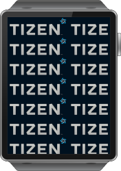

# Background

The background UI component is used to set a solid background decoration to a window or a container object. It works like an image, but has some background-specific properties. It can be set to a tiled, centered, scaled, or stretched mode. The background is the most simple UI component in that it emits no signals. For more information, see the [Background](../../../../api/wearable/latest/group__Elm__Bg.html) API.

This feature is supported in wearable applications only.

## Basic Usage

To use a background component in your application:

1. Add a background with the `elm_bg_add()` function:

   ```
   Evas_Object *bg;

   bg = elm_bg_add(parent);
   ```

2. Set the appearance of the background:

   - Set a color to the background using the `elm_bg_color_set()` function:

     ```
     elm_bg_color_set(bg, 64, 127, 256);
     ```

   - Set an Edje group as a background using the `elm_bg_file_set()` function:

     ```
     elm_bg_file_set(bg, "/path/to/the/edje", "group name");
     ```

   - Set an image file as a background using the `elm_bg_file_set()` function.

     For an image background, you can set additional [options](#options).

     ```
     elm_bg_file_set(bg, "/path/to/the/image", NULL);
     ```

3. Set a swallow part:

   ```
   /* Load content at the topmost layer of the background */
   elm_object_content_set(bg, evas_object);
   ```

The following example shows a simple use case of the background component.

**Example: Background use case**

    

```
Evas_Object *bg;
Evas_Object *box;
Evas_Object *label;
Evas_Object *nfl;

/* Starting right after the basic EFL UI layout code */
/* (win - conformant - naviframe) */

/* Add a background object */
bg = elm_bg_add(nf);

/* Set a color (R:64, G:127, B:256) */
elm_bg_color_set(bg, 64, 127, 256);

/* Add a box and set it as the background content */
box = elm_box_add(bg);
elm_object_content_set(bg, box);

label = elm_label_add(box);
elm_object_text_set(label, "overlay swallow part");
evas_object_show(label);
elm_box_pack_end(box, label);

elm_naviframe_item_push(nf, "Background", NULL, NULL, bg, "empty");
```

## Options

When you set an image, you can set a few background options using the `elm_bg_option_set()` function.

The following modes are available:

- `ELM_BG_OPTION_CENTER`: Centers the background image.
- `ELM_BG_OPTION_SCALE`: Scales the background image, retaining the aspect ratio.
- `ELM_BG_OPTION_STRETCH`: Stretches the background image to fill the UI component's area.
- `ELM_BG_OPTION_TILE`: Tiles the background image at its original size.

**Table: Background options**

| `ELM_BG_OPTION_CENTER`                   | `ELM_BG_OPTION_SCALE`                    |
|------------------------------------------|------------------------------------------|
|  |  |
| `ELM_BG_OPTION_STRETCH`                  | `ELM_BG_OPTION_TILE`                     |
|  |  |

## Styles

The following table lists the available component styles.

**Table: Background styles**

| Style     | Swallow part                           | Description                              |
|-----------|----------------------------------------|------------------------------------------|
| `default` | `elm.swallow.content`<br> `(alias:overlay)` | Default background style with an overlay swallow part on the top. |

> **Note**
>
> Except as noted, this content is licensed under [LGPLv2.1+](http://opensource.org/licenses/LGPL-2.1).

## Related Information
- Dependencies
  - Tizen 2.3.1 and Higher for Wearable
