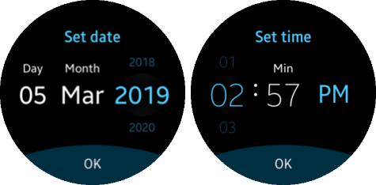

# Circle Datetime

This feature is supported in wearable applications only.

The circle datetime component extends the [datetime](component-datetime.md) component (`elm_datetime`) by visualizing the selected field. If a rotary event is activated by the `eext_rotary_object_event_activated_set()`function, the circle datetime increases or decreases the value of the selected field in the `elm_datetime` component through the clockwise or counter-clockwise rotary event.

For more information, see the [Efl Extension Circle Datetime](../../../../api/wearable/latest/group__CAPI__EFL__EXTENSION__CIRCLE__DATETIME__MODULE.html) API.

**Figure: Circle datetime component**



## Adding a Circle Datetime Component

To create a circle datetime component, use the `eext_circle_object_datetime_add()` function:

- The `elm_datetime` handle must be passed as the first parameter.
- If a [circle surface](component-circle-surface.md) is passed as the second parameter, a circle object connected with a circle surface is created, and it is rendered by the circle surface. If you pass `NULL` instead of a circle surface, the new circle object is managed and rendered by itself.

```
Evas_Object *datetime;
Evas_Object *circle_datetime;

datetime = elm_datetime_add(parent);
circle_datetime = eext_circle_object_datetime_add(datetime, surface);
```

The circle datetime component is created with the `default` style.

## Activating a Rotary Event

To activate or deactivate the circle datetime, use the `eext_rotary_object_event_activated_set()` function:

```
eext_rotary_object_event_activated_set(circle_datetime, EINA_TRUE);
```

If the second parameter is `EINA_TRUE`, the circle datetime can receive rotary events.

## Configuring the Circle Properties

To configure the circle properties of the circle datetime:

- You can modify the circle object within the circle datetime component using the following functions:

  - `eext_circle_object_line_width_set()`
  - `eext_circle_object_line_width_get()`
  - `eext_circle_object_radius_set()`
  - `eext_circle_object_radius_get()`
  - `eext_circle_object_color_set()`
  - `eext_circle_object_color_get()`
  - `eext_circle_object_disabled_set()`
  - `eext_circle_object_disabled_get()`

- You can modify the circle datetime `default` item, which draws the marker.

  To change the item properties, use the `eext_circle_object_item_XXX()` functions.

For more information, see [Circle Object](component-circle-object.md) and the [Efl Extension Circle Object](../../../../api/wearable/latest/group__CAPI__EFL__EXTENSION__CIRCLE__OBJECT__MODULE.html) API.

## Related Information
- Dependencies
  - Tizen 2.3.1 and Higher for Wearable
