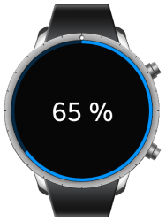

# Circle Progressbar

The circle progressbar UI component shows the progress status of a given task with the circular design. It visualizes the progress status within a range. For more information, see the [Circle Progressbar](../../../../api/wearable/latest/group__CAPI__EFL__EXTENSION__CIRCLE__PROGRESSBAR__MODULE.html) API.

This feature is supported in wearable applications only.

## Basic Usage

To use a circle progressbar component in your application:

1. To create a circle progressbar component, use the `eext_circle_object_progressbar_add()` function. Pass a [circle surface](component-circle-surface.md) as the second parameter to render the progressbar.

   ```
   Evas_Object *circle_progressbar;
   Evas_Object *parent;

   circle_progressbar = eext_circle_object_progressbar_add(parent, surface);
   ```

2. Before using the circle progressbar, set its value details:

   - To set the minimum and maximum values, use the `eext_circle_object_value_min_max_set()` function.
   - To set the current value, use the `eext_circle_object_value_set()` function.

   In the following example, the minimum value is set to 0.0, the maximum value to 100.0, and the current value to 3.0:

   ```
   eext_circle_object_value_min_max_set(circle_progressbar, 0.0, 100.0);
   eext_circle_object_value_set(circle_progressbar, 3.0);
   ```

The following example shows a simple use case of the circle progressbar component.

**Example: Circle progressbar use case**



```
/* C code */

Evas_Object *win;
Evas_Object *conf;
Evas_Object *nf;
Evas_Object *ly;
Evas_Object *pb;
Eext_Circle_Surface *circle_surface;

/* Starting right after the basic EFL UI layout code */
/* (win - conformant - naviframe) */

/* Set a circle surface */
circle_surface = eext_circle_surface_conformant_add(conf);

/* Add a layout and push the layout into the naviframe */
/* EDJ_PATH is folder path, it contains the progressbar_circle.edj file */
ly = elm_layout_add(nf);
elm_layout_file_set(ly, EDJ_PATH "progressbar_circle.edj", "eext_progressbar_layout");
evas_object_show(ly);
elm_naviframe_item_push(nf, "Progress", NULL, NULL, ly, NULL);

/* Add a progressbar and set a circle surface to render the progressbar */
pb = eext_circle_object_progressbar_add(ly, circle_surface);
/*Set a minimum and maximum values */
eext_circle_object_value_min_max_set(pb, 0.0, 100.0);
/* Set a progressbar value */
eext_circle_object_value_set(pb, 65);
/* Set a part content */
elm_object_part_content_set(ly, "elm.swallow.content", pb);
evas_object_show(pb);

/* Get a progressbar value and set a text */
char buf[255];
int value = eext_circle_object_value_get(pb);
snprintf(buf, sizeof(buf), "%d %%", (int)value);
elm_object_part_text_set(ly, "elm.text.progressbar", buf);

/* progressbar_circle.edc */

collections {
   group {
      name: "eext_progressbar_layout";
      parts {
         part {
            name: "base";
            type: SPACER;
            scale: 1;
            description {
               state: "default" 0.0;
               min: 360 360;
               max: 360 360;
               fixed: 1 1;
            }
         }
         part {
            name: "elm.swallow.content";
            type: SWALLOW;
            scale: 1;
            description {
               state: "default" 0.0;
               rel1.to: "base";
               rel2.to: "base";
            }
         }
         part {
            name: "elm.text.progressbar";
            type: TEXT;
            scale: 1;
            description {
               state: "default" 0.0;
               fixed: 1 1;
               rel1.to: "base";
               rel2.to: "base";
               rel1.relative: 0.5 0.5;
               rel2.relative: 0.5 0.5;
               text {
                  font: "Tizen:style=Regular";
                  size: 50;
                  min: 1 1;
               }
               color: 255 255 255 255;
            }
         }
      }
   }
}
```

## Features

To configure the circle properties of the circle progressbar:

- You can modify the circle object within the circle progressbar component using the following functions:

  - `eext_circle_object_value_min_max_set()`
  - `eext_circle_object_value_min_max_get()`
  - `eext_circle_object_value_set()`
  - `eext_circle_object_value_get()`
  - `eext_circle_object_angle_min_max_set()`
  - `eext_circle_object_angle_min_max_get()`
  - `eext_circle_object_angle_offset_set()`
  - `eext_circle_object_angle_offset_get()`
  - `eext_circle_object_angle_set()`
  - `eext_circle_object_angle_get()`
  - `eext_circle_object_line_width_set()`
  - `eext_circle_object_line_width_get()`
  - `eext_circle_object_radius_set()`
  - `eext_circle_object_radius_get()`
  - `eext_circle_object_color_set()`
  - `eext_circle_object_color_get()`
  - `eext_circle_object_disabled_set()`
  - `eext_circle_object_disabled_get()`

- You can modify the circle progressbar item properties with the `eext_circle_object_item_XXX()` functions.

  The circle progressbar has the following items:

  - `default`: Default circle item that draws the progressbar.
  - `bg`: Progress bar background circle item.

For more information, see [Circle Object](component-circle-object.md) and the [Efl Extension Circle Object](../../../../api/wearable/latest/group__CAPI__EFL__EXTENSION__CIRCLE__OBJECT__MODULE.html) API.

## Related Information
- Dependencies
  - Tizen 2.3.1 and Higher for Wearable
