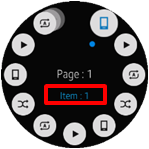
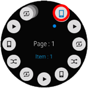

# Rotary Selector

This feature is supported in wearable applications only.

The rotary selector component is optimized for wearable circular devices. It is composed of a selector and multiple items surrounding the selector. The rotary selector can be used to select an item or to move to the next or previous page through a rotary event.

The rotary selector handle can use the `elm_layout` functions, because the rotary selector handle is an `elm_layout` object.

**Figure: Rotary selector component**


## Adding a Rotary Selector Component

To create a rotary selector, use the `eext_rotary_selector_add()` function:

```
Evas_Object *rotary_selector;
Evas_Object *parent;

Rotary_selector = eext_rotary_selector_add(parent);
```

## Activating a Rotary Event

To activate or deactivate the rotary selector, use the `eext_rotary_object_event_activated_set()` function:

```
eext_rotary_object_event_activated_set(rotary_selector, EINA_TRUE);
```

If the second parameter is `EINA_TRUE`, the rotary selector can receive rotary events.

## Adding Rotary Selector Items

> **Note**
>
> A maximum of 11 items can be displayed on one page of the rotary selector. Any excess items are arranged on the next page.

To add an item:

1. Append the new item with the `eext_rotary_selector_item_append()` function:

   ```
   Eext_Object_Item * item;
   Evas_Object *image;

   /* Append item */
   item = eext_rotary_selector_item_append(rotary_selector);
   ```

2. Configure the item (for more information, see [Configuring the Selector and Items](#configuring-the-selector-and-items)).

   In the following example, 2 icons are set for the item and selector:

   ```
   /* Set item icon */
   image = elm_image_add(rotary_selector);
   elm_image_file_set(image, "music_controller_btn_play.png", NULL);

   eext_rotary_selector_item_part_content_set(item, "item,icon",
                                              EEXT_ROTARY_SELECTOR_ITEM_STATE_NORMAL, image);

   /* Set selector content icon */
   image = elm_image_add(rotary_selector);
   elm_image_file_set(image, "music_controller_btn.png", NULL);
   eext_rotary_selector_item_part_content_set(item, "selector,icon",
                                              EEXT_ROTARY_SELECTOR_ITEM_STATE_NORMAL, image);
   ```

3. Define the item texts. The text is displayed in the selector when the item is selected.

   In the following example, the main text is defined for the new item:

   ```
   /* Set selector main text */
   eext_rotary_selector_item_part_text_set(item, "selector,main_text", "Options");
   ```

   The following table shows the functions you can use to set the main and sub text of an item.

   **Table: Item texts**

   | Text                 | Setting function                         | View                                     |
   |----------------------|------------------------------------------|------------------------------------------|
   | `selector,main_text` | `eext_rotary_selector_item_part_text_set()`<br> `eext_rotary_selector_item_domain_translatable_part_text_set()` |  |
   | `selector,sub_text`  | `eext_rotary_selector_item_part_text_set()`<br> `eext_rotary_selector_item_domain_translatable_part_text_set()` |  |

## Configuring the Selector and Items

You can configure the color and content of various rotary selector parts.

The following table shows the configurable rotary selector parts.

**Table: Configurable rotary selector parts**

| Part                                     | Setting function                         | View                                     |
|------------------------------------------|------------------------------------------|------------------------------------------|
| `selector,main_text`                     | `eext_rotary_selector_item_part_color_set()` |  |
| `selector,sub_text`                      | `eext_rotary_selector_item_part_color_set()` |  |
| `item,icon`<br> `item,bg_image`               | `eext_rotary_selector_item_part_content_set()`<br> `eext_rotary_selector_item_part_color_set()` |  |
| `selector,icon`<br> `selector,content`<br> `selector,bg_image` | `eext_rotary_selector_part_content_set()`<br> `eext_rotary_selector_part_color_set()`<br> `eext_rotary_selector_part_content_get()` |  |

You can also configure the selector and item appearance based on their current state:

- The available selector states are:

  - `EEXT_ROTARY_SELECTOR_SELECTOR_STATE_NORMAL`: Selector is in a normal state.
  - `EEXT_ROTARY_SELECTOR_SELECTOR_STATE_PRESSED`: Selector is in a pressed state.

  For example, to set the selector color for a normal state selector:

  ```
  eext_rotary_selector_part_color_set(selector, "selector,bg_image",
                                      EEXT_ROTARY_SELECTOR_SELECTOR_STATE_NORMAL,
                                      100, 100, 100, 255);
  ```

- The available selector item states are:

  - `EEXT_ROTARY_SELECTOR_ITEM_STATE_NORMAL`: Item is in a normal state.
  - `EEXT_ROTARY_SELECTOR_ITEM_STATE_PRESSED`: Item is in a pressed state.

  For example, to set the item color for a normal state item:

  ```
  eext_rotary_selector_item_part_color_set(item, "item,icon",
                                           EEXT_ROTARY_SELECTOR_ITEM_STATE_NORMAL,
                                           100, 100, 100, 255);
  ```

## Using the Rotary Selector Callbacks

To receive notifications about the rotary selector events, listen for the following signals:

- `item,selected`: The item is selected.
- `item,clicked`: The item is clicked.

> **Note**
>
> The signal list in the API reference can be more extensive, but only the above signals are actually supported in Tizen.

In both these signals, the `event_info` callback parameter is `NULL`.

To register and define a callback for the `item,clicked` signal:

```
{
    evas_object_smart_callback_add(rotary_selector, "item,clicked", item_clicked_cb, data);
}

/* Callback for the "item,clicked" signal */
/* Called when the item is clicked by the user */
void
item_clicked_cb(void *data, Evas_Object *obj, void *event_info)
{
    dlog_print(DLOG_INFO, LOG_TAG, "Item clicked\n");
}
```

## Related Information
- Dependencies
  - Tizen 2.3.1 and Higher for Wearable
