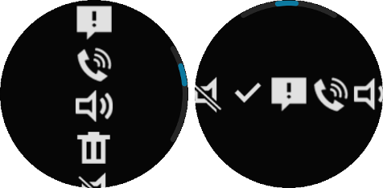

# Circle Scroller

This feature is supported in wearable applications only.

The circle scroller component changes corresponding to the rotary events. It shows the whole scrollable area with a circular scroll bar.

The circle scroller wraps the [scroller](container-scroller.md) component (`elm_scroller`) internally to draw a circular scroller to the edge of the circular screen. This means that you can use the `elm_scroller` callbacks and functions, excluding the `elm_scroller_policy_set()` and `elm_scroller_policy_get()` functions.

For more information, see the [Efl Extension Circle Scroller](../../../../api/wearable/latest/group__CAPI__EFL__EXTENSION__CIRCLE__SCROLLER__MODULE.html) API.

**Figure: Circle scroller component**



## Adding a Circle Scroller Component

To create a circle scroller component, use the `eext_circle_object_scroller_add()` function. Pass a `elm_scroller` component as the first parameter and a [circle surface](component-circle-surface.md) as the second parameter.

```
Evas_Object *scroller;
Evas_Object *circle_scroller;

scroller = elm_scroller_add(parent);
circle_scroller = eext_circle_object_scroller_add(scroller, surface);
```

The circle scroller component is created with the `default` style.

## Configuring the Circle Scroller

You can use the `elm_scroller` functions to configure a circle scroller, except for the `elm_scroller_policy_set()` and `elm_scroller_policy_get()` functions.

To set the circle scroller policy, use the `eext_circle_object_scroller_policy_set()` function. The scroller policy can be:

- `ELM_SCROLLER_POLICY_AUTO`: Scrollbar is made visible if it is needed, and otherwise kept hidden.
- `ELM_SCROLLER_POLICY_ON`: Scrollbar is always visible.
- `ELM_SCROLLER_POLICY_OFF`: Scrollbar is always hidden.

The following example sets the horizontal scrollbar on when needed and the vertical scrollbar always off:

```
eext_circle_object_scroller_policy_set(circle_scroller, ELM_SCROLLER_POLICY_AUTO, ELM_SCROLLER_POLICY_OFF);
```

To get the current scroller policy, use the `eext_circle_object_scroller_policy_get()` function.

## Activating a Rotary Event

To activate or deactivate the circle scroller, use the `eext_rotary_object_event_activated_set()` function:

```
eext_rotary_object_event_activated_set(circle_scroller, EINA_TRUE);
```

If the second parameter is `EINA_TRUE`, the circle scroller can receive rotary events.

## Configuring the Circle Properties

To configure the circle properties of the circle scroller:

- You can modify the circle object within the circle scroller component using the following functions:

  - `eext_circle_object_line_width_set()`
  - `eext_circle_object_line_width_get()`
  - `eext_circle_object_radius_set()`
  - `eext_circle_object_radius_get()`
  - `eext_circle_object_color_set()`
  - `eext_circle_object_color_get()`
  - `eext_circle_object_disabled_set()`
  - `eext_circle_object_disabled_get()`

- You can modify the circle scroller item properties with the `eext_circle_object_item_XXX()` functions.

  The circle scroller has the following items:

  - `default`: Default circle item that draws the vertical scroller.
  - `vertical,scroll,bg`: Vertical scroller background circle item.
  - `horizontal,scroll,bar`: Horizontal scroller circle item.
  - `horizontal,scroll,bg`: Horizontal scroller background circle item.

For more information, see [Circle Object](component-circle-object.md) and the [Efl Extension Circle Object](../../../../api/wearable/latest/group__CAPI__EFL__EXTENSION__CIRCLE__OBJECT__MODULE.html) API.

## Related Information
- Dependencies
  - Tizen 2.3.1 and Higher for Wearable
