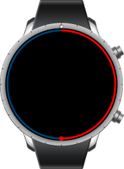

# Circle Slider

The circle slider UI component changes corresponding to rotary events. The circle slider not only extends the UI feature of the [slider](component-slider.md) component (`elm_slider`), but also replaces the functionalities of the `elm_slider` in the circular design. For more information, see the [Efl Extension Circle Slider](../../../../api/wearable/latest/group__CAPI__EFL__EXTENSION__CIRCLE__SLIDER__MODULE.html) API.

This feature is supported in wearable applications only.

## Basic Usage

To use a circle slider component in your application:

1. To create a circle slider component, use the `eext_circle_object_slider_add()` function. Pass a circle surface as the second parameter.

   ```
   Evas_Object *slider = NULL;

   slider = eext_circle_object_slider_add(ad->nf, ad->circle_surface);
   ```

2. Configure the circle slider [features](#features).

   The following configurations are optional. Unless you configure them, the slider adopts the default styles.

   - Set the range of the slider.
   - Set the color of the slider.

3. Register the [callback](#callbacks) functions.

   The following example shows how to define and register a callback for the `value,changed` signal:

   ```
   evas_object_smart_callback_add(slider, "value,changed", _value_changed_cb, NULL);

   /* Callback for the "value,changed" signal */
   /* Called when the value of the circle slider is changed */
   static void
   _value_changed_cb(void *data, Evas_Object *obj, void *event_info)
   {
       double _val = eext_circle_object_value_get(obj);
       dlog_print(DLOG_INFO, LOG_TAG, "Circle slider value changed. %0.1f\n", _val);
   }
   ```

The following example shows a simple use case of the circle slider component.

**Example: Circle slider use case**



```
Evas_Object *circle_surface;
Evas_Object *nf;
Evas_Object *slider;
Evas_Object *conform;

/* Starting right after the basic EFL UI layout code */
/* (win - conformant - naviframe) */

/* Create eext circle surface */
circle_surface = eext_circle_surface_conformant_add(conform);
eext_object_event_callback_add(nf, EEXT_CALLBACK_BACK, eext_naviframe_back_cb, NULL);
eext_object_event_callback_add(nf, EEXT_CALLBACK_MORE, eext_naviframe_more_cb, NULL);

slider = eext_circle_object_slider_add(nf, circle_surface);

eext_circle_object_value_min_max_set(slider, 0.0, 10.0);
eext_circle_object_value_set(slider, 5.0);

eext_circle_object_color_set(slider, 255, 0, 0, 255);

eext_rotary_object_event_activated_set(slider, EINA_TRUE);
evas_object_smart_callback_add(slider, "value,changed", _value_changed_cb, 0);
```

## Features

You can modify the circle slider properties using the following functions.

**Table: Circle slider properties**

| Functions                                | Description                              |
|------------------------------------------|------------------------------------------|
| `eext_circle_object_value_set()`<br>`eext_circle_object_value_get()` | Set and get the value of the circle object. |
| `eext_circle_object_angle_min_max_set()`<br>`eext_circle_object_angle_min_max_get()` | Set and get the minimum and maximum angle for the item of the circle object. |
| `eext_circle_object_angle_offset_set()`<br>`eext_circle_object_angle_offset_get()` | Set and get the angle offset of the circle object. |
| `eext_circle_object_angle_set()`<br>`eext_circle_object_angle_get()` | Set and get the angle in degree of the circle object. |
| `eext_circle_object_line_width_set()`<br>`eext_circle_object_line_width_get()` | Set and get the line width of the circle object. |
| `eext_circle_object_radius_set()`<br>`eext_circle_object_radius_get()` | Set and get circle radius of the circle object. |
| `eext_circle_object_color_set()`<br>`eext_circle_object_color_get()` | Set and get the color of circle line and font in the circle object. |
| `eext_circle_object_disabled_set()`<br>`eext_circle_object_disabled_get()` | Set and get the disabled state of the circle object. |

The circle slider consists of 2 parts, introduced in the following table.

**Table: Circle slider items**
<table>
<thead>
<tr><th>Sample</th><th>Items</th></tr>
</thead>
<tbody>
<tr><td rowspan="2"> </td>
<td> <code>default</code>: Default circle item, which draws a slider bar.<br>This item represents the value of the circle slider, which is a red circular area in the left example.</td></tr>
<tr><td> <code>bg</code>: Background circle item, which is a dark circular area in the left example. </td></tr>
</tbody>
</table>

The following example shows how to manipulate the items.

**Example: Manipulating the circle slider items**


```
Evas_Object* slider;

slider = eext_circle_object_slider_add(ad->nf, ad->circle_surface);

eext_circle_object_value_min_max_set(slider, 0.0, 10.0);
eext_circle_object_value_set(slider, 5.0);

/* Set red color */
eext_circle_object_color_set(slider, 255, 0, 0, 255);

/* Set a radius of the foreground circle to 70% of the original size */
double default_radius = eext_circle_object_radius_get(slider);
eext_circle_object_radius_set(slider, default_radius * 0.7);
```


```
Evas_Object* slider;

slider = eext_circle_object_slider_add(ad->nf, ad->circle_surface);

eext_circle_object_value_min_max_set(slider, 0.0, 10.0);
eext_circle_object_value_set(slider, 5.0);
eext_circle_object_color_set(slider, 255, 0, 0, 255);

/* Set background color */
eext_circle_object_item_color_set(slider, "bg", 0, 0, 255, 255);
```

## Callbacks

You can register callback functions connected to the following signals for a circle slider object.

**Table: Circle slider callback signals**

| Signal          | Description                           | `event_info` |
|-----------------|---------------------------------------|--------------|
| `value,changed` | The value of a circle slider changes. | `NULL`       |

> **Note**
>
> The signal list in the API reference can be more extensive, but only the above signals are actually supported in Tizen.

## Related Information
- Dependencies
  - Tizen 2.3.1 and Higher for Wearable
