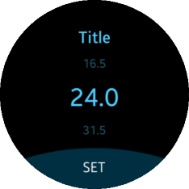

# Circle Spinner

This feature is supported in wearable applications only.

The circle spinner component extends the spinner component (`elm_spinner`) by visualizing its value. The circle spinner increases or decreases the value of the `elm_spinner` through a clockwise or counter-clockwise rotary event.

**Figure: Circle spinner component**



## Adding a Circle Spinner Component

To create a circle spinner component:

1. Create an `elm_spinner` object:

   ```
   Evas_Object *spinner;
   Evas_Object *circle_spinner;

   spinner = elm_spinner_add(parent);
   ```

2. Set the object style as `circle`:

   ```
   elm_object_style_set(spinner, "circle");
   ```

3. Create an `eext_spinner` object using the `eext_circle_object_spinner_add()` function.

   Pass a [circle surface](component-circle-surface.md) as the second parameter.

   ```
   circle_spinner = eext_circle_object_spinner_add(spinner, surface);
   ```

The circle spinner component is created with the `default` style.

## Configuring the Circle Spinner

To handle the circle spinner value, use the `elm_spinner` functions. They are automatically synchronized with the user values. You can also use the `elm_spinner` callback functions.

## Activating a Rotary Event

To activate or deactivate the circle spinner, use the `eext_rotary_object_event_activated_set()` function:

```
eext_rotary_object_event_activated_set(circle_spinner, EINA_TRUE);
```

If the second parameter is `EINA_TRUE`, the circle spinner can receive rotary events.

## Configuring the Circle Properties

To configure the circle properties of the circle spinner:

- You can disable the circle object within the circle spinner component using the following functions:

  - `eext_circle_object_disabled_set()`
  - `eext_circle_object_disabled_get()`

## Related Information
- Dependencies
  - Tizen 4.0 and Higher for Wearable
