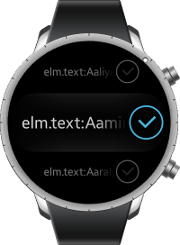
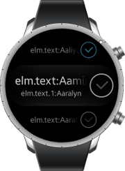

# Genlist

This feature is supported in wearable applications only.

Genlist is a UI component that displays a scrollable list of items. It allows you to manage a lot of items while still being fast and having a low memory footprint, as only the visible items are allocated in the memory.

For more information, see the [Genlist](../../../../api/wearable/latest/group__Elm__Genlist.html) API.

**Figure: Genlist component**


**Figure: Genlist hierarchy**


## Adding a Genlist Component

To add a genlist component, use the `elm_genlist_add()` function:

```
Evas_Object *genlist;
Evas_Object *parent;

genlist = elm_genlist_add(parent);
```

## Using the Genlist Item Styles

An item can have 0 or more texts, 0 or more contents, and 0 or more boolean states. This is defined in the Edje item theme style. The genlist looks for data items named respectively `labels`, `contents`, and `states` in the Edje file. The `default` item style provides 1 text part (`elm.text`), 2 content parts (`elm.swallow.icon` and `elm.swallow.end`), and no state parts.

The following item styles are available:

- `default`
- `groupindex`
- `1text`
- `1text.1icon`
- `2text`
- `2text.1`
- `1text.1icon.divider`
- `1text.1icon.1`
- `2text.1icon.1`
- `multiline/1text`
- `multiline/2text`

The following figures show examples of the item styles.

**Figure: 1text item style**


**Figure: 1text.1icon.1 item style**



**Figure: 2text.1icon.1 item style**



For more information on creating a new genlist item style, see [Customizing UI Components](component-custom.md).

## Defining the Genlist Item Class

To save memory and speed up processing when many items exist, the genlist uses the concept of "realization" when managing items. It means that a genlist item creates its text and content (realizes) when the user scrolls the list and the item shows up on the screen, and frees them (unrealizes) when the item is scrolled out of the screen. To enable the item realization, you must create and fill an `Elm_Genlist_Item_Class` structure (genlist item class) that informs the genlist component which callbacks to call when an item is created or deleted.

You can use the genlist item class for the following purposes:

- Setting the item styles
- Registering callback functions for item realization
- Registering a callback function for item deletion

```
Elm_Genlist_Item_Class *itc = elm_genlist_item_class_new();

itc->item_style = "default";
itc->decorate_item_style = NULL;
itc->decorate_all_item_style = NULL;
itc->func.text_get = _item_label_get;
itc->func.content_get = _item_content_get;
itc->func.state_get = _item_state_get;
itc->func.del = _item_del;
```

The `item_style`, `decorate_item_style`, and `decorate_all_item_style` attributes define the names of the item style, the decorate mode item style, and the decorate all item style.

The `func` structure contains pointers to functions that are called when an item is going to be realized or deleted. All of them receive a data parameter that points to the same data passed to the `elm_genlist_item_append()` function and related item creation functions, and an `obj` parameter that points to the genlist object itself.

- `text_get()`
  The `PART` parameter is the name string of one of the existing text parts in the Edje group implementing the item's theme. It has to return a string (duplicated with the `strdup()` function) corresponding to the `PART` parameter. The caller is in charge of freeing the string when done.

- `content_get()`
  The `PART` parameter is the name string of one of the existing swallow parts in the Edje group. The function returns a valid object handle, or `NULL` when no content is desired. The object is deleted by the genlist on its deletion or when the item is `unrealized`.

- `state_get()`
  The `PART` parameter is the name string of one of the state parts in the Edje group implementing the item's theme. It returns `EINA_FALSE` for false/off or `EINA_TRUE` for true/on. The default is false. When the state is true, the genlist emits a signal to the `PART` parameter's theming Edje object using `elm,state,xxx,active` as the `emission` parameter and `elm` as the `source` parameter. xxx is the name of the (state) part.

- `del()`
  This function is called when the genlist item is deleted. It deletes any data that is allocated at the item creation.

## Managing Genlist Items

To manage items:

- Add items:

  - To add an item to the end of the list (or if there is a parent list, to the end of all the child items of the parent list), use the `elm_genlist_item_append()` function.
  - To add an item to the beginning of the list or parent list, use the similar `elm_genlist_item_prepend()` function.
  - To insert an item before the indicated item, use the `elm_genlist_item_insert_before()` function.
  - To insert an item after the indicated item, use the `elm_genlist_item_insert_after()` function.

  The functions take one of the following `type` parameters:

  - `ELM_GENLIST_ITEM_NONE`
  - `ELM_GENLIST_ITEM_TREE`

    The item is displayed as being able to expand and have child items. In the wearable profile, the genlist tree item style is not supported yet.

  - `ELM_GENLIST_ITEM_GROUP`

    The item is a group index item that is displayed at the top until the next group appears.

- Delete items and clear the list:

  - To delete a single genlist item, use the `elm_object_item_del()` function.
  - To clear the list and delete all items, use the `elm_genlist_clear()` function.
  - To delete all items that are children of the indicated parent item, use the `elm_genlist_item_subitems_clear()` function.

- Inspect list elements:

  To help inspect the list items, move to the item at the top of the list with the `elm_genlist_first_item_get()` function, which returns the item pointer. The `elm_genlist_last_item_get()` function moves to the item at the end of the list. The `elm_genlist_item_next_get()` and `elm_genlist_item_prev_get()` functions move to the next and previous items relative to the indicated item. Using these calls you can go through the entire item list or tree.

  > **Note**
  >
  > As a tree, the items are flattened on the list, so the `elm_genlist_item_parent_get()` function gives you the name of the parent item (even to skip them if needed).

  The `elm_genlist_item_show()` function scrolls the scroller to show the desired item as visible.

  The `elm_object_item_data_get()` function returns the data pointer set by the item creation functions.

- Update items:

  If an item changes (state, boolean, text or content change), use the `elm_genlist_item_update()` function for the genlist to update the item. Genlist re-realizes the item and calls the functions in the `_Elm_Genlist_Item_Class` class for it.

## Selecting Genlist Items

To select or deselect items manually, use the `elm_genlist_item_selected_set()` function. To expand or collapse a tree or group item, use the `elm_genlist_item_expanded_set()` function.

To prevent a selection, you can disable an item with the `elm_object_item_disabled_set()` function.

> **Note**
>
> Calling this function does not show or hide any child of an item (if it is a parent). You must manually delete and create them on the callbacks of the `expanded` or `contracted` signals.

## Using the Genlist Callbacks

To receive notifications about the genlist events, listen for the following signals:

- `activated`: The item is double-clicked or pressed (enter | return | spacebar).

  The `event_info` callback parameter points at an `Elm_Object_Item` object that contains the activated item.

- `clicked,double`: The item is double-clicked.

  The `event_info` callback parameter points at an `Elm_Object_Item` object that contains the double-clicked item.

- `selected`: The item is selected.

  The `event_info` callback parameter points at an `Elm_Object_Item` object that contains the selected item.

- `unselected`: The item is unselected.

  The `event_info` callback parameter points at an `Elm_Object_Item` object that contains the unselected item.

- `expanded`: The item is to be expanded with the `elm_genlist_item_expanded_set()` function.

  The callback fills in the child items.

  The `event_info` callback parameter points at an `Elm_Object_Item` object that contains the item to be expanded.

- `contracted`: The item is to be collapsed with the `elm_genlist_item_expanded_set()` function.    The callback deletes the child items.

  The `event_info` callback parameter points at an `Elm_Object_Item` object that contains the item to be collapsed.

- `expand,request`: The user wants to expand a tree branch item. The callback decides whether the item can expand (if it has any children) and calls the `elm_genlist_item_expanded_set()` function to set the state.

  The `event_info` callback parameter points at an `Elm_Object_Item` object that contains the item to be expanded.

- `contract,request`: The user wants to collapse a tree branch item.

  The callback decides whether the item can collapse (if it has any children) and calls the `elm_genlist_item_expanded_set()` function to set the state.

  The `event_info` callback parameter points at an `Elm_Object_Item` object that contains the item to be collapsed.

- `realized`: The item is created as a real Evas object.

  The `event_info` callback parameter points at an `Elm_Object_Item` object that contains the item to be created.

- `unrealized`: The item is going to be unrealized. Provided content objects are deleted and the item object is deleted or put into a floating cache.

  The `event_info` callback parameter points at an `Elm_Object_Item` object that contains the item to be deleted.

- `drag,start,up`: The item in the list is dragged (not scrolled) up.

  The `event_info` callback parameter points at an `Elm_Object_Item` object that contains the dragged item.

- `drag,start,down`: The item in the list is dragged (not scrolled) down.

  The `event_info` callback parameter points at an `Elm_Object_Item` object that contains the dragged item.

- `drag,start,left`: The item in the list is dragged (not scrolled) left.

  The `event_info` callback parameter points at an `Elm_Object_Item` object that contains the dragged item.

- `drag,start,right`: The item in the list is dragged (not scrolled) right.
  The `event_info` callback parameter points at an `Elm_Object_Item` object that contains the dragged item.

- `drag,stop`: The item in the list has stopped being dragged.

  The `event_info` callback parameter points at an `Elm_Object_Item` object that contains the dragged item.

- `drag`: The item in the list is being dragged.

  The `event_info` callback parameter points at an `Elm_Object_Item` object that contains the dragged item.

- `longpressed`: The item is pressed for a certain amount of time. The default specified time is 1 second.

  The `event_info` callback parameter points at an `Elm_Object_Item` object that contains the pressed item.

- `scroll,anim,start`: The scrolling animation is started.

  The `event_info` callback parameter is `NULL`.

- `scroll,anim,stop`: The scrolling animation is stopped.

  The `event_info` callback parameter is `NULL`.

- `scroll,drag,start`: Dragging the content is started.

  The `event_info` callback parameter is `NULL`.

- `scroll,drag,stop`: Dragging the content is stopped.

  The `event_info` callback parameter is `NULL`.

- `edge,top`: The genlist is scrolled to the top edge.

  The `event_info` callback parameter is `NULL`.

- `edge,bottom`: The genlist is scrolled to the bottom edge.

  The `event_info` callback parameter is `NULL`.

- `edge,left`: The genlist is scrolled to the left edge.

  The `event_info` callback parameter is `NULL`.

- `edge,right`: The genlist is scrolled to the right edge.

  The `event_info` callback parameter is `NULL`.

- `multi,swipe,left`: The genlist is multi-touch-swiped left.

  The `event_info` callback parameter points at an `Elm_Object_Item` object that contains the swiped item.

- `multi,swipe,right`: The genlist is multi-touch-swiped right.

  The `event_info` callback parameter points at an `Elm_Object_Item` object that contains the swiped item.

- `multi,swipe,up`: The genlist is multi-touch-swiped up.

  The `event_info` callback parameter points at an `Elm_Object_Item` object that contains the swiped item.

- `multi,swipe,down`: The genlist is multi-touch-swiped down.

  The `event_info` callback parameter points at an `Elm_Object_Item` object that contains the swiped item.

- `multi,pinch,out`: The genlist is multi-touch-pinched out.

  The `event_info` callback parameter points at an `Elm_Object_Item` object that contains the pinched item.

- `multi,pinch,in`: The genlist is multi-touch-pinched in.

  The `event_info` callback parameter points at an `Elm_Object_Item` object that contains the pinched item.

- `swipe`: The genlist is swiped.

  The `event_info` callback parameter points at an `Elm_Object_Item` object that contains the swiped item.

- `moved`: The item is moved in the reorder mode.

  The `event_info` callback parameter points at an `Elm_Object_Item` object that contains the moved item.

- `moved,after`: The item is moved after another item in the reorder mode. To access the relative previous item, use the `elm_genlist_item_prev_get()` function. This signal is called along with the `moved` signal.

  The `event_info` callback parameter points at an `Elm_Object_Item` object that contains the moved item.

- `moved,before`: The item is moved before another item in the reorder mode. To access the relative next item, use the `elm_genlist_item_next_get()` function. This signal is called along with the `moved` signal.

  The `event_info` callback parameter points at an `Elm_Object_Item` object that contains the moved item.

- `language,changed` The program language is changed.

  The `event_info` callback parameter is `NULL`.

- `tree,effect,finished`: The genlist tree effect is finished.

  The `event_info` callback parameter is `NULL`.

> **Note**
>
> The signal list in the API reference can be more extensive, but only the above signals are actually supported in Tizen.

> **Note**
>
> Except as noted, this content is licensed under [LGPLv2.1+](http://opensource.org/licenses/LGPL-2.1).

## Related Information
- Dependencies
  - Tizen 2.3.1 and Higher for Wearable
