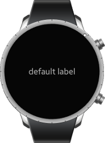

# Label

This feature is supported in wearable applications only.

The label component displays text with a simple HTML-like markup.

For more information, see the [Label](../../../../api/wearable/latest/group__Elm__Label.html) API.

**Figure: Label component**



**Figure: Label hierarchy**


## Adding a Label Component

To create a label, use the `elm_label_add()` function. You can set the label text with the `elm_object_text_set()` function.

```
Evas_Object *label = elm_label_add(win);

elm_object_text_set(label, "Some long text for our label, that is not so long");
```

## Configuring the Label

To configure the label:

1. Modify the style with which the label component displays text.

   The following styles are available:

   - `default`: No animation
   - `marker`: The text is centered and bolded.
   - `slide_long`: The text appears from the right of the screen and slides until it disappears in the left of the screen (reappearing on the right again).
   - `slide_roll`: The text appears from the left of the label and slides to the right to show the overflow, and then appears from the right of the label again.
   - `slide_short`: The text appears in the left of the label and slides to the right to show the overflow. When all of the text has been shown, the position is reset.
   - `slide_bounce`: The text appears in the left of the label and slides to the right to show the overflow. When all of the text has been shown, the animation reverses, moving the text to the left.

   ```
   elm_object_style_set(label, "slide_roll");
   ```

2. If you use a slide-type style for the text, you can also set the slide mode and animation duration:

   ```
   elm_label_slide_duration_set(label, 3);
   elm_label_slide_mode_set(label, ELM_LABEL_SLIDE_MODE_ALWAYS);
   ```

## Using the Label Callbacks

To receive notifications about the label events, listen for the following signals:

- `language,changed`: The program language is changed.
- `slide,end`: The slide reaches the end.
- `anchor,clicked`: The anchor is clicked.  
The `event_info` callback parameter points to an `Elm_Label_Anchor_Info` object.
- `anchor,mouse,down`: The anchor is pressed by mouse down.  
The `event_info` callback parameter points to an `Elm_Label_Anchor_Info` object.
- `anchor,mouse,up`: The anchor is released by mouse up.  
The `event_info` callback parameter points to an `Elm_Label_Anchor_Info` object.

> **Note**  
> The signal list in the API reference can be more extensive, but only the above signals are actually supported in Tizen.

To register and define a callback for the `slide,end` signal:

```
{
    evas_object_smart_callback_add(label, "slide,end", slide_end_cb, data);
}

/* Callback for the "slide,end" signal */
/* Called when the label slide reaches the end */
void
slide_end_cb(void *data, Evas_Object *obj, void *event_info)
{
    dlog_print(DLOG_INFO, LOG_TAG, "Slide has reach the end.\n");
}
```

> **Note**  
> Except as noted, this content is licensed under [LGPLv2.1+](http://opensource.org/licenses/LGPL-2.1).

## Related Information
- Dependencies
  - Tizen 2.3.1 and Higher for Wearable
