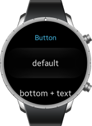

# List

This feature is supported in wearable applications only.

The list is a very simple UI component used to manage a limited number of items. For lists with a lot of items, use the [Genlist](component-genlist.md).

For more information, see the [List](../../../../api/wearable/latest/group__Elm__List.html) API.

**Figure: List component**



**Figure: List hierarchy**


## Adding a List Component

To add a list component, use the `elm_list_add()` function:

```
Evas_Object *list;
Evas_Object *parent;

/* Create a list */
list = elm_list_add(parent);
```

## Adding List Items

A list item can contain a piece of text and 2 contents (`start` and `end`). To set the individual elements of an item, use the `elm_object_item_XXX()` functions.

To add an item to the list, use the `elm_list_item_append()` or `elm_list_item_prepend()` function. In the following example, 10 items with text and 1 icon are added. The last 2 parameters of the `elm_list_item_append()` function are the callback function when the created item is selected and the data passed to the callback function.

```
Evas_Object *list;
int i;

/* Called when the list item is selected */
static void
_selected_item_cb(void *data, Evas_Object *obj, void *event_info)
{
    Elm_Object_Item *list_it = elm_list_selected_item_get(obj);
    Eina_Bool selected = elm_list_item_selected_get(list_it);
    dlog_print(DLOG_INFO, LOG_TAG, "item is %s\n", selected? "selected": "unselected");
}

for (i = 0; i < 10; i++) {
    Evas_Object *ic;
    char tmp[8];
    snprintf(tmp, sizeof(tmp), "Item %02d", i);
    /* Create an icon */
    ic = elm_icon_add(win);
    /* Set the file to the icon file */
    elm_image_file_set(ic, "path/to/file", NULL);
    /* Add the item to the list */
    elm_list_item_append(list, tmp, ic, NULL, _selected_item_cb, NULL);
}
```

## Modifying List Items

To modify the list item elements, use the `Elm_Object_Item` functions:

- To modify the item label, use the `elm_object_item_text_set()` function.
- To modify the 2 contents, use the `elm_object_item_part_content_set()` function, referencing the first object as the `start` object in the theme and the second one as the `end` object.

Each content is an `evas_object` instance, and they are defined as the third and the fourth parameters when you append or prepend the item in the list with the `elm_list_item_append()` or `elm_list_item_prepend()` function.

```
Evas_Object *list;
Eina_List *l;
Elm_Object_Item *it;

/* Retrieve the current selected item */
it = elm_list_selected_item_get(list);
if (!it)
    return;

ic = elm_icon_add(win);
/* Set the file to the icon file */
elm_image_file_set(ic, "path/to/file", NULL);
/* Change the first icon */
elm_object_item_part_content_set(it, "start", ic);
/* Change the second icon */
elm_object_item_part_content_set(it, "end", ic);
/* Change the label */
elm_object_item_text_set(it, "I've been selected !");
```

## Accessing and Selecting List Items

To access and select list items:

- Configuring the scroller:

  The list component implements the scrollable interface, which means that the scroller component functions can be used to ease the management of longer lists. To change the bounce property of the scroller or the scrolling policy:

  ```
  Evas_Object *list;

  /* Change the scroller policy to fix the scroll only vertically */
  elm_scroller_policy_set(list, ELM_SCROLLER_POLICY_OFF, ELM_SCROLLER_POLICY_AUTO);
  /* Enable bounce effect when the list reaches the vertical limits */
  elm_scroller_bounce_set(list, EINA_FALSE, EINA_TRUE);
  ```

- Enabling the multi-selection mode:

  To enable multiple items to be selected at the same time, enable the multi-selection mode with the `elm_list_multi_select_set()` function. Each time an item is clicked, its state changes to `selected`.

  ```
  Evas_Object *list;

  /* Enable multi-selection mode */
  elm_list_multi_select_set(list, EINA_TRUE);
  ```

- Selecting items:

  To find out whether an item is selected, use the `elm_list_item_selected_get()` function. This function returns `EINA_TRUE` if the item is selected, otherwise `EINA_FALSE`.

  To set an item as `selected`, use the `elm_list_item_selected_set()` function.

- Retrieving selected items:

  To retrieve the list of the currently selected items, use the `elm_list_selected_items_get()` function.

  If the multi-selection mode is disabled, only 1 item can be selected, and you can retrieve it with the `elm_list_selected_item_get()` function.

  To retrieve all selected items and set their state to `unselected`:

  ```
  Evas_Object *list;
  Eina_List *l;
  Eina_List *selected_items;
  /* Elm_Object_Item list */
  Elm_Object_Item *it;

  selected_items = elm_list_selected_items_get(list);
  EINA_LIST_FOREACH(selected_items, l, it)
      elm_list_item_selected_set(it, EINA_FALSE);
  ```

- Moving within the list:

  The list component provides various functions for moving within the list and sliding the list to a specific item:

  - The `elm_list_item_show()` function shows the item passed as a parameter.
  - The `elm_list_item_bring_in()` function shows the item passed as a parameter, after animating the slide.
  - The `elm_list_item_prev()` function goes to the item immediately preceding a specific item.
  - The `elm_list_item_next()` function goes to the item immediately following a specific item.

  To retrieve the currently selected item and unselect it, and then select the next item and bring it to the screen:

  ```
  Evas_Object *list;
  Elm_Object_Item *current;
  Elm_Object_Item *next;
  current = elm_list_selected_item_get(list);
  elm_list_item_selected_set(current, EINA_FALSE);
  next = elm_list_item_next(current);
  elm_list_item_selected_set(next, EINA_TRUE);
  elm_list_item_bring_in(next);
  ```

## Using the List Callbacks

To receive notifications about list events, listen for the following signals:

- `activated`: The item is double-clicked or pressed (enter | return | spacebar).  
  The `event_info` callback parameter points at the activated item.

- `clicked,double`: The item is double-clicked.  
  The `event_info` callback parameter points at the double-clicked item.

- `selected`: The item is selected.  
  The `event_info` callback parameter points at the selected item.

- `unselected`: The item is unselected.  
  The `event_info` callback parameter points at the unselected item.

- `longpressed`: The item is long-pressed.  
The `event_info` callback parameter points at the long-pressed item.

- `edge,top`: The list is scrolled to the top edge.

- `edge,bottom`: The list is scrolled to the bottom edge.

- `edge,left`: The list is scrolled to the left edge.

- `edge,right`: The list is scrolled to the right edge.

- `highlighted`: An item on the list is highlighted.  
  The `event_info` callback parameter points at the highlighted item.

- `unhighlighted`: An item in the list is unhighlighted.  
  The `event_info` callback parameter points at the unhighlighted item.

> **Note**  
> The signal list in the API reference can be more extensive, but only the above signals are actually supported in Tizen.

To register and define a callback for the `clicked,double` signal:

```
{
    Evas_Object *list;

    evas_object_smart_callback_add(list, "clicked,double", double_clicked_cb, data);
}

/* Callback for the "clicked,double" signal */
/* Called when the button is double-clicked by the user */
void
double_clicked_cb(void *data, Evas_Object *obj, void *event_info)
{
    elm_Object_Item *it = event_info;
    elm_list_selected_item_set(it, EINA_FALSE);
}
```

> **Note**  
> Except as noted, this content is licensed under [LGPLv2.1+](http://opensource.org/licenses/LGPL-2.1).

## Related Information
- Dependencies
  - Tizen 2.3.1 and Higher for Wearable
